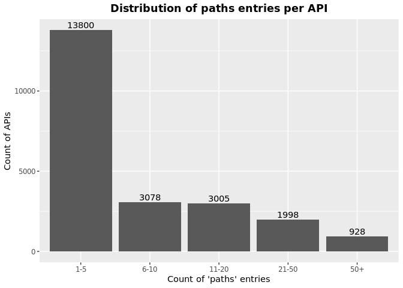

OAS Paths Analysis
================
Last updated: 2023-03-04

- <a href="#findings" id="toc-findings">Findings</a>
  - <a href="#how-is-the-path-property-used-in-apis"
    id="toc-how-is-the-path-property-used-in-apis">How is the path property
    used in APIs?</a>
  - <a href="#which-properties-are-used-under-paths"
    id="toc-which-properties-are-used-under-paths">Which properties are used
    under paths?</a>
- <a href="#methodology" id="toc-methodology">Methodology</a>

*DISCLAIMER: the results and findings below are preliminary and
have not been fully validated or peer reviewed. Use with care. Do not
quote or disseminate.*

[Back to summary](oas_summary.md) \| [View related
issues](https://github.com/postman-open-technologies/knowledge-base/labels/oas%3Apaths)

# Findings

## How is the path property used in APIs?

- The average number of path per API is 11.9, ranging from 1 to 1,550.
- Out of the 22,230 APIs with a path, 13,562 (61%) have 1-5 paths, 2,981
  (13.4%) have 6-10 paths, 2,869 (12.9%) have 11-20 paths, 1,912 (8.6%)
  have 21-50 paths, and 906 (0.04075574%) have over 50 paths.

## Which properties are used under paths?

- Out of 379,165 properties under paths, the most commonly used are
  `get` 171,665 (45.3%), `post` 94,668 (25%), `put` 31,867 (8.4%),
  `delete` 29,825 (7.9%), and `parameters` 22,976 (6.1%).
- Beyond standard properties, numerous extensions were found. See table
  below for details.
- No significant variations were observed across specification versions
  (2.x vs 3.x) or collections
- Consult the [operations report](oas_paths_operations.md) for more
  in-depth analysis.q

Table: Counts and percentages of properties under paths

| property                               |      n |       pct |
|:---------------------------------------|-------:|----------:|
| get                                    | 171665 | 0.4527448 |
| post                                   |  94668 | 0.2496749 |
| put                                    |  31867 | 0.0840452 |
| delete                                 |  29825 | 0.0786597 |
| parameters                             |  22976 | 0.0605963 |
| patch                                  |   8352 | 0.0220273 |
| x-swagger-router-controller            |   6413 | 0.0169135 |
| \$ref                                  |   4757 | 0.0125460 |
| description                            |   1851 | 0.0048818 |
| servers                                |   1351 | 0.0035631 |
| options                                |    775 | 0.0020440 |
| summary                                |    770 | 0.0020308 |
| x-endpoint                             |    687 | 0.0018119 |
| x-platforms-available                  |    663 | 0.0017486 |
| head                                   |    352 | 0.0009284 |
| x-swagger-pipe                         |    298 | 0.0007859 |
| x-route-enum                           |    291 | 0.0007675 |
| x-twilio                               |    272 | 0.0007174 |
| x-api-version                          |    175 | 0.0004615 |
| x-summary                              |    146 | 0.0003851 |
| x-linode-cli-command                   |    133 | 0.0003508 |
| x-default-output-properties            |    129 | 0.0003402 |
| x-path-type                            |    129 | 0.0003402 |
| x-description                          |     81 | 0.0002136 |
| x-restlet                              |     67 | 0.0001767 |
| x-related-model                        |     45 | 0.0001187 |
| x-gelato-group                         |     39 | 0.0001029 |
| x-vault-unauthenticated                |     36 | 0.0000949 |
| x-amazon-apigateway-any-method         |     35 | 0.0000923 |
| x-vault-sudo                           |     25 | 0.0000659 |
| x-modules                              |     25 | 0.0000659 |
| x-controller                           |     25 | 0.0000659 |
| trace                                  |     16 | 0.0000422 |
| x-ms-notification-content              |     15 | 0.0000396 |
| x-a127-apply                           |     14 | 0.0000369 |
| x-WM-COMPLETE_PATH                     |     14 | 0.0000369 |
| x-amf-description                      |     12 | 0.0000316 |
| x-vault-createSupported                |     11 | 0.0000290 |
| x-snyk-api-version                     |     10 | 0.0000264 |
| x-swagger-section-capabilities         |      9 | 0.0000237 |
| x-eac-ignore                           |      8 | 0.0000211 |
| x-internal                             |      7 | 0.0000185 |
| x-data_classification                  |      7 | 0.0000185 |
| x-volos-apply                          |      7 | 0.0000185 |
| x-external                             |      7 | 0.0000185 |
| x-swagger-section-2fa-bypass-permitted |      7 | 0.0000185 |
| x-zendesk-owner                        |      6 | 0.0000158 |
| x-controller-interface                 |      6 | 0.0000158 |
| x-snyk-api-resource                    |      6 | 0.0000158 |
| x-order                                |      6 | 0.0000158 |
| x-last-modified                        |      6 | 0.0000158 |
| x-swagger-route-controller             |      5 | 0.0000132 |
| x-vendor-method                        |      5 | 0.0000132 |
| x-private                              |      4 | 0.0000105 |
| x-python-connexion-openapi-name        |      4 | 0.0000105 |
| x-handler                              |      4 | 0.0000105 |
| x-kusk                                 |      4 | 0.0000105 |
| x-vertx-event-bus                      |      3 | 0.0000079 |
| x-oba-custom                           |      2 | 0.0000053 |
| x-annotation-counting                  |      2 | 0.0000053 |
| x-exegesis-controller                  |      2 | 0.0000053 |
| x-db-table-name                        |      2 | 0.0000053 |
| x-annotation-experimental              |      2 | 0.0000053 |
| x-amzn-api-sandbox                     |      2 | 0.0000053 |
| x-style-validator-ignored              |      2 | 0.0000053 |
| x-wso2-production-endpoints            |      2 | 0.0000053 |
| x-wso2-sandbox-endpoints               |      2 | 0.0000053 |
| x-annotation-clearanceLevel            |      2 | 0.0000053 |
| x-annotation-meta-data                 |      2 | 0.0000053 |
| x-temp                                 |      1 | 0.0000026 |
| x-comment                              |      1 | 0.0000026 |
| x-oad-type                             |      1 | 0.0000026 |
| x-zally-ignore                         |      1 | 0.0000026 |
| x-a127-authorizations                  |      1 | 0.0000026 |
| x-openapi-router-controller            |      1 | 0.0000026 |
| x-DNB-Name                             |      1 | 0.0000026 |
| x-lambda                               |      1 | 0.0000026 |
| x-wso2-disable-security                |      1 | 0.0000026 |
| x-volos-authorizations                 |      1 | 0.0000026 |
| x-wso2-request-interceptor             |      1 | 0.0000026 |
| x-test                                 |      1 | 0.0000026 |
| x-bank                                 |      1 | 0.0000026 |
| x-route-filters                        |      1 | 0.0000026 |
| x-kong-plugin-key-auth                 |      1 | 0.0000026 |
| x-DNB-ID                               |      1 | 0.0000026 |
| x-swagstar                             |      1 | 0.0000026 |

# Methodology

Results are based on the content and count of entries in the `/paths`
property in the APIs specifications.
