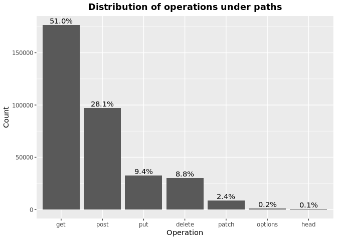
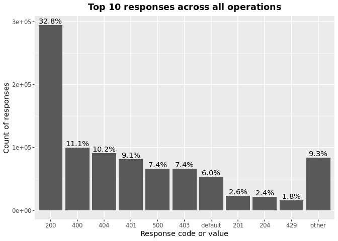
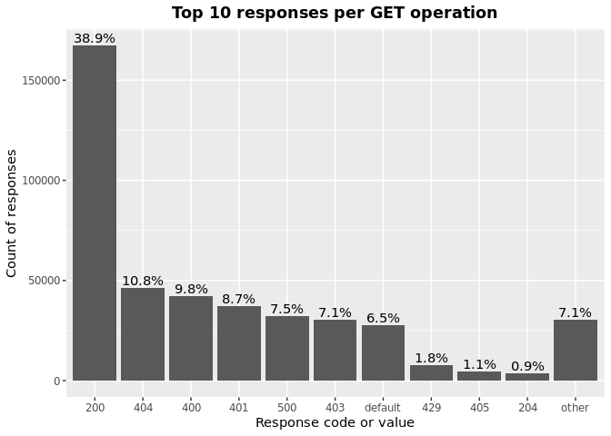
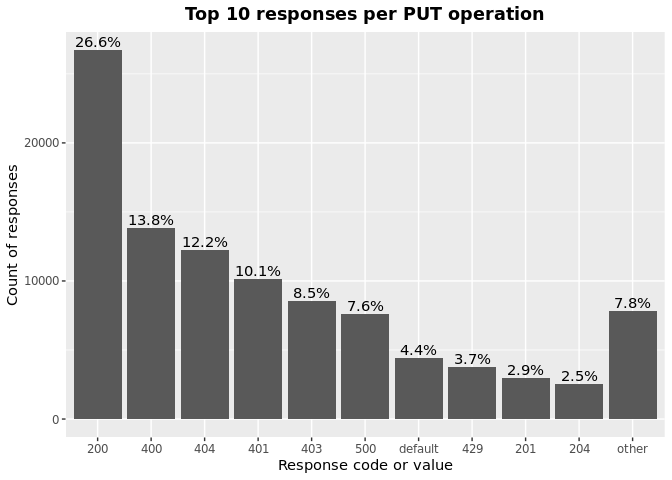
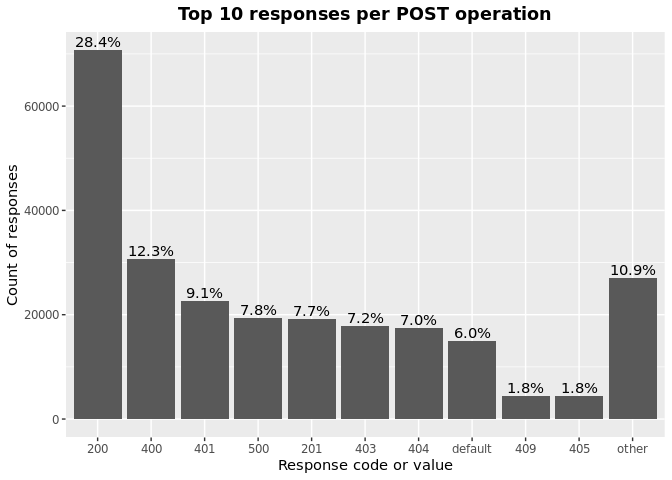
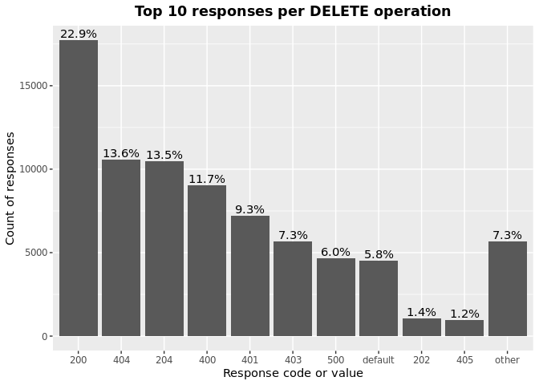
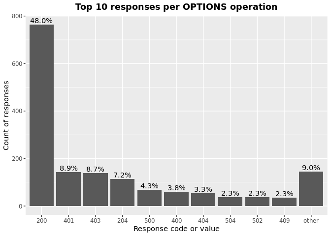
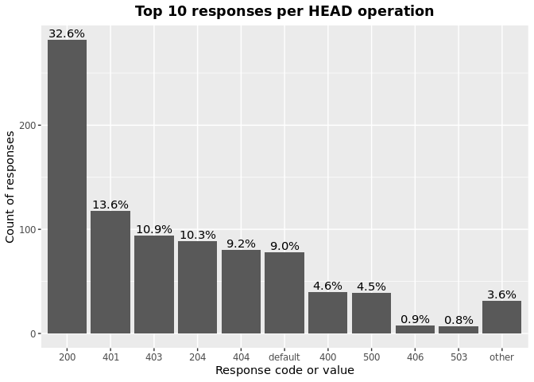
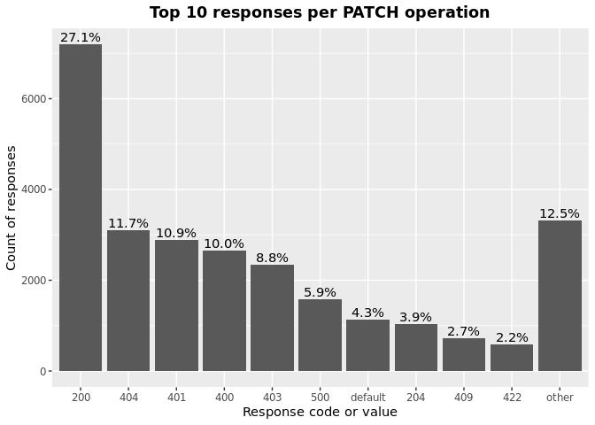

OAS Paths Operations & Responses
================
Last updated: 2023-06-15

- <a href="#findings" id="toc-findings">Findings</a>
  - <a href="#operations" id="toc-operations">Operations</a>
  - <a href="#responses" id="toc-responses">Responses</a>
  - <a href="#operations-responses" id="toc-operations-responses">Operations
    Responses</a>
    - <a href="#get" id="toc-get">GET</a>
    - <a href="#put" id="toc-put">PUT</a>
    - <a href="#post" id="toc-post">POST</a>
    - <a href="#delete" id="toc-delete">DELETE</a>
    - <a href="#options" id="toc-options">OPTIONS</a>
    - <a href="#head" id="toc-head">HEAD</a>
    - <a href="#patch" id="toc-patch">PATCH</a>
    - <a href="#trace" id="toc-trace">TRACE</a>
- <a href="#methodology" id="toc-methodology">Methodology</a>

*DISCLAIMER: the results and findings below are preliminary and
have not been fully validated or peer reviewed. Use with care. Do not
quote or disseminate.*

[Back to summary](oas_summary.md) \| [View related
issues](https://github.com/postman-open-technologies/knowledge-base/labels/oas%3Aoperations)

This document explores questions around OpenAPI paths operations
(‘get’,‘put’, ‘post’, ‘delete’, ‘options’, ‘head’, ‘patch’, ’ trace’)
and responses. Note that trace was added in OpenAPI3. See our related
[paths analysis](oas_paths.md) report for higher level findings and
other properties under `paths`.

# Findings

## Operations

Operations under paths are distributed as follows:

Table: Counts and percentages of operations under paths

| operation |      n |       pct |
|:----------|-------:|----------:|
| get       | 176537 | 0.5100162 |
| post      |  97239 | 0.2809239 |
| put       |  32385 | 0.0935604 |
| delete    |  30335 | 0.0876379 |
| patch     |   8473 | 0.0244785 |
| options   |    813 | 0.0023488 |
| head      |    358 | 0.0010343 |

## Responses

- Across all 898,451 responses, the most common codes or values are
  `200` 294,619 (32.8%), `400` 99,843 (11.1%), `404` 91,201 (10.2%),
  `401` 81,843 (9.1%), and `500` 66,448 (7.4%)
- A number of unassigned, / invalid codes and extensions were found. See
  table below for details.
- No significant variations were observed across specification versions
  (2.x vs 3.x) or collections

Table: Counts and percentages of responses under paths (across all
operations)

| response                             |      n |       pct |
|:-------------------------------------|-------:|----------:|
| 200                                  | 294619 | 0.3279188 |
| 400                                  |  99843 | 0.1111279 |
| 404                                  |  91201 | 0.1015092 |
| 401                                  |  81843 | 0.0910934 |
| 500                                  |  66448 | 0.0739584 |
| 403                                  |  66092 | 0.0735622 |
| default                              |  53487 | 0.0595325 |
| 201                                  |  23375 | 0.0260170 |
| 204                                  |  21625 | 0.0240692 |
| 429                                  |  15945 | 0.0177472 |
| 405                                  |  12089 | 0.0134554 |
| 409                                  |   9474 | 0.0105448 |
| 422                                  |   8045 | 0.0089543 |
| 202                                  |   7442 | 0.0082831 |
| 503                                  |   6722 | 0.0074818 |
| 415                                  |   6522 | 0.0072592 |
| 406                                  |   5768 | 0.0064199 |
| 502                                  |   3558 | 0.0039601 |
| 501                                  |   3229 | 0.0035940 |
| 304                                  |   2258 | 0.0025132 |
| 504                                  |   1873 | 0.0020847 |
| 410                                  |   1758 | 0.0019567 |
| 408                                  |   1435 | 0.0015972 |
| 412                                  |   1245 | 0.0013857 |
| 5XX                                  |   1023 | 0.0011386 |
| 480                                  |    964 | 0.0010730 |
| 4XX                                  |    886 | 0.0009861 |
| 481                                  |    872 | 0.0009706 |
| 482                                  |    730 | 0.0008125 |
| 302                                  |    685 | 0.0007624 |
| 483                                  |    540 | 0.0006010 |
| 402                                  |    530 | 0.0005899 |
| 413                                  |    507 | 0.0005643 |
| 484                                  |    425 | 0.0004730 |
| 300                                  |    414 | 0.0004608 |
| 420                                  |    388 | 0.0004319 |
| 207                                  |    362 | 0.0004029 |
| 485                                  |    289 | 0.0003217 |
| 301                                  |    277 | 0.0003083 |
| 307                                  |    212 | 0.0002360 |
| 505                                  |    204 | 0.0002271 |
| 203                                  |    198 | 0.0002204 |
| 486                                  |    183 | 0.0002037 |
| 414                                  |    179 | 0.0001992 |
| 303                                  |    150 | 0.0001670 |
| 206                                  |    143 | 0.0001592 |
| 418                                  |    137 | 0.0001525 |
| 487                                  |    124 | 0.0001380 |
| 205                                  |    102 | 0.0001135 |
| 416                                  |     93 | 0.0001035 |
| 417                                  |     91 | 0.0001013 |
| 419                                  |     91 | 0.0001013 |
| 456                                  |     73 | 0.0000813 |
| 426                                  |     69 | 0.0000768 |
| 424                                  |     68 | 0.0000757 |
| 488                                  |     65 | 0.0000723 |
| 555                                  |     62 | 0.0000690 |
| 449                                  |     56 | 0.0000623 |
| 529                                  |     55 | 0.0000612 |
| 423                                  |     54 | 0.0000601 |
| 489                                  |     46 | 0.0000512 |
| 308                                  |     45 | 0.0000501 |
| 540                                  |     41 | 0.0000456 |
| 490                                  |     39 | 0.0000434 |
| 510                                  |     39 | 0.0000434 |
| 210                                  |     37 | 0.0000412 |
| 299                                  |     37 | 0.0000412 |
| 411                                  |     37 | 0.0000412 |
| 491                                  |     34 | 0.0000378 |
| 596                                  |     34 | 0.0000378 |
| 599                                  |     30 | 0.0000334 |
| 999                                  |     30 | 0.0000334 |
| 492                                  |     29 | 0.0000323 |
| 512                                  |     28 | 0.0000312 |
| 461                                  |     26 | 0.0000289 |
| 520                                  |     26 | 0.0000289 |
| 507                                  |     25 | 0.0000278 |
| 909                                  |     25 | 0.0000278 |
| 493                                  |     24 | 0.0000267 |
| 515                                  |     23 | 0.0000256 |
| 521                                  |     23 | 0.0000256 |
| 101                                  |     22 | 0.0000245 |
| 494                                  |     22 | 0.0000245 |
| 495                                  |     22 | 0.0000245 |
| 553                                  |     22 | 0.0000245 |
| 407                                  |     21 | 0.0000234 |
| 496                                  |     20 | 0.0000223 |
| 460                                  |     19 | 0.0000211 |
| 497                                  |     19 | 0.0000211 |
| 499                                  |     19 | 0.0000211 |
| 498                                  |     18 | 0.0000200 |
| x-csm-error-codes                    |     18 | 0.0000200 |
| 421                                  |     16 | 0.0000178 |
| 100                                  |     12 | 0.0000134 |
| 2XX                                  |     12 | 0.0000134 |
| 506                                  |     12 | 0.0000134 |
| 428                                  |     10 | 0.0000111 |
| 462                                  |      9 | 0.0000100 |
| 508                                  |      9 | 0.0000100 |
| 425                                  |      8 | 0.0000089 |
| 451                                  |      8 | 0.0000089 |
| 509                                  |      8 | 0.0000089 |
| 511                                  |      8 | 0.0000089 |
| 513                                  |      8 | 0.0000089 |
| 900                                  |      8 | 0.0000089 |
| 430                                  |      7 | 0.0000078 |
| 531                                  |      7 | 0.0000078 |
| 102                                  |      6 | 0.0000067 |
| 457                                  |      6 | 0.0000067 |
| 467                                  |      6 | 0.0000067 |
| 514                                  |      6 | 0.0000067 |
| 450                                  |      5 | 0.0000056 |
| 463                                  |      5 | 0.0000056 |
| 477                                  |      5 | 0.0000056 |
| 478                                  |      5 | 0.0000056 |
| 479                                  |      5 | 0.0000056 |
| 516                                  |      5 | 0.0000056 |
| 910                                  |      5 | 0.0000056 |
| x-notification                       |      5 | 0.0000056 |
| x-vendor-operation-response-property |      5 | 0.0000056 |
| 208                                  |      4 | 0.0000045 |
| 226                                  |      4 | 0.0000045 |
| 440                                  |      4 | 0.0000045 |
| 465                                  |      4 | 0.0000045 |
| 466                                  |      4 | 0.0000045 |
| 522                                  |      4 | 0.0000045 |
| 523                                  |      4 | 0.0000045 |
| 550                                  |      4 | 0.0000045 |
| 703                                  |      4 | 0.0000045 |
| x-32700                              |      4 | 0.0000045 |
| x-std-errors                         |      4 | 0.0000045 |
| 222                                  |      3 | 0.0000033 |
| 438                                  |      3 | 0.0000033 |
| 455                                  |      3 | 0.0000033 |
| 458                                  |      3 | 0.0000033 |
| 464                                  |      3 | 0.0000033 |
| 468                                  |      3 | 0.0000033 |
| 475                                  |      3 | 0.0000033 |
| 517                                  |      3 | 0.0000033 |
| 524                                  |      3 | 0.0000033 |
| 525                                  |      3 | 0.0000033 |
| 526                                  |      3 | 0.0000033 |
| 527                                  |      3 | 0.0000033 |
| 552                                  |      3 | 0.0000033 |
| x-3                                  |      3 | 0.0000033 |
| x-32602                              |      3 | 0.0000033 |
| 236                                  |      2 | 0.0000022 |
| 433                                  |      2 | 0.0000022 |
| 444                                  |      2 | 0.0000022 |
| 448                                  |      2 | 0.0000022 |
| 454                                  |      2 | 0.0000022 |
| 473                                  |      2 | 0.0000022 |
| 518                                  |      2 | 0.0000022 |
| 528                                  |      2 | 0.0000022 |
| 530                                  |      2 | 0.0000022 |
| 541                                  |      2 | 0.0000022 |
| 543                                  |      2 | 0.0000022 |
| 551                                  |      2 | 0.0000022 |
| 103                                  |      1 | 0.0000011 |
| 209                                  |      1 | 0.0000011 |
| 215                                  |      1 | 0.0000011 |
| 218                                  |      1 | 0.0000011 |
| 220                                  |      1 | 0.0000011 |
| 250                                  |      1 | 0.0000011 |
| 255                                  |      1 | 0.0000011 |
| 305                                  |      1 | 0.0000011 |
| 306                                  |      1 | 0.0000011 |
| 333                                  |      1 | 0.0000011 |
| 431                                  |      1 | 0.0000011 |
| 469                                  |      1 | 0.0000011 |
| 472                                  |      1 | 0.0000011 |
| 474                                  |      1 | 0.0000011 |
| 476                                  |      1 | 0.0000011 |
| 532                                  |      1 | 0.0000011 |
| 533                                  |      1 | 0.0000011 |
| 534                                  |      1 | 0.0000011 |
| 535                                  |      1 | 0.0000011 |
| 536                                  |      1 | 0.0000011 |
| 544                                  |      1 | 0.0000011 |
| 560                                  |      1 | 0.0000011 |
| 561                                  |      1 | 0.0000011 |
| 591                                  |      1 | 0.0000011 |
| 593                                  |      1 | 0.0000011 |
| 598                                  |      1 | 0.0000011 |
| 601                                  |      1 | 0.0000011 |
| 704                                  |      1 | 0.0000011 |
| x-codegen-request-body-name          |      1 | 0.0000011 |
| x-swrclassic                         |      1 | 0.0000011 |

## Operations Responses

### GET

- GET is the \#1 ranked operation
- Across the 436,636 responses for GET, the most common values are `200`
  169,706 (38.9%), `404` 47,173 (10.8%), `400` 42,862 (9.8%), `401`
  38,011 (8.7%), and `500` 32,601 (7.5%)

Table: Counts and percentages of responses for the GET operation

| response                             |      n |       pct |
|:-------------------------------------|-------:|----------:|
| 200                                  | 169706 | 0.3886670 |
| 404                                  |  47173 | 0.1080374 |
| 400                                  |  42862 | 0.0981641 |
| 401                                  |  38011 | 0.0870542 |
| 500                                  |  32601 | 0.0746640 |
| 403                                  |  30965 | 0.0709172 |
| default                              |  28110 | 0.0643786 |
| 429                                  |   7740 | 0.0177264 |
| 405                                  |   4723 | 0.0108168 |
| 503                                  |   3895 | 0.0089205 |
| 204                                  |   3884 | 0.0088953 |
| 406                                  |   3433 | 0.0078624 |
| 415                                  |   3092 | 0.0070814 |
| 202                                  |   2474 | 0.0056660 |
| 409                                  |   2335 | 0.0053477 |
| 422                                  |   2174 | 0.0049790 |
| 502                                  |   2019 | 0.0046240 |
| 304                                  |   1684 | 0.0038568 |
| 501                                  |   1481 | 0.0033918 |
| 504                                  |   1254 | 0.0028720 |
| 410                                  |    835 | 0.0019123 |
| 408                                  |    661 | 0.0015138 |
| 5XX                                  |    512 | 0.0011726 |
| 4XX                                  |    484 | 0.0011085 |
| 302                                  |    380 | 0.0008703 |
| 201                                  |    311 | 0.0007123 |
| 412                                  |    310 | 0.0007100 |
| 420                                  |    254 | 0.0005817 |
| 300                                  |    247 | 0.0005657 |
| 301                                  |    241 | 0.0005519 |
| 402                                  |    206 | 0.0004718 |
| 413                                  |    198 | 0.0004535 |
| 480                                  |    168 | 0.0003848 |
| 203                                  |    167 | 0.0003825 |
| 481                                  |    158 | 0.0003619 |
| 307                                  |    158 | 0.0003619 |
| 505                                  |    146 | 0.0003344 |
| 207                                  |    139 | 0.0003183 |
| 482                                  |    126 | 0.0002886 |
| 414                                  |    123 | 0.0002817 |
| 206                                  |    113 | 0.0002588 |
| 418                                  |    112 | 0.0002565 |
| 416                                  |     78 | 0.0001786 |
| 303                                  |     78 | 0.0001786 |
| 484                                  |     68 | 0.0001557 |
| 483                                  |     67 | 0.0001534 |
| 426                                  |     44 | 0.0001008 |
| 417                                  |     38 | 0.0000870 |
| 456                                  |     35 | 0.0000802 |
| 485                                  |     35 | 0.0000802 |
| 419                                  |     34 | 0.0000779 |
| 540                                  |     28 | 0.0000641 |
| 529                                  |     28 | 0.0000641 |
| 423                                  |     28 | 0.0000641 |
| 299                                  |     28 | 0.0000641 |
| 555                                  |     27 | 0.0000618 |
| 553                                  |     21 | 0.0000481 |
| 510                                  |     20 | 0.0000458 |
| 205                                  |     18 | 0.0000412 |
| 424                                  |     17 | 0.0000389 |
| 101                                  |     16 | 0.0000366 |
| 308                                  |     15 | 0.0000344 |
| 999                                  |     15 | 0.0000344 |
| 512                                  |     13 | 0.0000298 |
| 461                                  |     11 | 0.0000252 |
| 407                                  |     10 | 0.0000229 |
| 909                                  |     10 | 0.0000229 |
| 596                                  |     10 | 0.0000229 |
| 460                                  |      8 | 0.0000183 |
| 100                                  |      8 | 0.0000183 |
| 462                                  |      8 | 0.0000183 |
| 520                                  |      8 | 0.0000183 |
| 421                                  |      7 | 0.0000160 |
| 521                                  |      5 | 0.0000115 |
| 428                                  |      5 | 0.0000115 |
| 2XX                                  |      5 | 0.0000115 |
| 411                                  |      5 | 0.0000115 |
| 900                                  |      5 | 0.0000115 |
| 910                                  |      5 | 0.0000115 |
| 515                                  |      5 | 0.0000115 |
| x-vendor-operation-response-property |      5 | 0.0000115 |
| x-csm-error-codes                    |      4 | 0.0000092 |
| 467                                  |      4 | 0.0000092 |
| 465                                  |      4 | 0.0000092 |
| 487                                  |      3 | 0.0000069 |
| 451                                  |      3 | 0.0000069 |
| 449                                  |      3 | 0.0000069 |
| 703                                  |      3 | 0.0000069 |
| 486                                  |      3 | 0.0000069 |
| 102                                  |      3 | 0.0000069 |
| 222                                  |      3 | 0.0000069 |
| 525                                  |      2 | 0.0000046 |
| 526                                  |      2 | 0.0000046 |
| 527                                  |      2 | 0.0000046 |
| 440                                  |      2 | 0.0000046 |
| 522                                  |      2 | 0.0000046 |
| 208                                  |      2 | 0.0000046 |
| 236                                  |      2 | 0.0000046 |
| 541                                  |      2 | 0.0000046 |
| 513                                  |      2 | 0.0000046 |
| 550                                  |      2 | 0.0000046 |
| 552                                  |      2 | 0.0000046 |
| 444                                  |      2 | 0.0000046 |
| 511                                  |      2 | 0.0000046 |
| 430                                  |      2 | 0.0000046 |
| 523                                  |      2 | 0.0000046 |
| 103                                  |      1 | 0.0000023 |
| x-codegen-request-body-name          |      1 | 0.0000023 |
| x-swrclassic                         |      1 | 0.0000023 |
| 551                                  |      1 | 0.0000023 |
| 472                                  |      1 | 0.0000023 |
| 450                                  |      1 | 0.0000023 |
| 488                                  |      1 | 0.0000023 |
| 489                                  |      1 | 0.0000023 |
| 490                                  |      1 | 0.0000023 |
| 491                                  |      1 | 0.0000023 |
| 494                                  |      1 | 0.0000023 |
| 495                                  |      1 | 0.0000023 |
| 496                                  |      1 | 0.0000023 |
| 497                                  |      1 | 0.0000023 |
| 498                                  |      1 | 0.0000023 |
| 499                                  |      1 | 0.0000023 |
| 431                                  |      1 | 0.0000023 |
| 425                                  |      1 | 0.0000023 |
| 333                                  |      1 | 0.0000023 |
| 506                                  |      1 | 0.0000023 |
| 507                                  |      1 | 0.0000023 |
| 508                                  |      1 | 0.0000023 |
| 509                                  |      1 | 0.0000023 |
| 306                                  |      1 | 0.0000023 |
| 305                                  |      1 | 0.0000023 |
| 524                                  |      1 | 0.0000023 |
| 528                                  |      1 | 0.0000023 |
| 530                                  |      1 | 0.0000023 |
| 544                                  |      1 | 0.0000023 |
| 226                                  |      1 | 0.0000023 |
| 560                                  |      1 | 0.0000023 |
| 561                                  |      1 | 0.0000023 |
| 220                                  |      1 | 0.0000023 |
| 598                                  |      1 | 0.0000023 |
| 218                                  |      1 | 0.0000023 |
| 601                                  |      1 | 0.0000023 |
| 210                                  |      1 | 0.0000023 |

### PUT

- PUT is the \#3 ranked operation
- Across the 101,258 responses for PUT, the most common values are `200`
  26,917 (26.6%), `400` 13,905 (13.7%), `404` 12,343 (12.2%), `401`
  10,214 (10.1%), and `403` 8,597 (8.5%)

Table: Counts and percentages of responses for the PUT operation

| response |     n |       pct |
|:---------|------:|----------:|
| 200      | 26917 | 0.2658259 |
| 400      | 13905 | 0.1373225 |
| 404      | 12343 | 0.1218965 |
| 401      | 10214 | 0.1008710 |
| 403      |  8597 | 0.0849019 |
| 500      |  7649 | 0.0755397 |
| default  |  4413 | 0.0435817 |
| 429      |  3754 | 0.0370736 |
| 201      |  2968 | 0.0293113 |
| 204      |  2576 | 0.0254400 |
| 405      |  1422 | 0.0140433 |
| 422      |  1177 | 0.0116238 |
| 409      |   988 | 0.0097573 |
| 202      |   844 | 0.0083351 |
| 415      |   531 | 0.0052440 |
| 406      |   389 | 0.0038417 |
| 503      |   388 | 0.0038318 |
| 412      |   338 | 0.0033380 |
| 501      |   323 | 0.0031899 |
| 502      |   237 | 0.0023406 |
| 410      |   217 | 0.0021430 |
| 408      |   161 | 0.0015900 |
| 304      |   114 | 0.0011258 |
| 5XX      |    59 | 0.0005827 |
| 504      |    59 | 0.0005827 |
| 207      |    46 | 0.0004543 |
| 505      |    41 | 0.0004049 |
| 205      |    39 | 0.0003852 |
| 481      |    34 | 0.0003358 |
| 482      |    34 | 0.0003358 |
| 480      |    34 | 0.0003358 |
| 484      |    30 | 0.0002963 |
| 485      |    30 | 0.0002963 |
| 483      |    30 | 0.0002963 |
| 486      |    27 | 0.0002666 |
| 307      |    25 | 0.0002469 |
| 301      |    24 | 0.0002370 |
| 413      |    24 | 0.0002370 |
| 487      |    23 | 0.0002271 |
| 302      |    23 | 0.0002271 |
| 210      |    22 | 0.0002173 |
| 521      |    18 | 0.0001778 |
| 402      |    17 | 0.0001679 |
| 300      |    14 | 0.0001383 |
| 555      |    12 | 0.0001185 |
| 4XX      |    12 | 0.0001185 |
| 414      |    10 | 0.0000988 |
| 420      |    10 | 0.0000988 |
| 417      |     9 | 0.0000889 |
| 416      |     7 | 0.0000691 |
| 423      |     6 | 0.0000593 |
| 456      |     6 | 0.0000593 |
| 203      |     6 | 0.0000593 |
| 424      |     6 | 0.0000593 |
| 540      |     5 | 0.0000494 |
| 510      |     5 | 0.0000494 |
| 2XX      |     4 | 0.0000395 |
| 407      |     4 | 0.0000395 |
| 428      |     4 | 0.0000395 |
| 449      |     4 | 0.0000395 |
| 460      |     4 | 0.0000395 |
| 461      |     4 | 0.0000395 |
| 308      |     3 | 0.0000296 |
| 303      |     3 | 0.0000296 |
| 550      |     2 | 0.0000198 |
| 515      |     2 | 0.0000198 |
| 419      |     2 | 0.0000198 |
| 524      |     1 | 0.0000099 |
| 206      |     1 | 0.0000099 |
| 551      |     1 | 0.0000099 |
| 552      |     1 | 0.0000099 |
| 100      |     1 | 0.0000099 |
| 703      |     1 | 0.0000099 |
| 507      |     1 | 0.0000099 |
| 418      |     1 | 0.0000099 |
| 512      |     1 | 0.0000099 |
| 411      |     1 | 0.0000099 |

### POST

- POST is the \#2 ranked operation
- Across the 252,568 responses for POST, the most common values are
  `200` 71,698 (28.4%), `400` 31,141 (12.3%), `401` 23,109 (9.1%), `500`
  19,780 (7.8%), and `201` 19,423 (7.7%)

Table: Counts and percentages of responses for the POST operation

| response          |     n |       pct |
|:------------------|------:|----------:|
| 200               | 71698 | 0.2838760 |
| 400               | 31141 | 0.1232975 |
| 401               | 23109 | 0.0914962 |
| 500               | 19780 | 0.0783155 |
| 201               | 19423 | 0.0769021 |
| 403               | 18145 | 0.0718420 |
| 404               | 17679 | 0.0699970 |
| default           | 15163 | 0.0600353 |
| 405               |  4528 | 0.0179278 |
| 409               |  4518 | 0.0178883 |
| 422               |  3556 | 0.0140794 |
| 429               |  3370 | 0.0133429 |
| 204               |  3258 | 0.0128995 |
| 202               |  2777 | 0.0109951 |
| 415               |  1951 | 0.0077247 |
| 503               |  1864 | 0.0073802 |
| 406               |  1124 | 0.0044503 |
| 501               |   985 | 0.0038999 |
| 502               |   753 | 0.0029814 |
| 480               |   730 | 0.0028903 |
| 481               |   648 | 0.0025656 |
| 482               |   540 | 0.0021380 |
| 504               |   453 | 0.0017936 |
| 408               |   442 | 0.0017500 |
| 483               |   415 | 0.0016431 |
| 410               |   406 | 0.0016075 |
| 412               |   335 | 0.0013264 |
| 484               |   302 | 0.0011957 |
| 5XX               |   281 | 0.0011126 |
| 302               |   268 | 0.0010611 |
| 413               |   258 | 0.0010215 |
| 402               |   252 | 0.0009978 |
| 4XX               |   211 | 0.0008354 |
| 485               |   203 | 0.0008037 |
| 304               |   186 | 0.0007364 |
| 207               |   140 | 0.0005543 |
| 486               |   139 | 0.0005503 |
| 420               |   115 | 0.0004553 |
| 487               |    96 | 0.0003801 |
| 488               |    64 | 0.0002534 |
| 303               |    61 | 0.0002415 |
| 300               |    54 | 0.0002138 |
| 489               |    45 | 0.0001782 |
| 419               |    43 | 0.0001703 |
| 449               |    41 | 0.0001623 |
| 414               |    39 | 0.0001544 |
| 490               |    38 | 0.0001505 |
| 417               |    36 | 0.0001425 |
| 491               |    33 | 0.0001307 |
| 205               |    30 | 0.0001188 |
| 599               |    30 | 0.0001188 |
| 492               |    29 | 0.0001148 |
| 456               |    27 | 0.0001069 |
| 411               |    26 | 0.0001029 |
| 596               |    24 | 0.0000950 |
| 493               |    24 | 0.0000950 |
| 529               |    23 | 0.0000911 |
| 206               |    22 | 0.0000871 |
| 507               |    21 | 0.0000831 |
| 495               |    21 | 0.0000831 |
| 494               |    21 | 0.0000831 |
| 203               |    21 | 0.0000831 |
| 424               |    19 | 0.0000752 |
| 496               |    19 | 0.0000752 |
| 499               |    18 | 0.0000713 |
| 520               |    18 | 0.0000713 |
| 497               |    18 | 0.0000713 |
| 418               |    17 | 0.0000673 |
| 498               |    17 | 0.0000673 |
| 308               |    16 | 0.0000633 |
| 307               |    16 | 0.0000633 |
| 999               |    15 | 0.0000594 |
| 426               |    15 | 0.0000594 |
| 909               |    15 | 0.0000594 |
| 210               |    14 | 0.0000554 |
| 515               |    14 | 0.0000554 |
| 512               |    14 | 0.0000554 |
| 505               |    14 | 0.0000554 |
| 510               |    13 | 0.0000515 |
| 423               |    12 | 0.0000475 |
| 506               |    11 | 0.0000436 |
| x-csm-error-codes |    10 | 0.0000396 |
| 421               |     9 | 0.0000356 |
| 508               |     8 | 0.0000317 |
| 299               |     8 | 0.0000317 |
| 540               |     8 | 0.0000317 |
| 460               |     7 | 0.0000277 |
| 425               |     7 | 0.0000277 |
| 407               |     7 | 0.0000277 |
| 531               |     7 | 0.0000277 |
| 509               |     7 | 0.0000277 |
| 457               |     6 | 0.0000238 |
| 513               |     6 | 0.0000238 |
| 511               |     6 | 0.0000238 |
| 514               |     6 | 0.0000238 |
| 101               |     6 | 0.0000238 |
| x-notification    |     5 | 0.0000198 |
| 451               |     5 | 0.0000198 |
| 516               |     5 | 0.0000198 |
| 463               |     5 | 0.0000198 |
| 430               |     5 | 0.0000198 |
| 479               |     5 | 0.0000198 |
| 478               |     5 | 0.0000198 |
| 477               |     5 | 0.0000198 |
| 416               |     5 | 0.0000198 |
| 450               |     4 | 0.0000158 |
| x-32700           |     4 | 0.0000158 |
| 461               |     4 | 0.0000158 |
| 466               |     4 | 0.0000158 |
| 468               |     3 | 0.0000119 |
| x-32602           |     3 | 0.0000119 |
| 900               |     3 | 0.0000119 |
| 464               |     3 | 0.0000119 |
| 458               |     3 | 0.0000119 |
| 102               |     3 | 0.0000119 |
| 517               |     3 | 0.0000119 |
| x-3               |     3 | 0.0000119 |
| 455               |     3 | 0.0000119 |
| 475               |     3 | 0.0000119 |
| 438               |     3 | 0.0000119 |
| 555               |     3 | 0.0000119 |
| 467               |     2 | 0.0000079 |
| 208               |     2 | 0.0000079 |
| 226               |     2 | 0.0000079 |
| 2XX               |     2 | 0.0000079 |
| 301               |     2 | 0.0000079 |
| 433               |     2 | 0.0000079 |
| 440               |     2 | 0.0000079 |
| 448               |     2 | 0.0000079 |
| 454               |     2 | 0.0000079 |
| 473               |     2 | 0.0000079 |
| 518               |     2 | 0.0000079 |
| 522               |     2 | 0.0000079 |
| 523               |     2 | 0.0000079 |
| 543               |     2 | 0.0000079 |
| x-std-errors      |     2 | 0.0000079 |
| 532               |     1 | 0.0000040 |
| 535               |     1 | 0.0000040 |
| 536               |     1 | 0.0000040 |
| 530               |     1 | 0.0000040 |
| 533               |     1 | 0.0000040 |
| 553               |     1 | 0.0000040 |
| 528               |     1 | 0.0000040 |
| 591               |     1 | 0.0000040 |
| 593               |     1 | 0.0000040 |
| 527               |     1 | 0.0000040 |
| 526               |     1 | 0.0000040 |
| 525               |     1 | 0.0000040 |
| 704               |     1 | 0.0000040 |
| 524               |     1 | 0.0000040 |
| 476               |     1 | 0.0000040 |
| 474               |     1 | 0.0000040 |
| 469               |     1 | 0.0000040 |
| 462               |     1 | 0.0000040 |
| 255               |     1 | 0.0000040 |
| 250               |     1 | 0.0000040 |
| 215               |     1 | 0.0000040 |
| 100               |     1 | 0.0000040 |
| 534               |     1 | 0.0000040 |

### DELETE

- DELETE is the \#4 ranked operation
- Across the 78,774 responses for DELETE, the most common values are
  `200` 18,004 (22.9%), `404` 10,745 (13.6%), `204` 10,652 (13.5%),
  `400` 9,150 (11.6%), and `401` 7,337 (9.3%)

Table: Counts and percentages of responses for the DELETE operation

| response          |     n |       pct |
|:------------------|------:|----------:|
| 200               | 18004 | 0.2285526 |
| 404               | 10745 | 0.1364029 |
| 204               | 10652 | 0.1352223 |
| 400               |  9150 | 0.1161551 |
| 401               |  7337 | 0.0931399 |
| 403               |  5793 | 0.0735395 |
| 500               |  4728 | 0.0600198 |
| default           |  4561 | 0.0578998 |
| 202               |  1079 | 0.0136974 |
| 405               |   967 | 0.0122756 |
| 409               |   866 | 0.0109935 |
| 429               |   803 | 0.0101937 |
| 422               |   554 | 0.0070328 |
| 415               |   502 | 0.0063727 |
| 406               |   415 | 0.0052682 |
| 503               |   326 | 0.0041384 |
| 502               |   291 | 0.0036941 |
| 501               |   290 | 0.0036814 |
| 412               |   233 | 0.0029578 |
| 410               |   223 | 0.0028309 |
| 201               |   223 | 0.0028309 |
| 304               |   189 | 0.0023993 |
| 408               |   159 | 0.0020184 |
| 5XX               |   102 | 0.0012948 |
| 4XX               |    80 | 0.0010156 |
| 504               |    44 | 0.0005586 |
| 300               |    44 | 0.0005586 |
| 480               |    32 | 0.0004062 |
| 481               |    32 | 0.0004062 |
| 207               |    31 | 0.0003935 |
| 482               |    30 | 0.0003808 |
| 483               |    28 | 0.0003554 |
| 484               |    25 | 0.0003174 |
| 402               |    24 | 0.0003047 |
| 424               |    21 | 0.0002666 |
| 485               |    21 | 0.0002666 |
| 413               |    18 | 0.0002285 |
| 486               |    14 | 0.0001777 |
| 555               |    10 | 0.0001269 |
| 419               |    10 | 0.0001269 |
| 302               |    10 | 0.0001269 |
| 420               |     9 | 0.0001143 |
| 303               |     8 | 0.0001016 |
| 308               |     7 | 0.0000889 |
| 414               |     7 | 0.0000889 |
| 307               |     7 | 0.0000889 |
| 449               |     6 | 0.0000762 |
| 417               |     6 | 0.0000762 |
| 418               |     5 | 0.0000635 |
| 205               |     5 | 0.0000635 |
| 426               |     5 | 0.0000635 |
| 456               |     5 | 0.0000635 |
| 203               |     4 | 0.0000508 |
| 461               |     4 | 0.0000508 |
| 529               |     4 | 0.0000508 |
| 206               |     4 | 0.0000508 |
| 423               |     3 | 0.0000381 |
| 505               |     3 | 0.0000381 |
| x-std-errors      |     2 | 0.0000254 |
| 487               |     2 | 0.0000254 |
| 515               |     2 | 0.0000254 |
| x-csm-error-codes |     2 | 0.0000254 |
| 100               |     1 | 0.0000127 |
| 507               |     1 | 0.0000127 |
| 301               |     1 | 0.0000127 |
| 2XX               |     1 | 0.0000127 |
| 299               |     1 | 0.0000127 |
| 226               |     1 | 0.0000127 |
| 416               |     1 | 0.0000127 |
| 510               |     1 | 0.0000127 |

### OPTIONS

- OPTIONS is the \#6 ranked operation
- Across the 1,593 responses for OPTIONS, the most common values are
  `200` 764 (48%), `401` 142 (8.9%), `403` 138 (8.7%), `204` 114 (7.2%),
  and `500` 68 (4.3%)

Table: Counts and percentages of responses for the OPTIONS operation

| response |   n |       pct |
|:---------|----:|----------:|
| 200      | 764 | 0.4795982 |
| 401      | 142 | 0.0891400 |
| 403      | 138 | 0.0866290 |
| 204      | 114 | 0.0715631 |
| 500      |  68 | 0.0426868 |
| 400      |  60 | 0.0376648 |
| 404      |  53 | 0.0332706 |
| 504      |  37 | 0.0232266 |
| 502      |  37 | 0.0232266 |
| 409      |  36 | 0.0225989 |
| 503      |  34 | 0.0213434 |
| 406      |  34 | 0.0213434 |
| 415      |  34 | 0.0213434 |
| default  |  26 | 0.0163214 |
| 5XX      |  16 | 0.0100439 |

### HEAD

- HEAD is the \#7 ranked operation
- Across the 866 responses for HEAD, the most common values are `200`
  282 (32.6%), `401` 118 (13.6%), `403` 94 (10.9%), `204` 89 (10.3%),
  and `404` 80 (9.2%)

Table: Counts and percentages of responses for the HEAD operation

| response |   n |       pct |
|:---------|----:|----------:|
| 200      | 282 | 0.3256351 |
| 401      | 118 | 0.1362587 |
| 403      |  94 | 0.1085450 |
| 204      |  89 | 0.1027714 |
| 404      |  80 | 0.0923788 |
| default  |  78 | 0.0900693 |
| 400      |  40 | 0.0461894 |
| 500      |  39 | 0.0450346 |
| 406      |   8 | 0.0092379 |
| 503      |   7 | 0.0080831 |
| 429      |   6 | 0.0069284 |
| 501      |   3 | 0.0034642 |
| 409      |   3 | 0.0034642 |
| 410      |   2 | 0.0023095 |
| 304      |   2 | 0.0023095 |
| 408      |   2 | 0.0023095 |
| 412      |   2 | 0.0023095 |
| 419      |   2 | 0.0023095 |
| 422      |   2 | 0.0023095 |
| 5XX      |   2 | 0.0023095 |
| 415      |   1 | 0.0011547 |
| 307      |   1 | 0.0011547 |
| 302      |   1 | 0.0011547 |
| 206      |   1 | 0.0011547 |
| 416      |   1 | 0.0011547 |

### PATCH

- PATCH is the \#5 ranked operation
- Across the 26,756 responses for PATCH, the most common values are
  `200` 7,248 (27.1%), `404` 3,128 (11.7%), `401` 2,912 (10.9%), `400`
  2,685 (10%), and `403` 2,360 (8.8%)

Table: Counts and percentages of responses for the PATCH operation

| response          |    n |       pct |
|:------------------|-----:|----------:|
| 200               | 7248 | 0.2708925 |
| 404               | 3128 | 0.1169084 |
| 401               | 2912 | 0.1088354 |
| 400               | 2685 | 0.1003513 |
| 403               | 2360 | 0.0882045 |
| 500               | 1583 | 0.0591643 |
| default           | 1136 | 0.0424578 |
| 204               | 1052 | 0.0393183 |
| 409               |  728 | 0.0272089 |
| 422               |  582 | 0.0217521 |
| 201               |  450 | 0.0168187 |
| 405               |  449 | 0.0167813 |
| 415               |  411 | 0.0153610 |
| 406               |  365 | 0.0136418 |
| 429               |  272 | 0.0101659 |
| 202               |  268 | 0.0100164 |
| 502               |  221 | 0.0082598 |
| 503               |  208 | 0.0077740 |
| 501               |  147 | 0.0054941 |
| 4XX               |   99 | 0.0037001 |
| 304               |   83 | 0.0031021 |
| 410               |   75 | 0.0028031 |
| 300               |   55 | 0.0020556 |
| 5XX               |   51 | 0.0019061 |
| 402               |   31 | 0.0011586 |
| 412               |   27 | 0.0010091 |
| 504               |   26 | 0.0009717 |
| 408               |   10 | 0.0003737 |
| 205               |   10 | 0.0003737 |
| 555               |   10 | 0.0003737 |
| 413               |    9 | 0.0003364 |
| 301               |    9 | 0.0003364 |
| 207               |    6 | 0.0002242 |
| 423               |    5 | 0.0001869 |
| 307               |    5 | 0.0001869 |
| 426               |    5 | 0.0001869 |
| 424               |    5 | 0.0001869 |
| 411               |    5 | 0.0001869 |
| 308               |    4 | 0.0001495 |
| 461               |    3 | 0.0001121 |
| 302               |    3 | 0.0001121 |
| 417               |    2 | 0.0000747 |
| 418               |    2 | 0.0000747 |
| 449               |    2 | 0.0000747 |
| 206               |    2 | 0.0000747 |
| x-csm-error-codes |    2 | 0.0000747 |
| 507               |    1 | 0.0000374 |
| 100               |    1 | 0.0000374 |
| 428               |    1 | 0.0000374 |
| 416               |    1 | 0.0000374 |
| 209               |    1 | 0.0000374 |

### TRACE

*This operation is excluded from the analysis as it has, sadly, not been
found so far in any API.*

# Methodology

The above statistics are derived from multiple database views querying
the OpenAPI JSON under the `/paths/<path>/<operation>/<responses>`.
