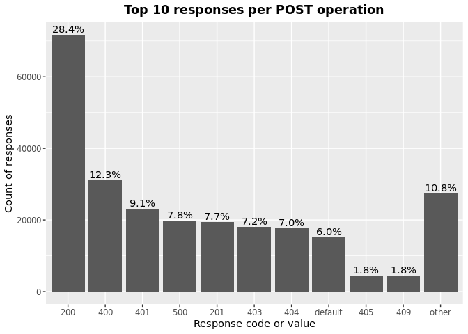

OAS Paths Operations & Responses
================
Last updated: 2023-03-12

- <a href="#findings" id="toc-findings">Findings</a>
  - <a href="#operations" id="toc-operations">Operations</a>
  - <a href="#responses" id="toc-responses">Responses</a>
  - <a href="#operations-responses" id="toc-operations-responses">Operations
    Responses</a>
    - <a href="#get" id="toc-get">GET</a>
    - <a href="#put" id="toc-put">PUT</a>
    - <a href="#post" id="toc-post">POST</a>
    - <a href="#delete" id="toc-delete">DELETE</a>
    - <a href="#options" id="toc-options">OPTIONS</a>
    - <a href="#head" id="toc-head">HEAD</a>
    - <a href="#patch" id="toc-patch">PATCH</a>
    - <a href="#trace" id="toc-trace">TRACE</a>
- <a href="#methodology" id="toc-methodology">Methodology</a>

*DISCLAIMER: the results and findings below are preliminary and
have not been fully validated or peer reviewed. Use with care. Do not
quote or disseminate.*

[Back to summary](oas_summary.md) \| [View related
issues](https://github.com/postman-open-technologies/knowledge-base/labels/oas%3Aoperations)

This document explores questions around OpenAPI paths operations
(‘get’,‘put’, ‘post’, ‘delete’, ‘options’, ‘head’, ‘patch’, ’ trace’)
and responses. Note that trace was added in OpenAPI3. See our related
[paths analysis](oas_paths.md) report for higher level findings and
other properties under `paths`.

# Findings

## Operations

Operations under paths are distributed as follows:

Table: Counts and percentages of operations under paths

| operation |      n |       pct |
|:----------|-------:|----------:|
| get       | 174099 | 0.5093354 |
| post      |  95951 | 0.2807095 |
| put       |  32126 | 0.0939862 |
| delete    |  30079 | 0.0879976 |
| patch     |   8412 | 0.0246097 |
| options   |    794 | 0.0023229 |
| head      |    355 | 0.0010386 |

## Responses

- Across all 886,851 responses, the most common codes or values are
  `200` 290,917 (32.8%), `400` 98,577 (11.1%), `404` 89,894 (10.1%),
  `401` 80,367 (9.1%), and `500` 65,545 (7.4%)
- A number of unassigned, / invalid codes and extensions were found. See
  table below for details.
- No significant variations were observed across specification versions
  (2.x vs 3.x) or collections

Table: Counts and percentages of responses under paths (across all
operations)

| response                             |      n |       pct |
|:-------------------------------------|-------:|----------:|
| 200                                  | 290917 | 0.3280337 |
| 400                                  |  98577 | 0.1111540 |
| 404                                  |  89894 | 0.1013631 |
| 401                                  |  80367 | 0.0906206 |
| 500                                  |  65545 | 0.0739076 |
| 403                                  |  65115 | 0.0734227 |
| default                              |  53072 | 0.0598432 |
| 201                                  |  23064 | 0.0260066 |
| 204                                  |  21427 | 0.0241608 |
| 429                                  |  15791 | 0.0178057 |
| 405                                  |  11860 | 0.0133732 |
| 409                                  |   9395 | 0.0105937 |
| 422                                  |   7991 | 0.0090105 |
| 202                                  |   7410 | 0.0083554 |
| 503                                  |   6636 | 0.0074827 |
| 415                                  |   6476 | 0.0073022 |
| 406                                  |   5707 | 0.0064351 |
| 502                                  |   3442 | 0.0038811 |
| 501                                  |   3208 | 0.0036173 |
| 304                                  |   2251 | 0.0025382 |
| 504                                  |   1785 | 0.0020127 |
| 410                                  |   1755 | 0.0019789 |
| 408                                  |   1433 | 0.0016158 |
| 412                                  |   1236 | 0.0013937 |
| 5XX                                  |   1020 | 0.0011501 |
| 480                                  |    964 | 0.0010870 |
| 4XX                                  |    886 | 0.0009990 |
| 481                                  |    872 | 0.0009833 |
| 482                                  |    730 | 0.0008231 |
| 302                                  |    682 | 0.0007690 |
| 483                                  |    538 | 0.0006066 |
| 402                                  |    529 | 0.0005965 |
| 413                                  |    507 | 0.0005717 |
| 484                                  |    415 | 0.0004679 |
| 300                                  |    414 | 0.0004668 |
| 420                                  |    387 | 0.0004364 |
| 207                                  |    361 | 0.0004071 |
| 485                                  |    287 | 0.0003236 |
| 301                                  |    274 | 0.0003090 |
| 307                                  |    212 | 0.0002390 |
| 505                                  |    203 | 0.0002289 |
| 203                                  |    198 | 0.0002233 |
| 486                                  |    183 | 0.0002063 |
| 414                                  |    179 | 0.0002018 |
| 303                                  |    149 | 0.0001680 |
| 206                                  |    143 | 0.0001612 |
| 418                                  |    137 | 0.0001545 |
| 487                                  |    124 | 0.0001398 |
| 205                                  |    102 | 0.0001150 |
| 416                                  |     93 | 0.0001049 |
| 417                                  |     91 | 0.0001026 |
| 419                                  |     91 | 0.0001026 |
| 456                                  |     73 | 0.0000823 |
| 426                                  |     69 | 0.0000778 |
| 424                                  |     68 | 0.0000767 |
| 488                                  |     65 | 0.0000733 |
| 555                                  |     62 | 0.0000699 |
| 449                                  |     56 | 0.0000631 |
| 529                                  |     55 | 0.0000620 |
| 423                                  |     50 | 0.0000564 |
| 489                                  |     46 | 0.0000519 |
| 308                                  |     45 | 0.0000507 |
| 490                                  |     39 | 0.0000440 |
| 510                                  |     39 | 0.0000440 |
| 210                                  |     37 | 0.0000417 |
| 299                                  |     37 | 0.0000417 |
| 411                                  |     37 | 0.0000417 |
| 491                                  |     34 | 0.0000383 |
| 596                                  |     34 | 0.0000383 |
| 599                                  |     30 | 0.0000338 |
| 999                                  |     30 | 0.0000338 |
| 492                                  |     29 | 0.0000327 |
| 512                                  |     27 | 0.0000304 |
| 461                                  |     26 | 0.0000293 |
| 520                                  |     26 | 0.0000293 |
| 507                                  |     25 | 0.0000282 |
| 909                                  |     25 | 0.0000282 |
| 493                                  |     24 | 0.0000271 |
| 515                                  |     23 | 0.0000259 |
| 521                                  |     23 | 0.0000259 |
| 101                                  |     22 | 0.0000248 |
| 494                                  |     22 | 0.0000248 |
| 495                                  |     22 | 0.0000248 |
| 540                                  |     22 | 0.0000248 |
| 553                                  |     22 | 0.0000248 |
| 407                                  |     21 | 0.0000237 |
| 496                                  |     20 | 0.0000226 |
| 460                                  |     19 | 0.0000214 |
| 497                                  |     19 | 0.0000214 |
| 499                                  |     19 | 0.0000214 |
| 498                                  |     18 | 0.0000203 |
| x-csm-error-codes                    |     18 | 0.0000203 |
| 421                                  |     16 | 0.0000180 |
| 100                                  |     12 | 0.0000135 |
| 2XX                                  |     12 | 0.0000135 |
| 506                                  |     11 | 0.0000124 |
| 428                                  |     10 | 0.0000113 |
| 462                                  |      9 | 0.0000101 |
| 508                                  |      9 | 0.0000101 |
| 425                                  |      8 | 0.0000090 |
| 509                                  |      8 | 0.0000090 |
| 511                                  |      8 | 0.0000090 |
| 900                                  |      8 | 0.0000090 |
| 430                                  |      7 | 0.0000079 |
| 451                                  |      7 | 0.0000079 |
| 513                                  |      7 | 0.0000079 |
| 531                                  |      7 | 0.0000079 |
| 102                                  |      6 | 0.0000068 |
| 457                                  |      6 | 0.0000068 |
| 467                                  |      6 | 0.0000068 |
| 514                                  |      6 | 0.0000068 |
| 450                                  |      5 | 0.0000056 |
| 463                                  |      5 | 0.0000056 |
| 477                                  |      5 | 0.0000056 |
| 478                                  |      5 | 0.0000056 |
| 479                                  |      5 | 0.0000056 |
| 516                                  |      5 | 0.0000056 |
| 910                                  |      5 | 0.0000056 |
| x-notification                       |      5 | 0.0000056 |
| x-vendor-operation-response-property |      5 | 0.0000056 |
| 208                                  |      4 | 0.0000045 |
| 226                                  |      4 | 0.0000045 |
| 440                                  |      4 | 0.0000045 |
| 465                                  |      4 | 0.0000045 |
| 466                                  |      4 | 0.0000045 |
| 522                                  |      4 | 0.0000045 |
| 523                                  |      4 | 0.0000045 |
| 550                                  |      4 | 0.0000045 |
| 703                                  |      4 | 0.0000045 |
| x-32700                              |      4 | 0.0000045 |
| x-std-errors                         |      4 | 0.0000045 |
| 222                                  |      3 | 0.0000034 |
| 438                                  |      3 | 0.0000034 |
| 455                                  |      3 | 0.0000034 |
| 458                                  |      3 | 0.0000034 |
| 464                                  |      3 | 0.0000034 |
| 468                                  |      3 | 0.0000034 |
| 475                                  |      3 | 0.0000034 |
| 517                                  |      3 | 0.0000034 |
| 524                                  |      3 | 0.0000034 |
| 525                                  |      3 | 0.0000034 |
| 526                                  |      3 | 0.0000034 |
| 527                                  |      3 | 0.0000034 |
| 552                                  |      3 | 0.0000034 |
| x-3                                  |      3 | 0.0000034 |
| x-32602                              |      3 | 0.0000034 |
| 236                                  |      2 | 0.0000023 |
| 444                                  |      2 | 0.0000023 |
| 448                                  |      2 | 0.0000023 |
| 454                                  |      2 | 0.0000023 |
| 473                                  |      2 | 0.0000023 |
| 518                                  |      2 | 0.0000023 |
| 528                                  |      2 | 0.0000023 |
| 530                                  |      2 | 0.0000023 |
| 551                                  |      2 | 0.0000023 |
| 103                                  |      1 | 0.0000011 |
| 209                                  |      1 | 0.0000011 |
| 215                                  |      1 | 0.0000011 |
| 218                                  |      1 | 0.0000011 |
| 220                                  |      1 | 0.0000011 |
| 250                                  |      1 | 0.0000011 |
| 255                                  |      1 | 0.0000011 |
| 305                                  |      1 | 0.0000011 |
| 306                                  |      1 | 0.0000011 |
| 333                                  |      1 | 0.0000011 |
| 431                                  |      1 | 0.0000011 |
| 433                                  |      1 | 0.0000011 |
| 469                                  |      1 | 0.0000011 |
| 472                                  |      1 | 0.0000011 |
| 474                                  |      1 | 0.0000011 |
| 476                                  |      1 | 0.0000011 |
| 532                                  |      1 | 0.0000011 |
| 533                                  |      1 | 0.0000011 |
| 534                                  |      1 | 0.0000011 |
| 535                                  |      1 | 0.0000011 |
| 536                                  |      1 | 0.0000011 |
| 541                                  |      1 | 0.0000011 |
| 543                                  |      1 | 0.0000011 |
| 544                                  |      1 | 0.0000011 |
| 560                                  |      1 | 0.0000011 |
| 561                                  |      1 | 0.0000011 |
| 591                                  |      1 | 0.0000011 |
| 593                                  |      1 | 0.0000011 |
| 598                                  |      1 | 0.0000011 |
| 601                                  |      1 | 0.0000011 |
| 704                                  |      1 | 0.0000011 |
| x-codegen-request-body-name          |      1 | 0.0000011 |
| x-swrclassic                         |      1 | 0.0000011 |

## Operations Responses

### GET

- GET is the \#1 ranked operation
- Across the 430,454 responses for GET, the most common values are `200`
  167,363 (38.9%), `404` 46,382 (10.8%), `400` 42,292 (9.8%), `401`
  37,264 (8.7%), and `500` 32,224 (7.5%)

Table: Counts and percentages of responses for the GET operation

| response                             |      n |       pct |
|:-------------------------------------|-------:|----------:|
| 200                                  | 167363 | 0.3888058 |
| 404                                  |  46382 | 0.1077514 |
| 400                                  |  42292 | 0.0982498 |
| 401                                  |  37264 | 0.0865691 |
| 500                                  |  32224 | 0.0748605 |
| 403                                  |  30385 | 0.0705883 |
| default                              |  27872 | 0.0647502 |
| 429                                  |   7636 | 0.0177394 |
| 405                                  |   4578 | 0.0106353 |
| 204                                  |   3862 | 0.0089719 |
| 503                                  |   3852 | 0.0089487 |
| 406                                  |   3411 | 0.0079242 |
| 415                                  |   3079 | 0.0071529 |
| 202                                  |   2472 | 0.0057428 |
| 409                                  |   2323 | 0.0053966 |
| 422                                  |   2163 | 0.0050249 |
| 502                                  |   1957 | 0.0045464 |
| 304                                  |   1677 | 0.0038959 |
| 501                                  |   1474 | 0.0034243 |
| 504                                  |   1212 | 0.0028156 |
| 410                                  |    835 | 0.0019398 |
| 408                                  |    660 | 0.0015333 |
| 5XX                                  |    510 | 0.0011848 |
| 4XX                                  |    484 | 0.0011244 |
| 302                                  |    377 | 0.0008758 |
| 412                                  |    310 | 0.0007202 |
| 201                                  |    308 | 0.0007155 |
| 420                                  |    253 | 0.0005878 |
| 300                                  |    247 | 0.0005738 |
| 301                                  |    238 | 0.0005529 |
| 402                                  |    206 | 0.0004786 |
| 413                                  |    198 | 0.0004600 |
| 480                                  |    168 | 0.0003903 |
| 203                                  |    167 | 0.0003880 |
| 481                                  |    158 | 0.0003671 |
| 307                                  |    158 | 0.0003671 |
| 505                                  |    146 | 0.0003392 |
| 207                                  |    139 | 0.0003229 |
| 482                                  |    126 | 0.0002927 |
| 414                                  |    123 | 0.0002857 |
| 206                                  |    113 | 0.0002625 |
| 418                                  |    112 | 0.0002602 |
| 416                                  |     78 | 0.0001812 |
| 303                                  |     78 | 0.0001812 |
| 483                                  |     65 | 0.0001510 |
| 484                                  |     58 | 0.0001347 |
| 426                                  |     44 | 0.0001022 |
| 417                                  |     38 | 0.0000883 |
| 456                                  |     35 | 0.0000813 |
| 419                                  |     34 | 0.0000790 |
| 485                                  |     33 | 0.0000767 |
| 423                                  |     28 | 0.0000650 |
| 299                                  |     28 | 0.0000650 |
| 529                                  |     28 | 0.0000650 |
| 555                                  |     27 | 0.0000627 |
| 553                                  |     21 | 0.0000488 |
| 510                                  |     20 | 0.0000465 |
| 205                                  |     18 | 0.0000418 |
| 424                                  |     17 | 0.0000395 |
| 101                                  |     16 | 0.0000372 |
| 308                                  |     15 | 0.0000348 |
| 999                                  |     15 | 0.0000348 |
| 540                                  |     14 | 0.0000325 |
| 512                                  |     12 | 0.0000279 |
| 461                                  |     11 | 0.0000256 |
| 407                                  |     10 | 0.0000232 |
| 596                                  |     10 | 0.0000232 |
| 909                                  |     10 | 0.0000232 |
| 460                                  |      8 | 0.0000186 |
| 100                                  |      8 | 0.0000186 |
| 462                                  |      8 | 0.0000186 |
| 520                                  |      8 | 0.0000186 |
| 421                                  |      7 | 0.0000163 |
| x-vendor-operation-response-property |      5 | 0.0000116 |
| 521                                  |      5 | 0.0000116 |
| 910                                  |      5 | 0.0000116 |
| 515                                  |      5 | 0.0000116 |
| 2XX                                  |      5 | 0.0000116 |
| 411                                  |      5 | 0.0000116 |
| 428                                  |      5 | 0.0000116 |
| 900                                  |      5 | 0.0000116 |
| 465                                  |      4 | 0.0000093 |
| 467                                  |      4 | 0.0000093 |
| x-csm-error-codes                    |      4 | 0.0000093 |
| 449                                  |      3 | 0.0000070 |
| 486                                  |      3 | 0.0000070 |
| 102                                  |      3 | 0.0000070 |
| 703                                  |      3 | 0.0000070 |
| 222                                  |      3 | 0.0000070 |
| 487                                  |      3 | 0.0000070 |
| 451                                  |      3 | 0.0000070 |
| 527                                  |      2 | 0.0000046 |
| 526                                  |      2 | 0.0000046 |
| 208                                  |      2 | 0.0000046 |
| 525                                  |      2 | 0.0000046 |
| 440                                  |      2 | 0.0000046 |
| 522                                  |      2 | 0.0000046 |
| 550                                  |      2 | 0.0000046 |
| 552                                  |      2 | 0.0000046 |
| 523                                  |      2 | 0.0000046 |
| 444                                  |      2 | 0.0000046 |
| 511                                  |      2 | 0.0000046 |
| 430                                  |      2 | 0.0000046 |
| 236                                  |      2 | 0.0000046 |
| 598                                  |      1 | 0.0000023 |
| 218                                  |      1 | 0.0000023 |
| 601                                  |      1 | 0.0000023 |
| 210                                  |      1 | 0.0000023 |
| 103                                  |      1 | 0.0000023 |
| x-codegen-request-body-name          |      1 | 0.0000023 |
| x-swrclassic                         |      1 | 0.0000023 |
| 551                                  |      1 | 0.0000023 |
| 472                                  |      1 | 0.0000023 |
| 450                                  |      1 | 0.0000023 |
| 488                                  |      1 | 0.0000023 |
| 489                                  |      1 | 0.0000023 |
| 490                                  |      1 | 0.0000023 |
| 491                                  |      1 | 0.0000023 |
| 494                                  |      1 | 0.0000023 |
| 495                                  |      1 | 0.0000023 |
| 496                                  |      1 | 0.0000023 |
| 497                                  |      1 | 0.0000023 |
| 498                                  |      1 | 0.0000023 |
| 499                                  |      1 | 0.0000023 |
| 431                                  |      1 | 0.0000023 |
| 425                                  |      1 | 0.0000023 |
| 333                                  |      1 | 0.0000023 |
| 506                                  |      1 | 0.0000023 |
| 507                                  |      1 | 0.0000023 |
| 508                                  |      1 | 0.0000023 |
| 509                                  |      1 | 0.0000023 |
| 306                                  |      1 | 0.0000023 |
| 305                                  |      1 | 0.0000023 |
| 513                                  |      1 | 0.0000023 |
| 524                                  |      1 | 0.0000023 |
| 528                                  |      1 | 0.0000023 |
| 530                                  |      1 | 0.0000023 |
| 541                                  |      1 | 0.0000023 |
| 544                                  |      1 | 0.0000023 |
| 226                                  |      1 | 0.0000023 |
| 560                                  |      1 | 0.0000023 |
| 561                                  |      1 | 0.0000023 |
| 220                                  |      1 | 0.0000023 |

### PUT

- PUT is the \#3 ranked operation
- Across the 100,545 responses for PUT, the most common values are `200`
  26,725 (26.6%), `400` 13,826 (13.8%), `404` 12,236 (12.2%), `401`
  10,127 (10.1%), and `403` 8,538 (8.5%)

Table: Counts and percentages of responses for the PUT operation

| response |     n |       pct |
|:---------|------:|----------:|
| 200      | 26725 | 0.2658014 |
| 400      | 13826 | 0.1375106 |
| 404      | 12236 | 0.1216968 |
| 401      | 10127 | 0.1007211 |
| 403      |  8538 | 0.0849172 |
| 500      |  7599 | 0.0755781 |
| default  |  4385 | 0.0436123 |
| 429      |  3749 | 0.0372868 |
| 201      |  2952 | 0.0293600 |
| 204      |  2548 | 0.0253419 |
| 405      |  1410 | 0.0140236 |
| 422      |  1166 | 0.0115968 |
| 409      |   977 | 0.0097170 |
| 202      |   836 | 0.0083147 |
| 415      |   530 | 0.0052713 |
| 406      |   388 | 0.0038590 |
| 503      |   386 | 0.0038391 |
| 412      |   335 | 0.0033318 |
| 501      |   321 | 0.0031926 |
| 502      |   233 | 0.0023174 |
| 410      |   216 | 0.0021483 |
| 408      |   161 | 0.0016013 |
| 304      |   114 | 0.0011338 |
| 5XX      |    59 | 0.0005868 |
| 504      |    55 | 0.0005470 |
| 207      |    46 | 0.0004575 |
| 505      |    41 | 0.0004078 |
| 205      |    39 | 0.0003879 |
| 481      |    34 | 0.0003382 |
| 482      |    34 | 0.0003382 |
| 480      |    34 | 0.0003382 |
| 484      |    30 | 0.0002984 |
| 483      |    30 | 0.0002984 |
| 485      |    30 | 0.0002984 |
| 486      |    27 | 0.0002685 |
| 307      |    25 | 0.0002486 |
| 413      |    24 | 0.0002387 |
| 301      |    24 | 0.0002387 |
| 487      |    23 | 0.0002288 |
| 302      |    23 | 0.0002288 |
| 210      |    22 | 0.0002188 |
| 521      |    18 | 0.0001790 |
| 402      |    17 | 0.0001691 |
| 300      |    14 | 0.0001392 |
| 4XX      |    12 | 0.0001193 |
| 555      |    12 | 0.0001193 |
| 420      |    10 | 0.0000995 |
| 414      |    10 | 0.0000995 |
| 417      |     9 | 0.0000895 |
| 416      |     7 | 0.0000696 |
| 423      |     6 | 0.0000597 |
| 203      |     6 | 0.0000597 |
| 456      |     6 | 0.0000597 |
| 424      |     6 | 0.0000597 |
| 510      |     5 | 0.0000497 |
| 449      |     4 | 0.0000398 |
| 428      |     4 | 0.0000398 |
| 407      |     4 | 0.0000398 |
| 460      |     4 | 0.0000398 |
| 461      |     4 | 0.0000398 |
| 2XX      |     4 | 0.0000398 |
| 303      |     3 | 0.0000298 |
| 308      |     3 | 0.0000298 |
| 540      |     3 | 0.0000298 |
| 515      |     2 | 0.0000199 |
| 419      |     2 | 0.0000199 |
| 550      |     2 | 0.0000199 |
| 551      |     1 | 0.0000099 |
| 552      |     1 | 0.0000099 |
| 411      |     1 | 0.0000099 |
| 100      |     1 | 0.0000099 |
| 418      |     1 | 0.0000099 |
| 206      |     1 | 0.0000099 |
| 507      |     1 | 0.0000099 |
| 512      |     1 | 0.0000099 |
| 703      |     1 | 0.0000099 |
| 524      |     1 | 0.0000099 |

### POST

- POST is the \#2 ranked operation
- Across the 248,866 responses for POST, the most common values are
  `200` 70,740 (28.4%), `400` 30,617 (12.3%), `401` 22,584 (9.1%), `500`
  19,357 (7.8%), and `201` 19,136 (7.7%)

Table: Counts and percentages of responses for the POST operation

| response          |     n |       pct |
|:------------------|------:|----------:|
| 200               | 70740 | 0.2842494 |
| 400               | 30617 | 0.1230260 |
| 401               | 22584 | 0.0907476 |
| 500               | 19357 | 0.0777808 |
| 201               | 19136 | 0.0768928 |
| 403               | 17898 | 0.0719182 |
| 404               | 17413 | 0.0699694 |
| default           | 15049 | 0.0604703 |
| 409               |  4486 | 0.0180258 |
| 405               |  4458 | 0.0179133 |
| 422               |  3527 | 0.0141723 |
| 429               |  3325 | 0.0133606 |
| 204               |  3213 | 0.0129106 |
| 202               |  2759 | 0.0110863 |
| 415               |  1939 | 0.0077913 |
| 503               |  1843 | 0.0074056 |
| 406               |  1106 | 0.0044442 |
| 501               |   973 | 0.0039097 |
| 502               |   732 | 0.0029413 |
| 480               |   730 | 0.0029333 |
| 481               |   648 | 0.0026038 |
| 482               |   540 | 0.0021698 |
| 408               |   441 | 0.0017720 |
| 504               |   438 | 0.0017600 |
| 483               |   415 | 0.0016676 |
| 410               |   404 | 0.0016234 |
| 412               |   332 | 0.0013341 |
| 484               |   302 | 0.0012135 |
| 5XX               |   280 | 0.0011251 |
| 302               |   268 | 0.0010769 |
| 413               |   258 | 0.0010367 |
| 402               |   251 | 0.0010086 |
| 4XX               |   211 | 0.0008478 |
| 485               |   203 | 0.0008157 |
| 304               |   186 | 0.0007474 |
| 486               |   139 | 0.0005585 |
| 207               |   139 | 0.0005585 |
| 420               |   115 | 0.0004621 |
| 487               |    96 | 0.0003857 |
| 488               |    64 | 0.0002572 |
| 303               |    60 | 0.0002411 |
| 300               |    54 | 0.0002170 |
| 489               |    45 | 0.0001808 |
| 419               |    43 | 0.0001728 |
| 449               |    41 | 0.0001647 |
| 414               |    39 | 0.0001567 |
| 490               |    38 | 0.0001527 |
| 417               |    36 | 0.0001447 |
| 491               |    33 | 0.0001326 |
| 599               |    30 | 0.0001205 |
| 205               |    30 | 0.0001205 |
| 492               |    29 | 0.0001165 |
| 456               |    27 | 0.0001085 |
| 411               |    26 | 0.0001045 |
| 493               |    24 | 0.0000964 |
| 596               |    24 | 0.0000964 |
| 529               |    23 | 0.0000924 |
| 206               |    22 | 0.0000884 |
| 495               |    21 | 0.0000844 |
| 507               |    21 | 0.0000844 |
| 203               |    21 | 0.0000844 |
| 494               |    21 | 0.0000844 |
| 496               |    19 | 0.0000763 |
| 424               |    19 | 0.0000763 |
| 499               |    18 | 0.0000723 |
| 520               |    18 | 0.0000723 |
| 497               |    18 | 0.0000723 |
| 498               |    17 | 0.0000683 |
| 418               |    17 | 0.0000683 |
| 307               |    16 | 0.0000643 |
| 308               |    16 | 0.0000643 |
| 426               |    15 | 0.0000603 |
| 999               |    15 | 0.0000603 |
| 909               |    15 | 0.0000603 |
| 515               |    14 | 0.0000563 |
| 512               |    14 | 0.0000563 |
| 210               |    14 | 0.0000563 |
| 510               |    13 | 0.0000522 |
| 505               |    13 | 0.0000522 |
| x-csm-error-codes |    10 | 0.0000402 |
| 506               |    10 | 0.0000402 |
| 423               |    10 | 0.0000402 |
| 421               |     9 | 0.0000362 |
| 508               |     8 | 0.0000321 |
| 299               |     8 | 0.0000321 |
| 460               |     7 | 0.0000281 |
| 531               |     7 | 0.0000281 |
| 425               |     7 | 0.0000281 |
| 407               |     7 | 0.0000281 |
| 509               |     7 | 0.0000281 |
| 101               |     6 | 0.0000241 |
| 514               |     6 | 0.0000241 |
| 511               |     6 | 0.0000241 |
| 457               |     6 | 0.0000241 |
| 513               |     6 | 0.0000241 |
| 540               |     5 | 0.0000201 |
| 463               |     5 | 0.0000201 |
| 477               |     5 | 0.0000201 |
| 478               |     5 | 0.0000201 |
| 479               |     5 | 0.0000201 |
| 430               |     5 | 0.0000201 |
| 416               |     5 | 0.0000201 |
| 516               |     5 | 0.0000201 |
| x-notification    |     5 | 0.0000201 |
| x-32700           |     4 | 0.0000161 |
| 466               |     4 | 0.0000161 |
| 451               |     4 | 0.0000161 |
| 461               |     4 | 0.0000161 |
| 450               |     4 | 0.0000161 |
| 555               |     3 | 0.0000121 |
| 900               |     3 | 0.0000121 |
| 475               |     3 | 0.0000121 |
| 468               |     3 | 0.0000121 |
| 455               |     3 | 0.0000121 |
| 464               |     3 | 0.0000121 |
| 102               |     3 | 0.0000121 |
| 517               |     3 | 0.0000121 |
| 458               |     3 | 0.0000121 |
| x-32602           |     3 | 0.0000121 |
| x-3               |     3 | 0.0000121 |
| 438               |     3 | 0.0000121 |
| 467               |     2 | 0.0000080 |
| 208               |     2 | 0.0000080 |
| 226               |     2 | 0.0000080 |
| 2XX               |     2 | 0.0000080 |
| 301               |     2 | 0.0000080 |
| 440               |     2 | 0.0000080 |
| 448               |     2 | 0.0000080 |
| 454               |     2 | 0.0000080 |
| 473               |     2 | 0.0000080 |
| 518               |     2 | 0.0000080 |
| 522               |     2 | 0.0000080 |
| 523               |     2 | 0.0000080 |
| x-std-errors      |     2 | 0.0000080 |
| 532               |     1 | 0.0000040 |
| 533               |     1 | 0.0000040 |
| 534               |     1 | 0.0000040 |
| 535               |     1 | 0.0000040 |
| 536               |     1 | 0.0000040 |
| 528               |     1 | 0.0000040 |
| 543               |     1 | 0.0000040 |
| 553               |     1 | 0.0000040 |
| 527               |     1 | 0.0000040 |
| 591               |     1 | 0.0000040 |
| 593               |     1 | 0.0000040 |
| 526               |     1 | 0.0000040 |
| 525               |     1 | 0.0000040 |
| 524               |     1 | 0.0000040 |
| 704               |     1 | 0.0000040 |
| 476               |     1 | 0.0000040 |
| 474               |     1 | 0.0000040 |
| 469               |     1 | 0.0000040 |
| 462               |     1 | 0.0000040 |
| 433               |     1 | 0.0000040 |
| 255               |     1 | 0.0000040 |
| 250               |     1 | 0.0000040 |
| 215               |     1 | 0.0000040 |
| 100               |     1 | 0.0000040 |
| 530               |     1 | 0.0000040 |

### DELETE

- DELETE is the \#4 ranked operation
- Across the 78,179 responses for DELETE, the most common values are
  `200` 17,867 (22.9%), `404` 10,652 (13.6%), `204` 10,563 (13.5%),
  `400` 9,097 (11.6%), and `401` 7,266 (9.3%)

Table: Counts and percentages of responses for the DELETE operation

| response          |     n |       pct |
|:------------------|------:|----------:|
| 200               | 17867 | 0.2285396 |
| 404               | 10652 | 0.1362514 |
| 204               | 10563 | 0.1351130 |
| 400               |  9097 | 0.1163612 |
| 401               |  7266 | 0.0929406 |
| 403               |  5741 | 0.0734340 |
| 500               |  4699 | 0.0601057 |
| default           |  4528 | 0.0579184 |
| 202               |  1075 | 0.0137505 |
| 405               |   965 | 0.0123435 |
| 409               |   860 | 0.0110004 |
| 429               |   803 | 0.0102713 |
| 422               |   552 | 0.0070607 |
| 415               |   500 | 0.0063956 |
| 406               |   413 | 0.0052827 |
| 503               |   324 | 0.0041443 |
| 501               |   290 | 0.0037094 |
| 502               |   284 | 0.0036327 |
| 412               |   230 | 0.0029420 |
| 410               |   223 | 0.0028524 |
| 201               |   221 | 0.0028268 |
| 304               |   189 | 0.0024175 |
| 408               |   159 | 0.0020338 |
| 5XX               |   102 | 0.0013047 |
| 4XX               |    80 | 0.0010233 |
| 300               |    44 | 0.0005628 |
| 504               |    39 | 0.0004989 |
| 481               |    32 | 0.0004093 |
| 480               |    32 | 0.0004093 |
| 207               |    31 | 0.0003965 |
| 482               |    30 | 0.0003837 |
| 483               |    28 | 0.0003582 |
| 484               |    25 | 0.0003198 |
| 402               |    24 | 0.0003070 |
| 424               |    21 | 0.0002686 |
| 485               |    21 | 0.0002686 |
| 413               |    18 | 0.0002302 |
| 486               |    14 | 0.0001791 |
| 302               |    10 | 0.0001279 |
| 555               |    10 | 0.0001279 |
| 419               |    10 | 0.0001279 |
| 420               |     9 | 0.0001151 |
| 303               |     8 | 0.0001023 |
| 414               |     7 | 0.0000895 |
| 307               |     7 | 0.0000895 |
| 308               |     7 | 0.0000895 |
| 417               |     6 | 0.0000767 |
| 449               |     6 | 0.0000767 |
| 418               |     5 | 0.0000640 |
| 456               |     5 | 0.0000640 |
| 426               |     5 | 0.0000640 |
| 205               |     5 | 0.0000640 |
| 203               |     4 | 0.0000512 |
| 461               |     4 | 0.0000512 |
| 529               |     4 | 0.0000512 |
| 206               |     4 | 0.0000512 |
| 505               |     3 | 0.0000384 |
| x-std-errors      |     2 | 0.0000256 |
| 423               |     2 | 0.0000256 |
| 487               |     2 | 0.0000256 |
| 515               |     2 | 0.0000256 |
| x-csm-error-codes |     2 | 0.0000256 |
| 100               |     1 | 0.0000128 |
| 507               |     1 | 0.0000128 |
| 301               |     1 | 0.0000128 |
| 2XX               |     1 | 0.0000128 |
| 299               |     1 | 0.0000128 |
| 226               |     1 | 0.0000128 |
| 416               |     1 | 0.0000128 |
| 510               |     1 | 0.0000128 |

### OPTIONS

- OPTIONS is the \#6 ranked operation
- Across the 1,381 responses for OPTIONS, the most common values are
  `200` 745 (53.9%), `401` 123 (8.9%), `403` 119 (8.6%), `204` 112
  (8.1%), and `500` 51 (3.7%)

Table: Counts and percentages of responses for the OPTIONS operation

| response |   n |       pct |
|:---------|----:|----------:|
| 200      | 745 | 0.5394642 |
| 401      | 123 | 0.0890659 |
| 403      | 119 | 0.0861694 |
| 204      | 112 | 0.0811007 |
| 500      |  51 | 0.0369298 |
| 400      |  43 | 0.0311369 |
| 404      |  36 | 0.0260681 |
| default  |  26 | 0.0188269 |
| 504      |  20 | 0.0144823 |
| 502      |  20 | 0.0144823 |
| 409      |  19 | 0.0137581 |
| 415      |  17 | 0.0123099 |
| 406      |  17 | 0.0123099 |
| 503      |  17 | 0.0123099 |
| 5XX      |  16 | 0.0115858 |

### HEAD

- HEAD is the \#7 ranked operation
- Across the 852 responses for HEAD, the most common values are `200`
  279 (32.7%), `401` 115 (13.5%), `403` 91 (10.7%), `204` 87 (10.2%),
  and `404` 79 (9.3%)

Table: Counts and percentages of responses for the HEAD operation

| response |   n |       pct |
|:---------|----:|----------:|
| 200      | 279 | 0.3274648 |
| 401      | 115 | 0.1349765 |
| 403      |  91 | 0.1068075 |
| 204      |  87 | 0.1021127 |
| 404      |  79 | 0.0927230 |
| default  |  78 | 0.0915493 |
| 400      |  39 | 0.0457746 |
| 500      |  38 | 0.0446009 |
| 406      |   8 | 0.0093897 |
| 503      |   7 | 0.0082160 |
| 429      |   6 | 0.0070423 |
| 501      |   3 | 0.0035211 |
| 409      |   3 | 0.0035211 |
| 410      |   2 | 0.0023474 |
| 304      |   2 | 0.0023474 |
| 408      |   2 | 0.0023474 |
| 412      |   2 | 0.0023474 |
| 419      |   2 | 0.0023474 |
| 422      |   2 | 0.0023474 |
| 5XX      |   2 | 0.0023474 |
| 415      |   1 | 0.0011737 |
| 307      |   1 | 0.0011737 |
| 302      |   1 | 0.0011737 |
| 206      |   1 | 0.0011737 |
| 416      |   1 | 0.0011737 |

### PATCH

- PATCH is the \#5 ranked operation
- Across the 26,574 responses for PATCH, the most common values are
  `200` 7,198 (27.1%), `404` 3,096 (11.7%), `401` 2,888 (10.9%), `400`
  2,663 (10%), and `403` 2,343 (8.8%)

Table: Counts and percentages of responses for the PATCH operation

| response          |    n |       pct |
|:------------------|-----:|----------:|
| 200               | 7198 | 0.2708663 |
| 404               | 3096 | 0.1165049 |
| 401               | 2888 | 0.1086777 |
| 400               | 2663 | 0.1002107 |
| 403               | 2343 | 0.0881689 |
| 500               | 1577 | 0.0593437 |
| default           | 1134 | 0.0426733 |
| 204               | 1042 | 0.0392113 |
| 409               |  727 | 0.0273576 |
| 422               |  581 | 0.0218635 |
| 405               |  449 | 0.0168962 |
| 201               |  447 | 0.0168210 |
| 415               |  410 | 0.0154286 |
| 406               |  364 | 0.0136976 |
| 429               |  272 | 0.0102356 |
| 202               |  268 | 0.0100850 |
| 502               |  216 | 0.0081282 |
| 503               |  207 | 0.0077896 |
| 501               |  147 | 0.0055317 |
| 4XX               |   99 | 0.0037254 |
| 304               |   83 | 0.0031234 |
| 410               |   75 | 0.0028223 |
| 300               |   55 | 0.0020697 |
| 5XX               |   51 | 0.0019192 |
| 402               |   31 | 0.0011666 |
| 412               |   27 | 0.0010160 |
| 504               |   21 | 0.0007902 |
| 205               |   10 | 0.0003763 |
| 408               |   10 | 0.0003763 |
| 555               |   10 | 0.0003763 |
| 413               |    9 | 0.0003387 |
| 301               |    9 | 0.0003387 |
| 207               |    6 | 0.0002258 |
| 411               |    5 | 0.0001882 |
| 426               |    5 | 0.0001882 |
| 424               |    5 | 0.0001882 |
| 307               |    5 | 0.0001882 |
| 308               |    4 | 0.0001505 |
| 423               |    4 | 0.0001505 |
| 302               |    3 | 0.0001129 |
| 461               |    3 | 0.0001129 |
| 449               |    2 | 0.0000753 |
| 206               |    2 | 0.0000753 |
| 417               |    2 | 0.0000753 |
| 418               |    2 | 0.0000753 |
| x-csm-error-codes |    2 | 0.0000753 |
| 507               |    1 | 0.0000376 |
| 428               |    1 | 0.0000376 |
| 100               |    1 | 0.0000376 |
| 209               |    1 | 0.0000376 |
| 416               |    1 | 0.0000376 |

### TRACE

*This operation is excluded from the analysis as it has, sadly, not been
found so far in any API.*

# Methodology

The above statistics are derived from multiple database views querying
the OpenAPI JSON under the `/paths/<path>/<operation>/<responses>`.
