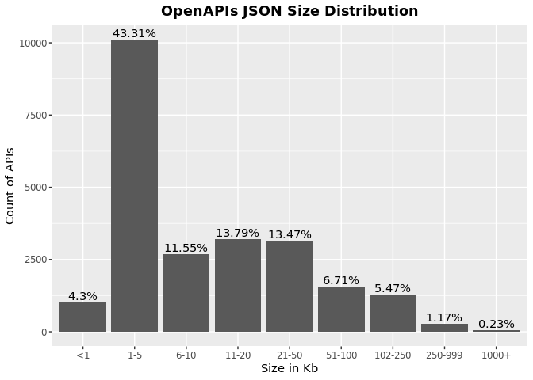
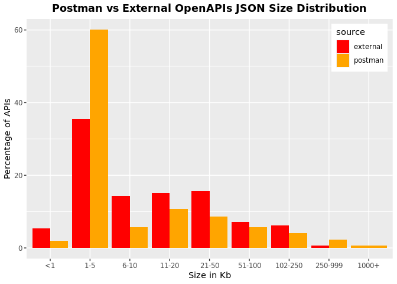

OAS JSON Size
================
Last updated: 2023-03-29

- <a href="#findings" id="toc-findings">Findings</a>
  - <a href="#what-is-the-typical-size-of-an-api"
    id="toc-what-is-the-typical-size-of-an-api">What is the typical size of
    an API?</a>
- <a href="#methodology" id="toc-methodology">Methodology</a>

*DISCLAIMER: the results and findings below are preliminary and
have not been fully validated or peer reviewed. Use with care. Do not
quote or disseminate.*

[Back to summary](oas_summary.md) \| [View related
issues](https://github.com/postman-open-technologies/knowledge-base/labels/oas%3Asize)

# Findings

## What is the typical size of an API?

- Based on 23,345 valid API specifications, the average JSON size is
  33.7Kb, ranging from \< 1Kb to 7,575Kb.
- No significant difference is observed between version 2 (33.1Kb) and 3
  (34.1Kb)
- Some interesting differences are observed between API from the Postman
  public network vs APIs collected the Internet
- It’s important to keep in mind that assessing API size can be
  challenging as we may do not have the full definition when the
  specification is spread across multiple files

Data Table

| bucket | label   | count |   pct |
|-------:|:--------|------:|------:|
|      0 | \<1     |  1003 |  4.30 |
|      1 | 1-5     | 10110 | 43.31 |
|      2 | 6-10    |  2697 | 11.55 |
|      3 | 11-20   |  3219 | 13.79 |
|      4 | 21-50   |  3145 | 13.47 |
|      5 | 51-100  |  1567 |  6.71 |
|      6 | 102-250 |  1277 |  5.47 |
|      7 | 250-999 |   273 |  1.17 |
|      8 | 1000+   |    54 |  0.23 |

Data Table

| source   | bucket | label   |    n |   pct |
|:---------|-------:|:--------|-----:|------:|
| external |      0 | \<1     |  857 |  5.39 |
| postman  |      0 | \<1     |  146 |  1.96 |
| external |      1 | 1-5     | 5643 | 35.46 |
| postman  |      1 | 1-5     | 4467 | 60.10 |
| external |      2 | 6-10    | 2277 | 14.31 |
| postman  |      2 | 6-10    |  420 |  5.65 |
| external |      3 | 11-20   | 2419 | 15.20 |
| postman  |      3 | 11-20   |  800 | 10.76 |
| external |      4 | 21-50   | 2498 | 15.70 |
| postman  |      4 | 21-50   |  647 |  8.70 |
| external |      5 | 51-100  | 1138 |  7.15 |
| postman  |      5 | 51-100  |  429 |  5.77 |
| external |      6 | 102-250 |  977 |  6.14 |
| postman  |      6 | 102-250 |  300 |  4.04 |
| external |      7 | 250-999 |  103 |  0.65 |
| postman  |      7 | 250-999 |  170 |  2.29 |
| postman  |      8 | 1000+   |   54 |  0.73 |

# Methodology

Results are based on the `json_data_size` field in the OAS resource
view. This value is computed by the Python ingestion script using size
optimized files (no indentation or cr/lf end of line characters).
