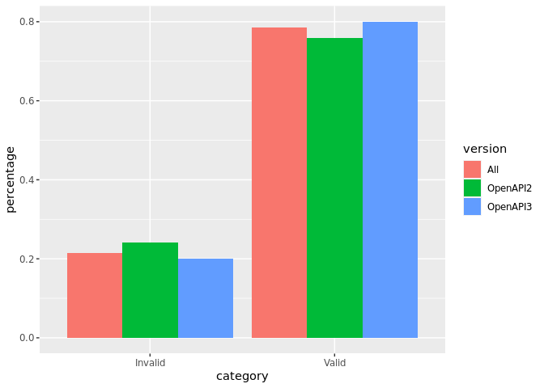

OAS Validity
================
Last updated: 2023-08-26

- <a href="#findings" id="toc-findings">Findings</a>
  - <a href="#how-many-valid-openapis-do-we-have"
    id="toc-how-many-valid-openapis-do-we-have"><em>How many valid OpenAPIs
    do we have?</em></a>
  - <a
    href="#which-top-level-paths-of-api-specifications-are-the-source-of-validation-errors"
    id="toc-which-top-level-paths-of-api-specifications-are-the-source-of-validation-errors"><em>Which
    top level paths of API specifications are the source of validation
    errors?</em></a>
- <a href="#methodology" id="toc-methodology">Methodology</a>

*DISCLAIMER: the results and findings below are preliminary and
have not been fully validated or peer reviewed. Use with care. Do not
quote or disseminate.*

[Back to summary](oas_summary.md) \| [View related
issues](https://github.com/postman-open-technologies/knowledge-base/labels/oas%3Avalidity)

# Findings

## *How many valid OpenAPIs do we have?*

- Out of 29,720 entries, 23,345 (78.5%) are valid and 6,375 (21.5%) are
  invalid
- 7,851 out of the 10,353 OpenAPI2 entries are valid (75.8%)
- 15,494 out of the 19,367 OpenAPI3 entries are valid (80%)

<!-- -->

## *Which top level paths of API specifications are the source of validation errors?*

See [source of errors](oas_validity_errors.md) for details and more
in-depth analysis around validation issues.

- A total of 186,354 validation errors are found across 6,375 invalid
  APIs
- Looking at the *error* counts, 132,096 (70.9%) are found under
  `paths`. This is followed by 36,176 (19.4%) under `components`, 13,101
  (7%) under `definitions`, 1,817 (1%) under `root`, and 1,107 (0.6%)
  under `info`
- Looking at the *API* counts, 4,000 (40.6%)have at least one error
  under `paths`. This is followed by 1,543 (15.6%) under `components`,
  1,496 (15.2%) under `root`, 854 (8.7%) under `info`, and 563 (5.7%)
  under `definitions`
- Keep in mind the `definitions` property is only used by OpenAPI 2.x
  and `components` by OpenAPI 3.x (as v2 `definitions` became
  `components/schema` in v3)
- `root` in the above findings mean an error at the highest level of the
  API specification (not under a property path)

# Methodology

Results are based on the count of the `isValid` boolean property in the
resource metadata. This flag is set by the `kb_oas_validation.py`
script, which uses the JSON schemas published under the [OAI GitHub
project](https://github.com/OAI/OpenAPI-Specification/tree/main/schemas).
Validation is performed by the Python
[jsonschema](https://github.com/python-jsonschema/jsonschema) package.
Validation errors are saved in a local file for further analysis.
