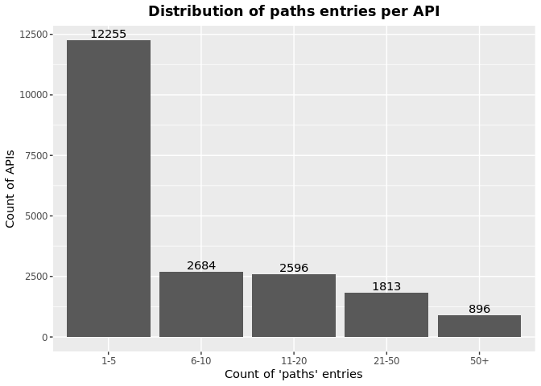

OAS Paths Analysis
================
Last updated: 2022-12-28

- <a href="#findings" id="toc-findings">Findings</a>
  - <a href="#how-is-the-path-property-used-in-apis"
    id="toc-how-is-the-path-property-used-in-apis">How is the path property
    used in APIs?</a>
- <a href="#methodology" id="toc-methodology">Methodology</a>

*DISCLAIMER: the results and findings below are preliminary and
have not been fully validated or peer reviewed. Use with care. Do not
quote or disseminate.*

[Back to summary](oas_summary.md) \| [View related
issues](https://github.com/postman-open-technologies/knowledge-base/labels/oas%3Apaths)

# Findings

## How is the path property used in APIs?

- The average number of path per API is 11.2, ranging from 1 to 310.
- Out of the 11,650 APIs with a path, 6,406 (55%) have 1-5 paths, 1,862
  (16%) have 6-10 paths, 1,758 (15.1%) have 11-20 paths, 1,148 (9.9%)
  have 21-50 paths, and 476 (0.04085837%) have over 50 paths.

# Methodology

Results are based on the content and count of entries in the `/paths`
property in the APIs specifications.
