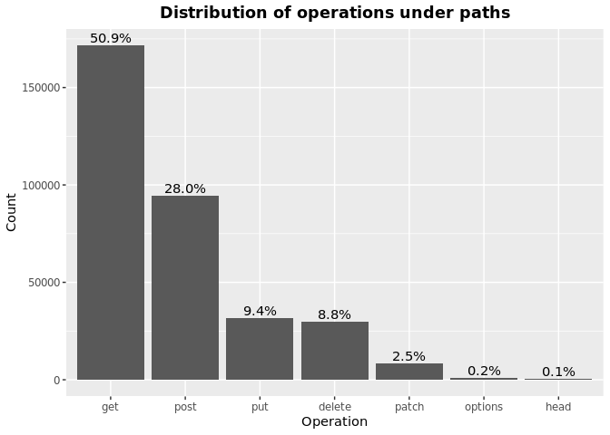
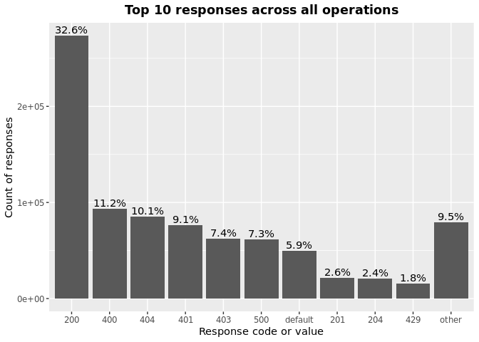
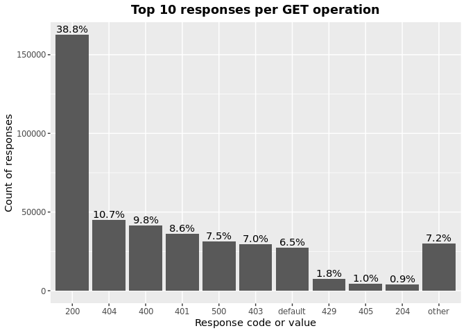
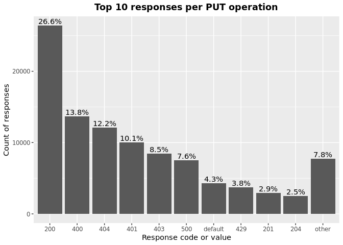
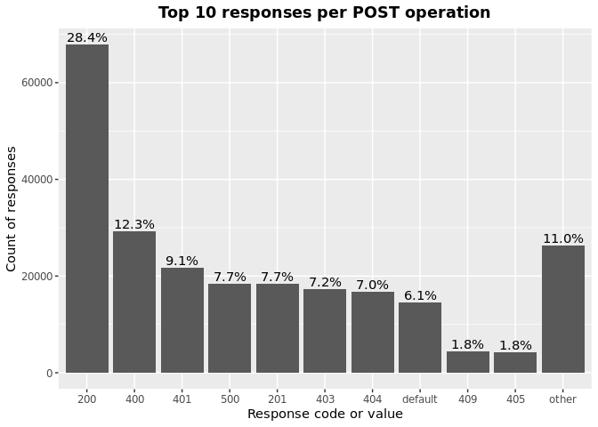
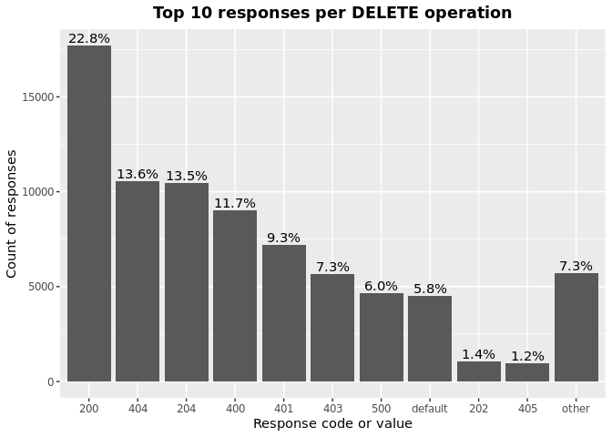
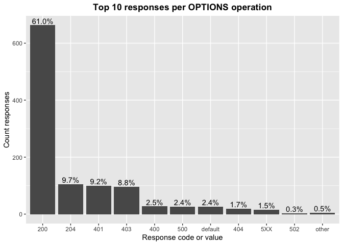
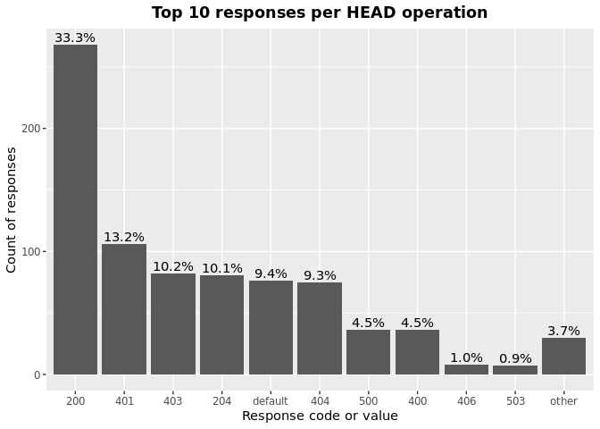
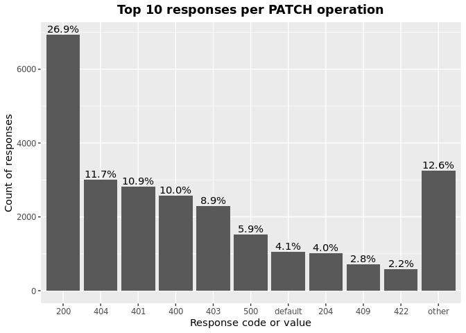

OAS Paths Operations & Responses
================
Last updated: 2023-02-07

- <a href="#findings" id="toc-findings">Findings</a>
  - <a href="#operations" id="toc-operations">Operations</a>
  - <a href="#responses" id="toc-responses">Responses</a>
  - <a href="#operations-responses" id="toc-operations-responses">Operations
    Responses</a>
    - <a href="#get" id="toc-get">GET</a>
    - <a href="#put" id="toc-put">PUT</a>
    - <a href="#post" id="toc-post">POST</a>
    - <a href="#delete" id="toc-delete">DELETE</a>
    - <a href="#options" id="toc-options">OPTIONS</a>
    - <a href="#head" id="toc-head">HEAD</a>
    - <a href="#patch" id="toc-patch">PATCH</a>
    - <a href="#trace" id="toc-trace">TRACE</a>
- <a href="#methodology" id="toc-methodology">Methodology</a>

*DISCLAIMER: the results and findings below are preliminary and
have not been fully validated or peer reviewed. Use with care. Do not
quote or disseminate.*

[Back to summary](oas_summary.md) \| [View related
issues](https://github.com/postman-open-technologies/knowledge-base/labels/oas%3Aoperations)

This document explores questions around OpenAPI paths operations
(‘get’,‘put’, ‘post’, ‘delete’, ‘options’, ‘head’, ‘patch’, ’ trace’)
and responses. Note that trace was added in OpenAPI3. See our related
[paths analysis](oas_paths.md) report for higher level findings and
other properties under `paths`.

# Findings

## Operations

Operations under paths are distributed as follows:

Table: Counts and percentages of operations under paths

| operation |      n |       pct |
|:----------|-------:|----------:|
| get       | 169231 | 0.5086075 |
| post      |  93344 | 0.2805364 |
| put       |  31427 | 0.0944508 |
| delete    |  29379 | 0.0882958 |
| patch     |   8236 | 0.0247525 |
| options   |    770 | 0.0023142 |
| head      |    347 | 0.0010429 |

## Responses

- Across all 864,153 responses, the most common codes or values are
  `200` 283,196 (32.8%), `400` 96,139 (11.1%), `404` 87,468 (10.1%),
  `401` 78,147 (9%), and `500` 63,731 (7.4%)
- A number of unassigned, / invalid codes and extensions were found. See
  table below for details.
- No significant variations were observed across specification versions
  (2.x vs 3.x) or collections

Table: Counts and percentages of responses under paths (across all
operations)

| response                             |      n |       pct |
|:-------------------------------------|-------:|----------:|
| 200                                  | 283196 | 0.3277151 |
| 400                                  |  96139 | 0.1112523 |
| 404                                  |  87468 | 0.1012182 |
| 401                                  |  78147 | 0.0904319 |
| 500                                  |  63731 | 0.0737497 |
| 403                                  |  63466 | 0.0734430 |
| default                              |  51811 | 0.0599558 |
| 201                                  |  22369 | 0.0258855 |
| 204                                  |  21014 | 0.0243175 |
| 429                                  |  15589 | 0.0180396 |
| 405                                  |  11474 | 0.0132777 |
| 409                                  |   9199 | 0.0106451 |
| 422                                  |   7828 | 0.0090586 |
| 202                                  |   7264 | 0.0084059 |
| 503                                  |   6462 | 0.0074778 |
| 415                                  |   6371 | 0.0073725 |
| 406                                  |   5575 | 0.0064514 |
| 502                                  |   3281 | 0.0037968 |
| 501                                  |   3160 | 0.0036568 |
| 304                                  |   2243 | 0.0025956 |
| 410                                  |   1749 | 0.0020239 |
| 504                                  |   1676 | 0.0019395 |
| 408                                  |   1430 | 0.0016548 |
| 412                                  |   1198 | 0.0013863 |
| 5XX                                  |   1017 | 0.0011769 |
| 480                                  |    965 | 0.0011167 |
| 4XX                                  |    880 | 0.0010183 |
| 481                                  |    873 | 0.0010102 |
| 482                                  |    731 | 0.0008459 |
| 302                                  |    645 | 0.0007464 |
| 483                                  |    537 | 0.0006214 |
| 402                                  |    526 | 0.0006087 |
| 413                                  |    489 | 0.0005659 |
| 300                                  |    414 | 0.0004791 |
| 484                                  |    406 | 0.0004698 |
| 420                                  |    386 | 0.0004467 |
| 207                                  |    358 | 0.0004143 |
| 485                                  |    285 | 0.0003298 |
| 301                                  |    271 | 0.0003136 |
| 307                                  |    210 | 0.0002430 |
| 505                                  |    202 | 0.0002338 |
| 203                                  |    194 | 0.0002245 |
| 486                                  |    183 | 0.0002118 |
| 414                                  |    178 | 0.0002060 |
| 303                                  |    148 | 0.0001713 |
| 206                                  |    143 | 0.0001655 |
| 487                                  |    124 | 0.0001435 |
| 418                                  |    122 | 0.0001412 |
| 205                                  |    101 | 0.0001169 |
| 416                                  |     94 | 0.0001088 |
| 417                                  |     91 | 0.0001053 |
| 419                                  |     85 | 0.0000984 |
| 426                                  |     69 | 0.0000798 |
| 424                                  |     68 | 0.0000787 |
| 488                                  |     65 | 0.0000752 |
| 555                                  |     62 | 0.0000717 |
| 456                                  |     61 | 0.0000706 |
| 449                                  |     56 | 0.0000648 |
| 489                                  |     46 | 0.0000532 |
| 423                                  |     45 | 0.0000521 |
| 308                                  |     44 | 0.0000509 |
| 529                                  |     43 | 0.0000498 |
| 490                                  |     39 | 0.0000451 |
| 510                                  |     39 | 0.0000451 |
| 411                                  |     37 | 0.0000428 |
| 210                                  |     36 | 0.0000417 |
| 491                                  |     34 | 0.0000393 |
| 596                                  |     34 | 0.0000393 |
| 599                                  |     30 | 0.0000347 |
| 999                                  |     30 | 0.0000347 |
| 492                                  |     29 | 0.0000336 |
| 299                                  |     26 | 0.0000301 |
| 461                                  |     26 | 0.0000301 |
| 512                                  |     26 | 0.0000301 |
| 520                                  |     26 | 0.0000301 |
| 507                                  |     25 | 0.0000289 |
| 909                                  |     25 | 0.0000289 |
| 493                                  |     24 | 0.0000278 |
| 515                                  |     23 | 0.0000266 |
| 521                                  |     23 | 0.0000266 |
| 101                                  |     22 | 0.0000255 |
| 494                                  |     22 | 0.0000255 |
| 495                                  |     22 | 0.0000255 |
| 553                                  |     22 | 0.0000255 |
| 407                                  |     21 | 0.0000243 |
| 496                                  |     20 | 0.0000231 |
| 460                                  |     19 | 0.0000220 |
| 497                                  |     19 | 0.0000220 |
| 499                                  |     19 | 0.0000220 |
| 498                                  |     18 | 0.0000208 |
| x-csm-error-codes                    |     18 | 0.0000208 |
| 421                                  |     16 | 0.0000185 |
| 100                                  |     12 | 0.0000139 |
| 2XX                                  |     10 | 0.0000116 |
| 428                                  |     10 | 0.0000116 |
| 506                                  |     10 | 0.0000116 |
| 462                                  |      9 | 0.0000104 |
| 508                                  |      9 | 0.0000104 |
| 425                                  |      8 | 0.0000093 |
| 509                                  |      8 | 0.0000093 |
| 511                                  |      8 | 0.0000093 |
| 900                                  |      8 | 0.0000093 |
| 430                                  |      7 | 0.0000081 |
| 531                                  |      7 | 0.0000081 |
| 102                                  |      6 | 0.0000069 |
| 451                                  |      6 | 0.0000069 |
| 457                                  |      6 | 0.0000069 |
| 467                                  |      6 | 0.0000069 |
| 513                                  |      6 | 0.0000069 |
| 514                                  |      6 | 0.0000069 |
| 450                                  |      5 | 0.0000058 |
| 463                                  |      5 | 0.0000058 |
| 477                                  |      5 | 0.0000058 |
| 478                                  |      5 | 0.0000058 |
| 479                                  |      5 | 0.0000058 |
| 516                                  |      5 | 0.0000058 |
| 910                                  |      5 | 0.0000058 |
| x-notification                       |      5 | 0.0000058 |
| x-vendor-operation-response-property |      5 | 0.0000058 |
| 226                                  |      4 | 0.0000046 |
| 440                                  |      4 | 0.0000046 |
| 465                                  |      4 | 0.0000046 |
| 466                                  |      4 | 0.0000046 |
| 522                                  |      4 | 0.0000046 |
| 523                                  |      4 | 0.0000046 |
| 550                                  |      4 | 0.0000046 |
| 703                                  |      4 | 0.0000046 |
| x-32700                              |      4 | 0.0000046 |
| x-std-errors                         |      4 | 0.0000046 |
| 208                                  |      3 | 0.0000035 |
| 222                                  |      3 | 0.0000035 |
| 438                                  |      3 | 0.0000035 |
| 455                                  |      3 | 0.0000035 |
| 458                                  |      3 | 0.0000035 |
| 464                                  |      3 | 0.0000035 |
| 468                                  |      3 | 0.0000035 |
| 475                                  |      3 | 0.0000035 |
| 517                                  |      3 | 0.0000035 |
| 524                                  |      3 | 0.0000035 |
| 525                                  |      3 | 0.0000035 |
| 526                                  |      3 | 0.0000035 |
| 527                                  |      3 | 0.0000035 |
| 540                                  |      3 | 0.0000035 |
| 552                                  |      3 | 0.0000035 |
| x-3                                  |      3 | 0.0000035 |
| x-32602                              |      3 | 0.0000035 |
| 236                                  |      2 | 0.0000023 |
| 444                                  |      2 | 0.0000023 |
| 448                                  |      2 | 0.0000023 |
| 454                                  |      2 | 0.0000023 |
| 473                                  |      2 | 0.0000023 |
| 518                                  |      2 | 0.0000023 |
| 528                                  |      2 | 0.0000023 |
| 530                                  |      2 | 0.0000023 |
| 551                                  |      2 | 0.0000023 |
| 103                                  |      1 | 0.0000012 |
| 209                                  |      1 | 0.0000012 |
| 215                                  |      1 | 0.0000012 |
| 218                                  |      1 | 0.0000012 |
| 220                                  |      1 | 0.0000012 |
| 250                                  |      1 | 0.0000012 |
| 255                                  |      1 | 0.0000012 |
| 305                                  |      1 | 0.0000012 |
| 306                                  |      1 | 0.0000012 |
| 333                                  |      1 | 0.0000012 |
| 431                                  |      1 | 0.0000012 |
| 469                                  |      1 | 0.0000012 |
| 472                                  |      1 | 0.0000012 |
| 474                                  |      1 | 0.0000012 |
| 476                                  |      1 | 0.0000012 |
| 532                                  |      1 | 0.0000012 |
| 533                                  |      1 | 0.0000012 |
| 534                                  |      1 | 0.0000012 |
| 535                                  |      1 | 0.0000012 |
| 536                                  |      1 | 0.0000012 |
| 544                                  |      1 | 0.0000012 |
| 560                                  |      1 | 0.0000012 |
| 561                                  |      1 | 0.0000012 |
| 591                                  |      1 | 0.0000012 |
| 593                                  |      1 | 0.0000012 |
| 598                                  |      1 | 0.0000012 |
| 601                                  |      1 | 0.0000012 |
| 704                                  |      1 | 0.0000012 |
| x-codegen-request-body-name          |      1 | 0.0000012 |
| x-swrclassic                         |      1 | 0.0000012 |

## Operations Responses

### GET

- GET is the \#1 ranked operation
- Across the 419,137 responses for GET, the most common values are `200`
  162,706 (38.8%), `404` 45,027 (10.7%), `400` 41,256 (9.8%), `401`
  36,209 (8.6%), and `500` 31,459 (7.5%)

Table: Counts and percentages of responses for the GET operation

| response                             |      n |       pct |
|:-------------------------------------|-------:|----------:|
| 200                                  | 162706 | 0.3881929 |
| 404                                  |  45027 | 0.1074279 |
| 400                                  |  41256 | 0.0984308 |
| 401                                  |  36209 | 0.0863894 |
| 500                                  |  31459 | 0.0750566 |
| 403                                  |  29505 | 0.0703946 |
| default                              |  27233 | 0.0649740 |
| 429                                  |   7508 | 0.0179130 |
| 405                                  |   4396 | 0.0104882 |
| 204                                  |   3809 | 0.0090877 |
| 503                                  |   3760 | 0.0089708 |
| 406                                  |   3355 | 0.0080045 |
| 415                                  |   3034 | 0.0072387 |
| 202                                  |   2464 | 0.0058787 |
| 409                                  |   2289 | 0.0054612 |
| 422                                  |   2113 | 0.0050413 |
| 502                                  |   1873 | 0.0044687 |
| 304                                  |   1670 | 0.0039844 |
| 501                                  |   1458 | 0.0034786 |
| 504                                  |   1161 | 0.0027700 |
| 410                                  |    833 | 0.0019874 |
| 408                                  |    659 | 0.0015723 |
| 5XX                                  |    508 | 0.0012120 |
| 4XX                                  |    482 | 0.0011500 |
| 302                                  |    359 | 0.0008565 |
| 201                                  |    297 | 0.0007086 |
| 412                                  |    294 | 0.0007014 |
| 420                                  |    252 | 0.0006012 |
| 300                                  |    247 | 0.0005893 |
| 301                                  |    235 | 0.0005607 |
| 402                                  |    205 | 0.0004891 |
| 413                                  |    188 | 0.0004485 |
| 480                                  |    168 | 0.0004008 |
| 203                                  |    165 | 0.0003937 |
| 481                                  |    158 | 0.0003770 |
| 307                                  |    156 | 0.0003722 |
| 505                                  |    146 | 0.0003483 |
| 207                                  |    139 | 0.0003316 |
| 482                                  |    126 | 0.0003006 |
| 414                                  |    123 | 0.0002935 |
| 206                                  |    113 | 0.0002696 |
| 418                                  |    106 | 0.0002529 |
| 416                                  |     79 | 0.0001885 |
| 303                                  |     78 | 0.0001861 |
| 483                                  |     63 | 0.0001503 |
| 484                                  |     48 | 0.0001145 |
| 426                                  |     44 | 0.0001050 |
| 417                                  |     38 | 0.0000907 |
| 419                                  |     34 | 0.0000811 |
| 485                                  |     31 | 0.0000740 |
| 456                                  |     29 | 0.0000692 |
| 423                                  |     28 | 0.0000668 |
| 555                                  |     27 | 0.0000644 |
| 299                                  |     25 | 0.0000596 |
| 529                                  |     22 | 0.0000525 |
| 553                                  |     21 | 0.0000501 |
| 510                                  |     20 | 0.0000477 |
| 205                                  |     18 | 0.0000429 |
| 424                                  |     17 | 0.0000406 |
| 101                                  |     16 | 0.0000382 |
| 999                                  |     15 | 0.0000358 |
| 308                                  |     14 | 0.0000334 |
| 512                                  |     11 | 0.0000262 |
| 461                                  |     11 | 0.0000262 |
| 596                                  |     10 | 0.0000239 |
| 407                                  |     10 | 0.0000239 |
| 909                                  |     10 | 0.0000239 |
| 460                                  |      8 | 0.0000191 |
| 100                                  |      8 | 0.0000191 |
| 462                                  |      8 | 0.0000191 |
| 520                                  |      8 | 0.0000191 |
| 421                                  |      7 | 0.0000167 |
| 411                                  |      5 | 0.0000119 |
| x-vendor-operation-response-property |      5 | 0.0000119 |
| 515                                  |      5 | 0.0000119 |
| 910                                  |      5 | 0.0000119 |
| 428                                  |      5 | 0.0000119 |
| 900                                  |      5 | 0.0000119 |
| 521                                  |      5 | 0.0000119 |
| 2XX                                  |      4 | 0.0000095 |
| 465                                  |      4 | 0.0000095 |
| 467                                  |      4 | 0.0000095 |
| x-csm-error-codes                    |      4 | 0.0000095 |
| 487                                  |      3 | 0.0000072 |
| 451                                  |      3 | 0.0000072 |
| 102                                  |      3 | 0.0000072 |
| 703                                  |      3 | 0.0000072 |
| 222                                  |      3 | 0.0000072 |
| 449                                  |      3 | 0.0000072 |
| 486                                  |      3 | 0.0000072 |
| 550                                  |      2 | 0.0000048 |
| 440                                  |      2 | 0.0000048 |
| 527                                  |      2 | 0.0000048 |
| 526                                  |      2 | 0.0000048 |
| 236                                  |      2 | 0.0000048 |
| 525                                  |      2 | 0.0000048 |
| 523                                  |      2 | 0.0000048 |
| 511                                  |      2 | 0.0000048 |
| 522                                  |      2 | 0.0000048 |
| 430                                  |      2 | 0.0000048 |
| 444                                  |      2 | 0.0000048 |
| 208                                  |      2 | 0.0000048 |
| 552                                  |      2 | 0.0000048 |
| 497                                  |      1 | 0.0000024 |
| 431                                  |      1 | 0.0000024 |
| 450                                  |      1 | 0.0000024 |
| 425                                  |      1 | 0.0000024 |
| 472                                  |      1 | 0.0000024 |
| 333                                  |      1 | 0.0000024 |
| 488                                  |      1 | 0.0000024 |
| 489                                  |      1 | 0.0000024 |
| 490                                  |      1 | 0.0000024 |
| 491                                  |      1 | 0.0000024 |
| 494                                  |      1 | 0.0000024 |
| 495                                  |      1 | 0.0000024 |
| 496                                  |      1 | 0.0000024 |
| 498                                  |      1 | 0.0000024 |
| 499                                  |      1 | 0.0000024 |
| 306                                  |      1 | 0.0000024 |
| 305                                  |      1 | 0.0000024 |
| 226                                  |      1 | 0.0000024 |
| 220                                  |      1 | 0.0000024 |
| 506                                  |      1 | 0.0000024 |
| 507                                  |      1 | 0.0000024 |
| 508                                  |      1 | 0.0000024 |
| 509                                  |      1 | 0.0000024 |
| 218                                  |      1 | 0.0000024 |
| 524                                  |      1 | 0.0000024 |
| 528                                  |      1 | 0.0000024 |
| 210                                  |      1 | 0.0000024 |
| 530                                  |      1 | 0.0000024 |
| 544                                  |      1 | 0.0000024 |
| 551                                  |      1 | 0.0000024 |
| 103                                  |      1 | 0.0000024 |
| 560                                  |      1 | 0.0000024 |
| 561                                  |      1 | 0.0000024 |
| 598                                  |      1 | 0.0000024 |
| 601                                  |      1 | 0.0000024 |
| x-codegen-request-body-name          |      1 | 0.0000024 |
| x-swrclassic                         |      1 | 0.0000024 |

### PUT

- PUT is the \#3 ranked operation
- Across the 98,529 responses for PUT, the most common values are `200`
  26,162 (26.6%), `400` 13,582 (13.8%), `404` 11,970 (12.1%), `401`
  9,946 (10.1%), and `403` 8,385 (8.5%)

Table: Counts and percentages of responses for the PUT operation

| response |     n |       pct |
|:---------|------:|----------:|
| 200      | 26162 | 0.2655259 |
| 400      | 13582 | 0.1378477 |
| 404      | 11970 | 0.1214871 |
| 401      |  9946 | 0.1009449 |
| 403      |  8385 | 0.0851018 |
| 500      |  7448 | 0.0755920 |
| default  |  4282 | 0.0434593 |
| 429      |  3744 | 0.0379990 |
| 201      |  2870 | 0.0291285 |
| 204      |  2497 | 0.0253428 |
| 405      |  1365 | 0.0138538 |
| 422      |  1133 | 0.0114992 |
| 409      |   948 | 0.0096215 |
| 202      |   811 | 0.0082311 |
| 415      |   526 | 0.0053385 |
| 406      |   372 | 0.0037755 |
| 503      |   366 | 0.0037146 |
| 412      |   328 | 0.0033290 |
| 501      |   307 | 0.0031158 |
| 502      |   226 | 0.0022937 |
| 410      |   214 | 0.0021719 |
| 408      |   161 | 0.0016340 |
| 304      |   114 | 0.0011570 |
| 5XX      |    59 | 0.0005988 |
| 504      |    51 | 0.0005176 |
| 207      |    46 | 0.0004669 |
| 505      |    41 | 0.0004161 |
| 205      |    39 | 0.0003958 |
| 481      |    34 | 0.0003451 |
| 482      |    34 | 0.0003451 |
| 480      |    34 | 0.0003451 |
| 485      |    30 | 0.0003045 |
| 483      |    30 | 0.0003045 |
| 484      |    30 | 0.0003045 |
| 486      |    27 | 0.0002740 |
| 307      |    25 | 0.0002537 |
| 413      |    24 | 0.0002436 |
| 301      |    24 | 0.0002436 |
| 487      |    23 | 0.0002334 |
| 210      |    22 | 0.0002233 |
| 521      |    18 | 0.0001827 |
| 302      |    18 | 0.0001827 |
| 402      |    17 | 0.0001725 |
| 300      |    14 | 0.0001421 |
| 555      |    12 | 0.0001218 |
| 4XX      |    12 | 0.0001218 |
| 420      |    10 | 0.0001015 |
| 414      |    10 | 0.0001015 |
| 417      |     9 | 0.0000913 |
| 416      |     7 | 0.0000710 |
| 424      |     6 | 0.0000609 |
| 456      |     6 | 0.0000609 |
| 203      |     6 | 0.0000609 |
| 423      |     6 | 0.0000609 |
| 510      |     5 | 0.0000507 |
| 461      |     4 | 0.0000406 |
| 449      |     4 | 0.0000406 |
| 428      |     4 | 0.0000406 |
| 460      |     4 | 0.0000406 |
| 407      |     4 | 0.0000406 |
| 2XX      |     3 | 0.0000304 |
| 308      |     3 | 0.0000304 |
| 303      |     3 | 0.0000304 |
| 515      |     2 | 0.0000203 |
| 550      |     2 | 0.0000203 |
| 524      |     1 | 0.0000101 |
| 540      |     1 | 0.0000101 |
| 551      |     1 | 0.0000101 |
| 552      |     1 | 0.0000101 |
| 411      |     1 | 0.0000101 |
| 100      |     1 | 0.0000101 |
| 507      |     1 | 0.0000101 |
| 512      |     1 | 0.0000101 |
| 206      |     1 | 0.0000101 |
| 703      |     1 | 0.0000101 |

### POST

- POST is the \#2 ranked operation
- Across the 242,143 responses for POST, the most common values are
  `200` 68,852 (28.4%), `400` 29,726 (12.3%), `401` 21,822 (9%), `500`
  18,664 (7.7%), and `201` 18,557 (7.7%)

Table: Counts and percentages of responses for the POST operation

| response          |     n |       pct |
|:------------------|------:|----------:|
| 200               | 68852 | 0.2843444 |
| 400               | 29726 | 0.1227622 |
| 401               | 21822 | 0.0901203 |
| 500               | 18664 | 0.0770784 |
| 201               | 18557 | 0.0766365 |
| 403               | 17480 | 0.0721887 |
| 404               | 16976 | 0.0701073 |
| default           | 14705 | 0.0607286 |
| 409               |  4398 | 0.0181628 |
| 405               |  4328 | 0.0178737 |
| 422               |  3457 | 0.0142767 |
| 429               |  3260 | 0.0134631 |
| 204               |  3153 | 0.0130212 |
| 202               |  2708 | 0.0111835 |
| 415               |  1907 | 0.0078755 |
| 503               |  1812 | 0.0074832 |
| 406               |  1074 | 0.0044354 |
| 501               |   958 | 0.0039563 |
| 480               |   731 | 0.0030189 |
| 502               |   694 | 0.0028661 |
| 481               |   649 | 0.0026802 |
| 482               |   541 | 0.0022342 |
| 408               |   440 | 0.0018171 |
| 483               |   416 | 0.0017180 |
| 504               |   411 | 0.0016973 |
| 410               |   402 | 0.0016602 |
| 412               |   325 | 0.0013422 |
| 484               |   303 | 0.0012513 |
| 5XX               |   279 | 0.0011522 |
| 302               |   258 | 0.0010655 |
| 413               |   251 | 0.0010366 |
| 402               |   249 | 0.0010283 |
| 4XX               |   209 | 0.0008631 |
| 485               |   203 | 0.0008383 |
| 304               |   185 | 0.0007640 |
| 486               |   139 | 0.0005740 |
| 207               |   136 | 0.0005617 |
| 420               |   115 | 0.0004749 |
| 487               |    96 | 0.0003965 |
| 488               |    64 | 0.0002643 |
| 303               |    59 | 0.0002437 |
| 300               |    54 | 0.0002230 |
| 489               |    45 | 0.0001858 |
| 449               |    41 | 0.0001693 |
| 419               |    41 | 0.0001693 |
| 490               |    38 | 0.0001569 |
| 414               |    38 | 0.0001569 |
| 417               |    36 | 0.0001487 |
| 491               |    33 | 0.0001363 |
| 599               |    30 | 0.0001239 |
| 492               |    29 | 0.0001198 |
| 205               |    29 | 0.0001198 |
| 411               |    26 | 0.0001074 |
| 596               |    24 | 0.0000991 |
| 493               |    24 | 0.0000991 |
| 206               |    22 | 0.0000909 |
| 456               |    22 | 0.0000909 |
| 507               |    21 | 0.0000867 |
| 494               |    21 | 0.0000867 |
| 495               |    21 | 0.0000867 |
| 496               |    19 | 0.0000785 |
| 203               |    19 | 0.0000785 |
| 424               |    19 | 0.0000785 |
| 520               |    18 | 0.0000743 |
| 497               |    18 | 0.0000743 |
| 499               |    18 | 0.0000743 |
| 529               |    18 | 0.0000743 |
| 498               |    17 | 0.0000702 |
| 307               |    16 | 0.0000661 |
| 308               |    16 | 0.0000661 |
| 909               |    15 | 0.0000619 |
| 999               |    15 | 0.0000619 |
| 426               |    15 | 0.0000619 |
| 515               |    14 | 0.0000578 |
| 512               |    14 | 0.0000578 |
| 418               |    14 | 0.0000578 |
| 510               |    13 | 0.0000537 |
| 210               |    13 | 0.0000537 |
| 505               |    12 | 0.0000496 |
| x-csm-error-codes |    10 | 0.0000413 |
| 421               |     9 | 0.0000372 |
| 506               |     9 | 0.0000372 |
| 508               |     8 | 0.0000330 |
| 407               |     7 | 0.0000289 |
| 531               |     7 | 0.0000289 |
| 423               |     7 | 0.0000289 |
| 425               |     7 | 0.0000289 |
| 460               |     7 | 0.0000289 |
| 509               |     7 | 0.0000289 |
| 101               |     6 | 0.0000248 |
| 511               |     6 | 0.0000248 |
| 457               |     6 | 0.0000248 |
| 513               |     6 | 0.0000248 |
| 514               |     6 | 0.0000248 |
| 516               |     5 | 0.0000206 |
| 430               |     5 | 0.0000206 |
| 416               |     5 | 0.0000206 |
| x-notification    |     5 | 0.0000206 |
| 479               |     5 | 0.0000206 |
| 478               |     5 | 0.0000206 |
| 477               |     5 | 0.0000206 |
| 463               |     5 | 0.0000206 |
| 450               |     4 | 0.0000165 |
| 461               |     4 | 0.0000165 |
| 466               |     4 | 0.0000165 |
| x-32700           |     4 | 0.0000165 |
| 455               |     3 | 0.0000124 |
| 451               |     3 | 0.0000124 |
| 517               |     3 | 0.0000124 |
| 555               |     3 | 0.0000124 |
| 468               |     3 | 0.0000124 |
| 900               |     3 | 0.0000124 |
| 464               |     3 | 0.0000124 |
| x-3               |     3 | 0.0000124 |
| x-32602           |     3 | 0.0000124 |
| 102               |     3 | 0.0000124 |
| 475               |     3 | 0.0000124 |
| 438               |     3 | 0.0000124 |
| 458               |     3 | 0.0000124 |
| 301               |     2 | 0.0000083 |
| 454               |     2 | 0.0000083 |
| x-std-errors      |     2 | 0.0000083 |
| 448               |     2 | 0.0000083 |
| 226               |     2 | 0.0000083 |
| 540               |     2 | 0.0000083 |
| 518               |     2 | 0.0000083 |
| 467               |     2 | 0.0000083 |
| 440               |     2 | 0.0000083 |
| 522               |     2 | 0.0000083 |
| 2XX               |     2 | 0.0000083 |
| 523               |     2 | 0.0000083 |
| 473               |     2 | 0.0000083 |
| 462               |     1 | 0.0000041 |
| 474               |     1 | 0.0000041 |
| 469               |     1 | 0.0000041 |
| 524               |     1 | 0.0000041 |
| 525               |     1 | 0.0000041 |
| 526               |     1 | 0.0000041 |
| 527               |     1 | 0.0000041 |
| 528               |     1 | 0.0000041 |
| 530               |     1 | 0.0000041 |
| 532               |     1 | 0.0000041 |
| 533               |     1 | 0.0000041 |
| 534               |     1 | 0.0000041 |
| 535               |     1 | 0.0000041 |
| 536               |     1 | 0.0000041 |
| 553               |     1 | 0.0000041 |
| 591               |     1 | 0.0000041 |
| 593               |     1 | 0.0000041 |
| 255               |     1 | 0.0000041 |
| 250               |     1 | 0.0000041 |
| 704               |     1 | 0.0000041 |
| 215               |     1 | 0.0000041 |
| 208               |     1 | 0.0000041 |
| 100               |     1 | 0.0000041 |
| 476               |     1 | 0.0000041 |

### DELETE

- DELETE is the \#4 ranked operation
- Across the 76,328 responses for DELETE, the most common values are
  `200` 17,439 (22.8%), `404` 10,382 (13.6%), `204` 10,333 (13.5%),
  `400` 8,911 (11.7%), and `401` 7,116 (9.3%)

Table: Counts and percentages of responses for the DELETE operation

| response          |     n |       pct |
|:------------------|------:|----------:|
| 200               | 17439 | 0.2284745 |
| 404               | 10382 | 0.1360182 |
| 204               | 10333 | 0.1353763 |
| 400               |  8911 | 0.1167461 |
| 401               |  7116 | 0.0932292 |
| 403               |  5605 | 0.0734331 |
| 500               |  4545 | 0.0595456 |
| default           |  4402 | 0.0576722 |
| 202               |  1031 | 0.0135075 |
| 405               |   944 | 0.0123677 |
| 409               |   845 | 0.0110706 |
| 429               |   799 | 0.0104680 |
| 422               |   545 | 0.0071402 |
| 415               |   494 | 0.0064721 |
| 406               |   403 | 0.0052798 |
| 503               |   311 | 0.0040745 |
| 501               |   287 | 0.0037601 |
| 502               |   274 | 0.0035898 |
| 410               |   223 | 0.0029216 |
| 412               |   222 | 0.0029085 |
| 201               |   211 | 0.0027644 |
| 304               |   189 | 0.0024762 |
| 408               |   158 | 0.0020700 |
| 5XX               |   102 | 0.0013363 |
| 4XX               |    79 | 0.0010350 |
| 300               |    44 | 0.0005765 |
| 504               |    34 | 0.0004454 |
| 481               |    32 | 0.0004192 |
| 480               |    32 | 0.0004192 |
| 207               |    31 | 0.0004061 |
| 482               |    30 | 0.0003930 |
| 483               |    28 | 0.0003668 |
| 484               |    25 | 0.0003275 |
| 402               |    24 | 0.0003144 |
| 424               |    21 | 0.0002751 |
| 485               |    21 | 0.0002751 |
| 413               |    17 | 0.0002227 |
| 486               |    14 | 0.0001834 |
| 555               |    10 | 0.0001310 |
| 420               |     9 | 0.0001179 |
| 419               |     8 | 0.0001048 |
| 303               |     8 | 0.0001048 |
| 308               |     7 | 0.0000917 |
| 307               |     7 | 0.0000917 |
| 414               |     7 | 0.0000917 |
| 302               |     7 | 0.0000917 |
| 417               |     6 | 0.0000786 |
| 449               |     6 | 0.0000786 |
| 426               |     5 | 0.0000655 |
| 205               |     5 | 0.0000655 |
| 456               |     4 | 0.0000524 |
| 203               |     4 | 0.0000524 |
| 206               |     4 | 0.0000524 |
| 461               |     4 | 0.0000524 |
| 529               |     3 | 0.0000393 |
| 505               |     3 | 0.0000393 |
| 487               |     2 | 0.0000262 |
| 515               |     2 | 0.0000262 |
| x-std-errors      |     2 | 0.0000262 |
| x-csm-error-codes |     2 | 0.0000262 |
| 507               |     1 | 0.0000131 |
| 510               |     1 | 0.0000131 |
| 2XX               |     1 | 0.0000131 |
| 299               |     1 | 0.0000131 |
| 226               |     1 | 0.0000131 |
| 423               |     1 | 0.0000131 |
| 418               |     1 | 0.0000131 |
| 416               |     1 | 0.0000131 |
| 301               |     1 | 0.0000131 |
| 100               |     1 | 0.0000131 |

### OPTIONS

- OPTIONS is the \#6 ranked operation
- Across the 1,161 responses for OPTIONS, the most common values are
  `200` 721 (62.1%), `204` 109 (9.4%), `401` 103 (8.9%), `403` 99
  (8.5%), and `500` 34 (2.9%)

Table: Counts and percentages of responses for the OPTIONS operation

| response |   n |       pct |
|:---------|----:|----------:|
| 200      | 721 | 0.6210164 |
| 204      | 109 | 0.0938846 |
| 401      | 103 | 0.0887166 |
| 403      |  99 | 0.0852713 |
| 500      |  34 | 0.0292851 |
| 400      |  26 | 0.0223945 |
| default  |  26 | 0.0223945 |
| 404      |  19 | 0.0163652 |
| 5XX      |  16 | 0.0137812 |
| 502      |   3 | 0.0025840 |
| 504      |   3 | 0.0025840 |
| 409      |   2 | 0.0017227 |

### HEAD

- HEAD is the \#7 ranked operation
- Across the 820 responses for HEAD, the most common values are `200`
  273 (33.3%), `401` 109 (13.3%), `403` 85 (10.4%), `204` 83 (10.1%),
  and `default` 78 (9.5%)

Table: Counts and percentages of responses for the HEAD operation

| response |   n |       pct |
|:---------|----:|----------:|
| 200      | 273 | 0.3329268 |
| 401      | 109 | 0.1329268 |
| 403      |  85 | 0.1036585 |
| 204      |  83 | 0.1012195 |
| default  |  78 | 0.0951220 |
| 404      |  76 | 0.0926829 |
| 400      |  36 | 0.0439024 |
| 500      |  35 | 0.0426829 |
| 406      |   8 | 0.0097561 |
| 503      |   7 | 0.0085366 |
| 429      |   6 | 0.0073171 |
| 501      |   3 | 0.0036585 |
| 409      |   3 | 0.0036585 |
| 412      |   2 | 0.0024390 |
| 304      |   2 | 0.0024390 |
| 5XX      |   2 | 0.0024390 |
| 419      |   2 | 0.0024390 |
| 422      |   2 | 0.0024390 |
| 410      |   2 | 0.0024390 |
| 408      |   2 | 0.0024390 |
| 307      |   1 | 0.0012195 |
| 415      |   1 | 0.0012195 |
| 416      |   1 | 0.0012195 |
| 206      |   1 | 0.0012195 |

### PATCH

- PATCH is the \#5 ranked operation
- Across the 26,035 responses for PATCH, the most common values are
  `200` 7,043 (27.1%), `404` 3,018 (11.6%), `401` 2,842 (10.9%), `400`
  2,602 (10%), and `403` 2,307 (8.9%)

Table: Counts and percentages of responses for the PATCH operation

| response          |    n |       pct |
|:------------------|-----:|----------:|
| 200               | 7043 | 0.2705205 |
| 404               | 3018 | 0.1159209 |
| 401               | 2842 | 0.1091607 |
| 400               | 2602 | 0.0999424 |
| 403               | 2307 | 0.0886115 |
| 500               | 1546 | 0.0593816 |
| default           | 1085 | 0.0416747 |
| 204               | 1030 | 0.0395621 |
| 409               |  714 | 0.0274246 |
| 422               |  578 | 0.0222009 |
| 405               |  441 | 0.0169387 |
| 201               |  434 | 0.0166699 |
| 415               |  409 | 0.0157096 |
| 406               |  363 | 0.0139428 |
| 429               |  272 | 0.0104475 |
| 202               |  250 | 0.0096025 |
| 502               |  211 | 0.0081045 |
| 503               |  206 | 0.0079124 |
| 501               |  147 | 0.0056462 |
| 4XX               |   98 | 0.0037642 |
| 304               |   83 | 0.0031880 |
| 410               |   75 | 0.0028807 |
| 300               |   55 | 0.0021125 |
| 5XX               |   51 | 0.0019589 |
| 402               |   31 | 0.0011907 |
| 412               |   27 | 0.0010371 |
| 504               |   16 | 0.0006146 |
| 555               |   10 | 0.0003841 |
| 408               |   10 | 0.0003841 |
| 205               |   10 | 0.0003841 |
| 413               |    9 | 0.0003457 |
| 301               |    9 | 0.0003457 |
| 207               |    6 | 0.0002305 |
| 411               |    5 | 0.0001920 |
| 307               |    5 | 0.0001920 |
| 426               |    5 | 0.0001920 |
| 424               |    5 | 0.0001920 |
| 308               |    4 | 0.0001536 |
| 302               |    3 | 0.0001152 |
| 461               |    3 | 0.0001152 |
| 423               |    3 | 0.0001152 |
| x-csm-error-codes |    2 | 0.0000768 |
| 417               |    2 | 0.0000768 |
| 449               |    2 | 0.0000768 |
| 206               |    2 | 0.0000768 |
| 507               |    1 | 0.0000384 |
| 428               |    1 | 0.0000384 |
| 418               |    1 | 0.0000384 |
| 416               |    1 | 0.0000384 |
| 100               |    1 | 0.0000384 |
| 209               |    1 | 0.0000384 |

### TRACE

*This operation is excluded from the analysis as it has, sadly, not been
found so far in any API.*

# Methodology

The above statistics are derived from multiple database views querying
the OpenAPI JSON under the `/paths/<path>/<operation>/<responses>`.
