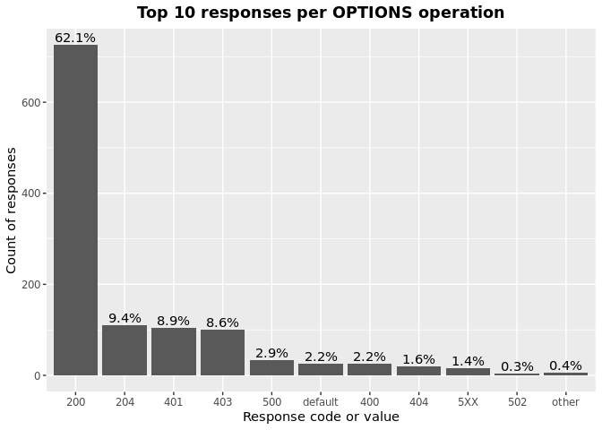

OAS Paths Operations & Responses
================
Last updated: 2023-02-11

- <a href="#findings" id="toc-findings">Findings</a>
  - <a href="#operations" id="toc-operations">Operations</a>
  - <a href="#responses" id="toc-responses">Responses</a>
  - <a href="#operations-responses" id="toc-operations-responses">Operations
    Responses</a>
    - <a href="#get" id="toc-get">GET</a>
    - <a href="#put" id="toc-put">PUT</a>
    - <a href="#post" id="toc-post">POST</a>
    - <a href="#delete" id="toc-delete">DELETE</a>
    - <a href="#options" id="toc-options">OPTIONS</a>
    - <a href="#head" id="toc-head">HEAD</a>
    - <a href="#patch" id="toc-patch">PATCH</a>
    - <a href="#trace" id="toc-trace">TRACE</a>
- <a href="#methodology" id="toc-methodology">Methodology</a>

*DISCLAIMER: the results and findings below are preliminary and
have not been fully validated or peer reviewed. Use with care. Do not
quote or disseminate.*

[Back to summary](oas_summary.md) \| [View related
issues](https://github.com/postman-open-technologies/knowledge-base/labels/oas%3Aoperations)

This document explores questions around OpenAPI paths operations
(‘get’,‘put’, ‘post’, ‘delete’, ‘options’, ‘head’, ‘patch’, ’ trace’)
and responses. Note that trace was added in OpenAPI3. See our related
[paths analysis](oas_paths.md) report for higher level findings and
other properties under `paths`.

# Findings

## Operations

Operations under paths are distributed as follows:

Table: Counts and percentages of operations under paths

| operation |      n |       pct |
|:----------|-------:|----------:|
| get       | 171114 | 0.5084401 |
| post      |  94466 | 0.2806918 |
| put       |  31782 | 0.0944355 |
| delete    |  29736 | 0.0883562 |
| patch     |   8323 | 0.0247306 |
| options   |    774 | 0.0022998 |
| head      |    352 | 0.0010459 |

## Responses

- Across all 872,917 responses, the most common codes or values are
  `200` 286,395 (32.8%), `400` 97,017 (11.1%), `404` 88,328 (10.1%),
  `401` 78,776 (9%), and `500` 64,447 (7.4%)
- A number of unassigned, / invalid codes and extensions were found. See
  table below for details.
- No significant variations were observed across specification versions
  (2.x vs 3.x) or collections

Table: Counts and percentages of responses under paths (across all
operations)

| response                             |      n |       pct |
|:-------------------------------------|-------:|----------:|
| 200                                  | 286395 | 0.3280896 |
| 400                                  |  97017 | 0.1111412 |
| 404                                  |  88328 | 0.1011872 |
| 401                                  |  78776 | 0.0902445 |
| 500                                  |  64447 | 0.0738295 |
| 403                                  |  64078 | 0.0734068 |
| default                              |  52452 | 0.0600882 |
| 201                                  |  22699 | 0.0260036 |
| 204                                  |  21185 | 0.0242692 |
| 429                                  |  15620 | 0.0178940 |
| 405                                  |  11561 | 0.0132441 |
| 409                                  |   9278 | 0.0106287 |
| 422                                  |   7920 | 0.0090730 |
| 202                                  |   7350 | 0.0084200 |
| 503                                  |   6535 | 0.0074864 |
| 415                                  |   6417 | 0.0073512 |
| 406                                  |   5641 | 0.0064622 |
| 502                                  |   3318 | 0.0038010 |
| 501                                  |   3184 | 0.0036475 |
| 304                                  |   2244 | 0.0025707 |
| 410                                  |   1751 | 0.0020059 |
| 504                                  |   1690 | 0.0019360 |
| 408                                  |   1431 | 0.0016393 |
| 412                                  |   1226 | 0.0014045 |
| 5XX                                  |   1017 | 0.0011651 |
| 480                                  |    964 | 0.0011043 |
| 4XX                                  |    886 | 0.0010150 |
| 481                                  |    872 | 0.0009989 |
| 482                                  |    730 | 0.0008363 |
| 302                                  |    664 | 0.0007607 |
| 483                                  |    536 | 0.0006140 |
| 402                                  |    527 | 0.0006037 |
| 413                                  |    495 | 0.0005671 |
| 300                                  |    414 | 0.0004743 |
| 484                                  |    405 | 0.0004640 |
| 420                                  |    386 | 0.0004422 |
| 207                                  |    360 | 0.0004124 |
| 485                                  |    285 | 0.0003265 |
| 301                                  |    271 | 0.0003105 |
| 307                                  |    212 | 0.0002429 |
| 505                                  |    202 | 0.0002314 |
| 203                                  |    198 | 0.0002268 |
| 486                                  |    183 | 0.0002096 |
| 414                                  |    178 | 0.0002039 |
| 303                                  |    148 | 0.0001695 |
| 206                                  |    143 | 0.0001638 |
| 418                                  |    137 | 0.0001569 |
| 487                                  |    124 | 0.0001421 |
| 205                                  |    102 | 0.0001168 |
| 416                                  |     93 | 0.0001065 |
| 417                                  |     91 | 0.0001042 |
| 419                                  |     91 | 0.0001042 |
| 426                                  |     69 | 0.0000790 |
| 424                                  |     68 | 0.0000779 |
| 488                                  |     65 | 0.0000745 |
| 555                                  |     62 | 0.0000710 |
| 456                                  |     61 | 0.0000699 |
| 449                                  |     56 | 0.0000642 |
| 423                                  |     46 | 0.0000527 |
| 489                                  |     46 | 0.0000527 |
| 308                                  |     44 | 0.0000504 |
| 529                                  |     43 | 0.0000493 |
| 490                                  |     39 | 0.0000447 |
| 510                                  |     39 | 0.0000447 |
| 210                                  |     37 | 0.0000424 |
| 411                                  |     37 | 0.0000424 |
| 491                                  |     34 | 0.0000389 |
| 596                                  |     34 | 0.0000389 |
| 599                                  |     30 | 0.0000344 |
| 999                                  |     30 | 0.0000344 |
| 492                                  |     29 | 0.0000332 |
| 299                                  |     26 | 0.0000298 |
| 461                                  |     26 | 0.0000298 |
| 512                                  |     26 | 0.0000298 |
| 520                                  |     26 | 0.0000298 |
| 507                                  |     25 | 0.0000286 |
| 909                                  |     25 | 0.0000286 |
| 493                                  |     24 | 0.0000275 |
| 515                                  |     23 | 0.0000263 |
| 521                                  |     23 | 0.0000263 |
| 101                                  |     22 | 0.0000252 |
| 494                                  |     22 | 0.0000252 |
| 495                                  |     22 | 0.0000252 |
| 553                                  |     22 | 0.0000252 |
| 407                                  |     21 | 0.0000241 |
| 496                                  |     20 | 0.0000229 |
| 460                                  |     19 | 0.0000218 |
| 497                                  |     19 | 0.0000218 |
| 499                                  |     19 | 0.0000218 |
| 498                                  |     18 | 0.0000206 |
| x-csm-error-codes                    |     18 | 0.0000206 |
| 421                                  |     16 | 0.0000183 |
| 100                                  |     12 | 0.0000137 |
| 2XX                                  |     12 | 0.0000137 |
| 428                                  |     10 | 0.0000115 |
| 506                                  |     10 | 0.0000115 |
| 462                                  |      9 | 0.0000103 |
| 508                                  |      9 | 0.0000103 |
| 425                                  |      8 | 0.0000092 |
| 509                                  |      8 | 0.0000092 |
| 511                                  |      8 | 0.0000092 |
| 900                                  |      8 | 0.0000092 |
| 430                                  |      7 | 0.0000080 |
| 531                                  |      7 | 0.0000080 |
| 102                                  |      6 | 0.0000069 |
| 451                                  |      6 | 0.0000069 |
| 457                                  |      6 | 0.0000069 |
| 467                                  |      6 | 0.0000069 |
| 513                                  |      6 | 0.0000069 |
| 514                                  |      6 | 0.0000069 |
| 450                                  |      5 | 0.0000057 |
| 463                                  |      5 | 0.0000057 |
| 477                                  |      5 | 0.0000057 |
| 478                                  |      5 | 0.0000057 |
| 479                                  |      5 | 0.0000057 |
| 516                                  |      5 | 0.0000057 |
| 910                                  |      5 | 0.0000057 |
| x-notification                       |      5 | 0.0000057 |
| x-vendor-operation-response-property |      5 | 0.0000057 |
| 208                                  |      4 | 0.0000046 |
| 226                                  |      4 | 0.0000046 |
| 440                                  |      4 | 0.0000046 |
| 465                                  |      4 | 0.0000046 |
| 466                                  |      4 | 0.0000046 |
| 522                                  |      4 | 0.0000046 |
| 523                                  |      4 | 0.0000046 |
| 550                                  |      4 | 0.0000046 |
| 703                                  |      4 | 0.0000046 |
| x-32700                              |      4 | 0.0000046 |
| x-std-errors                         |      4 | 0.0000046 |
| 222                                  |      3 | 0.0000034 |
| 438                                  |      3 | 0.0000034 |
| 455                                  |      3 | 0.0000034 |
| 458                                  |      3 | 0.0000034 |
| 464                                  |      3 | 0.0000034 |
| 468                                  |      3 | 0.0000034 |
| 475                                  |      3 | 0.0000034 |
| 517                                  |      3 | 0.0000034 |
| 524                                  |      3 | 0.0000034 |
| 525                                  |      3 | 0.0000034 |
| 526                                  |      3 | 0.0000034 |
| 527                                  |      3 | 0.0000034 |
| 540                                  |      3 | 0.0000034 |
| 552                                  |      3 | 0.0000034 |
| x-3                                  |      3 | 0.0000034 |
| x-32602                              |      3 | 0.0000034 |
| 236                                  |      2 | 0.0000023 |
| 444                                  |      2 | 0.0000023 |
| 448                                  |      2 | 0.0000023 |
| 454                                  |      2 | 0.0000023 |
| 473                                  |      2 | 0.0000023 |
| 518                                  |      2 | 0.0000023 |
| 528                                  |      2 | 0.0000023 |
| 530                                  |      2 | 0.0000023 |
| 551                                  |      2 | 0.0000023 |
| 103                                  |      1 | 0.0000011 |
| 209                                  |      1 | 0.0000011 |
| 215                                  |      1 | 0.0000011 |
| 218                                  |      1 | 0.0000011 |
| 220                                  |      1 | 0.0000011 |
| 250                                  |      1 | 0.0000011 |
| 255                                  |      1 | 0.0000011 |
| 305                                  |      1 | 0.0000011 |
| 306                                  |      1 | 0.0000011 |
| 333                                  |      1 | 0.0000011 |
| 431                                  |      1 | 0.0000011 |
| 469                                  |      1 | 0.0000011 |
| 472                                  |      1 | 0.0000011 |
| 474                                  |      1 | 0.0000011 |
| 476                                  |      1 | 0.0000011 |
| 532                                  |      1 | 0.0000011 |
| 533                                  |      1 | 0.0000011 |
| 534                                  |      1 | 0.0000011 |
| 535                                  |      1 | 0.0000011 |
| 536                                  |      1 | 0.0000011 |
| 544                                  |      1 | 0.0000011 |
| 560                                  |      1 | 0.0000011 |
| 561                                  |      1 | 0.0000011 |
| 591                                  |      1 | 0.0000011 |
| 593                                  |      1 | 0.0000011 |
| 598                                  |      1 | 0.0000011 |
| 601                                  |      1 | 0.0000011 |
| 704                                  |      1 | 0.0000011 |
| x-codegen-request-body-name          |      1 | 0.0000011 |
| x-swrclassic                         |      1 | 0.0000011 |

## Operations Responses

### GET

- GET is the \#1 ranked operation
- Across the 423,071 responses for GET, the most common values are `200`
  164,491 (38.9%), `404` 45,416 (10.7%), `400` 41,591 (9.8%), `401`
  36,461 (8.6%), and `500` 31,767 (7.5%)

Table: Counts and percentages of responses for the GET operation

| response                             |      n |       pct |
|:-------------------------------------|-------:|----------:|
| 200                                  | 164491 | 0.3888024 |
| 404                                  |  45416 | 0.1073484 |
| 400                                  |  41591 | 0.0983074 |
| 401                                  |  36461 | 0.0861818 |
| 500                                  |  31767 | 0.0750867 |
| 403                                  |  29789 | 0.0704113 |
| default                              |  27529 | 0.0650695 |
| 429                                  |   7525 | 0.0177866 |
| 405                                  |   4414 | 0.0104332 |
| 204                                  |   3833 | 0.0090599 |
| 503                                  |   3802 | 0.0089867 |
| 406                                  |   3383 | 0.0079963 |
| 415                                  |   3056 | 0.0072234 |
| 202                                  |   2469 | 0.0058359 |
| 409                                  |   2303 | 0.0054435 |
| 422                                  |   2143 | 0.0050653 |
| 502                                  |   1889 | 0.0044650 |
| 304                                  |   1670 | 0.0039473 |
| 501                                  |   1466 | 0.0034651 |
| 504                                  |   1168 | 0.0027608 |
| 410                                  |    835 | 0.0019737 |
| 408                                  |    659 | 0.0015577 |
| 5XX                                  |    508 | 0.0012007 |
| 4XX                                  |    484 | 0.0011440 |
| 302                                  |    374 | 0.0008840 |
| 412                                  |    310 | 0.0007327 |
| 201                                  |    302 | 0.0007138 |
| 420                                  |    252 | 0.0005956 |
| 300                                  |    247 | 0.0005838 |
| 301                                  |    235 | 0.0005555 |
| 402                                  |    205 | 0.0004846 |
| 413                                  |    192 | 0.0004538 |
| 480                                  |    168 | 0.0003971 |
| 203                                  |    167 | 0.0003947 |
| 481                                  |    158 | 0.0003735 |
| 307                                  |    158 | 0.0003735 |
| 505                                  |    146 | 0.0003451 |
| 207                                  |    139 | 0.0003286 |
| 482                                  |    126 | 0.0002978 |
| 414                                  |    123 | 0.0002907 |
| 206                                  |    113 | 0.0002671 |
| 418                                  |    112 | 0.0002647 |
| 303                                  |     78 | 0.0001844 |
| 416                                  |     78 | 0.0001844 |
| 483                                  |     63 | 0.0001489 |
| 484                                  |     48 | 0.0001135 |
| 426                                  |     44 | 0.0001040 |
| 417                                  |     38 | 0.0000898 |
| 419                                  |     34 | 0.0000804 |
| 485                                  |     31 | 0.0000733 |
| 456                                  |     29 | 0.0000685 |
| 423                                  |     28 | 0.0000662 |
| 555                                  |     27 | 0.0000638 |
| 299                                  |     25 | 0.0000591 |
| 529                                  |     22 | 0.0000520 |
| 553                                  |     21 | 0.0000496 |
| 510                                  |     20 | 0.0000473 |
| 205                                  |     18 | 0.0000425 |
| 424                                  |     17 | 0.0000402 |
| 101                                  |     16 | 0.0000378 |
| 999                                  |     15 | 0.0000355 |
| 308                                  |     14 | 0.0000331 |
| 512                                  |     11 | 0.0000260 |
| 461                                  |     11 | 0.0000260 |
| 596                                  |     10 | 0.0000236 |
| 407                                  |     10 | 0.0000236 |
| 909                                  |     10 | 0.0000236 |
| 460                                  |      8 | 0.0000189 |
| 100                                  |      8 | 0.0000189 |
| 462                                  |      8 | 0.0000189 |
| 520                                  |      8 | 0.0000189 |
| 421                                  |      7 | 0.0000165 |
| 411                                  |      5 | 0.0000118 |
| x-vendor-operation-response-property |      5 | 0.0000118 |
| 2XX                                  |      5 | 0.0000118 |
| 515                                  |      5 | 0.0000118 |
| 428                                  |      5 | 0.0000118 |
| 900                                  |      5 | 0.0000118 |
| 521                                  |      5 | 0.0000118 |
| 910                                  |      5 | 0.0000118 |
| 465                                  |      4 | 0.0000095 |
| 467                                  |      4 | 0.0000095 |
| x-csm-error-codes                    |      4 | 0.0000095 |
| 487                                  |      3 | 0.0000071 |
| 451                                  |      3 | 0.0000071 |
| 102                                  |      3 | 0.0000071 |
| 703                                  |      3 | 0.0000071 |
| 222                                  |      3 | 0.0000071 |
| 449                                  |      3 | 0.0000071 |
| 486                                  |      3 | 0.0000071 |
| 550                                  |      2 | 0.0000047 |
| 440                                  |      2 | 0.0000047 |
| 527                                  |      2 | 0.0000047 |
| 526                                  |      2 | 0.0000047 |
| 236                                  |      2 | 0.0000047 |
| 525                                  |      2 | 0.0000047 |
| 523                                  |      2 | 0.0000047 |
| 511                                  |      2 | 0.0000047 |
| 522                                  |      2 | 0.0000047 |
| 430                                  |      2 | 0.0000047 |
| 444                                  |      2 | 0.0000047 |
| 208                                  |      2 | 0.0000047 |
| 552                                  |      2 | 0.0000047 |
| 497                                  |      1 | 0.0000024 |
| 431                                  |      1 | 0.0000024 |
| 450                                  |      1 | 0.0000024 |
| 425                                  |      1 | 0.0000024 |
| 472                                  |      1 | 0.0000024 |
| 333                                  |      1 | 0.0000024 |
| 488                                  |      1 | 0.0000024 |
| 489                                  |      1 | 0.0000024 |
| 490                                  |      1 | 0.0000024 |
| 491                                  |      1 | 0.0000024 |
| 494                                  |      1 | 0.0000024 |
| 495                                  |      1 | 0.0000024 |
| 496                                  |      1 | 0.0000024 |
| 498                                  |      1 | 0.0000024 |
| 499                                  |      1 | 0.0000024 |
| 306                                  |      1 | 0.0000024 |
| 305                                  |      1 | 0.0000024 |
| 226                                  |      1 | 0.0000024 |
| 220                                  |      1 | 0.0000024 |
| 506                                  |      1 | 0.0000024 |
| 507                                  |      1 | 0.0000024 |
| 508                                  |      1 | 0.0000024 |
| 509                                  |      1 | 0.0000024 |
| 218                                  |      1 | 0.0000024 |
| 524                                  |      1 | 0.0000024 |
| 528                                  |      1 | 0.0000024 |
| 210                                  |      1 | 0.0000024 |
| 530                                  |      1 | 0.0000024 |
| 544                                  |      1 | 0.0000024 |
| 551                                  |      1 | 0.0000024 |
| 103                                  |      1 | 0.0000024 |
| 560                                  |      1 | 0.0000024 |
| 561                                  |      1 | 0.0000024 |
| 598                                  |      1 | 0.0000024 |
| 601                                  |      1 | 0.0000024 |
| x-codegen-request-body-name          |      1 | 0.0000024 |
| x-swrclassic                         |      1 | 0.0000024 |

### PUT

- PUT is the \#3 ranked operation
- Across the 99,587 responses for PUT, the most common values are `200`
  26,469 (26.6%), `400` 13,707 (13.8%), `404` 12,108 (12.2%), `401`
  10,023 (10.1%), and `403` 8,467 (8.5%)

Table: Counts and percentages of responses for the PUT operation

| response |     n |       pct |
|:---------|------:|----------:|
| 200      | 26469 | 0.2657877 |
| 400      | 13707 | 0.1376384 |
| 404      | 12108 | 0.1215821 |
| 401      | 10023 | 0.1006457 |
| 403      |  8467 | 0.0850211 |
| 500      |  7530 | 0.0756123 |
| default  |  4333 | 0.0435097 |
| 429      |  3744 | 0.0375953 |
| 201      |  2922 | 0.0293412 |
| 204      |  2518 | 0.0252844 |
| 405      |  1391 | 0.0139677 |
| 422      |  1151 | 0.0115577 |
| 409      |   959 | 0.0096298 |
| 202      |   823 | 0.0082641 |
| 415      |   529 | 0.0053119 |
| 406      |   388 | 0.0038961 |
| 503      |   382 | 0.0038358 |
| 412      |   332 | 0.0033338 |
| 501      |   317 | 0.0031831 |
| 502      |   229 | 0.0022995 |
| 410      |   214 | 0.0021489 |
| 408      |   161 | 0.0016167 |
| 304      |   114 | 0.0011447 |
| 5XX      |    59 | 0.0005924 |
| 504      |    51 | 0.0005121 |
| 207      |    46 | 0.0004619 |
| 505      |    41 | 0.0004117 |
| 205      |    39 | 0.0003916 |
| 482      |    34 | 0.0003414 |
| 481      |    34 | 0.0003414 |
| 480      |    34 | 0.0003414 |
| 483      |    30 | 0.0003012 |
| 485      |    30 | 0.0003012 |
| 484      |    30 | 0.0003012 |
| 486      |    27 | 0.0002711 |
| 307      |    25 | 0.0002510 |
| 413      |    24 | 0.0002410 |
| 301      |    24 | 0.0002410 |
| 487      |    23 | 0.0002310 |
| 210      |    22 | 0.0002209 |
| 521      |    18 | 0.0001807 |
| 302      |    18 | 0.0001807 |
| 402      |    17 | 0.0001707 |
| 300      |    14 | 0.0001406 |
| 4XX      |    12 | 0.0001205 |
| 555      |    12 | 0.0001205 |
| 420      |    10 | 0.0001004 |
| 414      |    10 | 0.0001004 |
| 417      |     9 | 0.0000904 |
| 416      |     7 | 0.0000703 |
| 456      |     6 | 0.0000602 |
| 203      |     6 | 0.0000602 |
| 424      |     6 | 0.0000602 |
| 423      |     6 | 0.0000602 |
| 510      |     5 | 0.0000502 |
| 461      |     4 | 0.0000402 |
| 460      |     4 | 0.0000402 |
| 449      |     4 | 0.0000402 |
| 428      |     4 | 0.0000402 |
| 2XX      |     4 | 0.0000402 |
| 407      |     4 | 0.0000402 |
| 308      |     3 | 0.0000301 |
| 303      |     3 | 0.0000301 |
| 515      |     2 | 0.0000201 |
| 419      |     2 | 0.0000201 |
| 550      |     2 | 0.0000201 |
| 552      |     1 | 0.0000100 |
| 703      |     1 | 0.0000100 |
| 524      |     1 | 0.0000100 |
| 540      |     1 | 0.0000100 |
| 411      |     1 | 0.0000100 |
| 551      |     1 | 0.0000100 |
| 418      |     1 | 0.0000100 |
| 206      |     1 | 0.0000100 |
| 100      |     1 | 0.0000100 |
| 507      |     1 | 0.0000100 |
| 512      |     1 | 0.0000100 |

### POST

- POST is the \#2 ranked operation
- Across the 244,626 responses for POST, the most common values are
  `200` 69,635 (28.5%), `400` 30,010 (12.3%), `401` 22,031 (9%), `500`
  18,866 (7.7%), and `201` 18,819 (7.7%)

Table: Counts and percentages of responses for the POST operation

| response          |     n |       pct |
|:------------------|------:|----------:|
| 200               | 69635 | 0.2846590 |
| 400               | 30010 | 0.1226771 |
| 401               | 22031 | 0.0900599 |
| 500               | 18866 | 0.0771218 |
| 201               | 18819 | 0.0769297 |
| 403               | 17628 | 0.0720610 |
| 404               | 17122 | 0.0699926 |
| default           | 14900 | 0.0609093 |
| 409               |  4439 | 0.0181461 |
| 405               |  4360 | 0.0178231 |
| 422               |  3496 | 0.0142912 |
| 429               |  3272 | 0.0133755 |
| 204               |  3167 | 0.0129463 |
| 202               |  2740 | 0.0112008 |
| 415               |  1925 | 0.0078692 |
| 503               |  1818 | 0.0074318 |
| 406               |  1088 | 0.0044476 |
| 501               |   961 | 0.0039284 |
| 480               |   730 | 0.0029841 |
| 502               |   709 | 0.0028983 |
| 481               |   648 | 0.0026489 |
| 482               |   540 | 0.0022075 |
| 408               |   440 | 0.0017987 |
| 504               |   418 | 0.0017087 |
| 483               |   415 | 0.0016965 |
| 410               |   402 | 0.0016433 |
| 412               |   329 | 0.0013449 |
| 484               |   302 | 0.0012345 |
| 5XX               |   279 | 0.0011405 |
| 302               |   261 | 0.0010669 |
| 413               |   253 | 0.0010342 |
| 402               |   250 | 0.0010220 |
| 4XX               |   211 | 0.0008625 |
| 485               |   203 | 0.0008298 |
| 304               |   186 | 0.0007603 |
| 486               |   139 | 0.0005682 |
| 207               |   138 | 0.0005641 |
| 420               |   115 | 0.0004701 |
| 487               |    96 | 0.0003924 |
| 488               |    64 | 0.0002616 |
| 303               |    59 | 0.0002412 |
| 300               |    54 | 0.0002207 |
| 489               |    45 | 0.0001840 |
| 419               |    43 | 0.0001758 |
| 449               |    41 | 0.0001676 |
| 414               |    38 | 0.0001553 |
| 490               |    38 | 0.0001553 |
| 417               |    36 | 0.0001472 |
| 491               |    33 | 0.0001349 |
| 599               |    30 | 0.0001226 |
| 205               |    30 | 0.0001226 |
| 492               |    29 | 0.0001185 |
| 411               |    26 | 0.0001063 |
| 493               |    24 | 0.0000981 |
| 596               |    24 | 0.0000981 |
| 206               |    22 | 0.0000899 |
| 456               |    22 | 0.0000899 |
| 507               |    21 | 0.0000858 |
| 203               |    21 | 0.0000858 |
| 495               |    21 | 0.0000858 |
| 494               |    21 | 0.0000858 |
| 496               |    19 | 0.0000777 |
| 424               |    19 | 0.0000777 |
| 520               |    18 | 0.0000736 |
| 529               |    18 | 0.0000736 |
| 497               |    18 | 0.0000736 |
| 499               |    18 | 0.0000736 |
| 418               |    17 | 0.0000695 |
| 498               |    17 | 0.0000695 |
| 307               |    16 | 0.0000654 |
| 308               |    16 | 0.0000654 |
| 426               |    15 | 0.0000613 |
| 909               |    15 | 0.0000613 |
| 999               |    15 | 0.0000613 |
| 210               |    14 | 0.0000572 |
| 512               |    14 | 0.0000572 |
| 515               |    14 | 0.0000572 |
| 510               |    13 | 0.0000531 |
| 505               |    12 | 0.0000491 |
| x-csm-error-codes |    10 | 0.0000409 |
| 421               |     9 | 0.0000368 |
| 506               |     9 | 0.0000368 |
| 508               |     8 | 0.0000327 |
| 423               |     8 | 0.0000327 |
| 407               |     7 | 0.0000286 |
| 425               |     7 | 0.0000286 |
| 531               |     7 | 0.0000286 |
| 460               |     7 | 0.0000286 |
| 509               |     7 | 0.0000286 |
| 511               |     6 | 0.0000245 |
| 457               |     6 | 0.0000245 |
| 101               |     6 | 0.0000245 |
| 514               |     6 | 0.0000245 |
| 513               |     6 | 0.0000245 |
| 463               |     5 | 0.0000204 |
| 516               |     5 | 0.0000204 |
| 477               |     5 | 0.0000204 |
| 478               |     5 | 0.0000204 |
| 479               |     5 | 0.0000204 |
| x-notification    |     5 | 0.0000204 |
| 430               |     5 | 0.0000204 |
| 416               |     5 | 0.0000204 |
| 450               |     4 | 0.0000164 |
| x-32700           |     4 | 0.0000164 |
| 461               |     4 | 0.0000164 |
| 466               |     4 | 0.0000164 |
| 451               |     3 | 0.0000123 |
| 102               |     3 | 0.0000123 |
| 438               |     3 | 0.0000123 |
| 455               |     3 | 0.0000123 |
| 458               |     3 | 0.0000123 |
| 464               |     3 | 0.0000123 |
| 468               |     3 | 0.0000123 |
| 475               |     3 | 0.0000123 |
| 517               |     3 | 0.0000123 |
| 555               |     3 | 0.0000123 |
| 900               |     3 | 0.0000123 |
| x-3               |     3 | 0.0000123 |
| x-32602           |     3 | 0.0000123 |
| 467               |     2 | 0.0000082 |
| 518               |     2 | 0.0000082 |
| 473               |     2 | 0.0000082 |
| 440               |     2 | 0.0000082 |
| 301               |     2 | 0.0000082 |
| 2XX               |     2 | 0.0000082 |
| 522               |     2 | 0.0000082 |
| x-std-errors      |     2 | 0.0000082 |
| 454               |     2 | 0.0000082 |
| 523               |     2 | 0.0000082 |
| 226               |     2 | 0.0000082 |
| 540               |     2 | 0.0000082 |
| 208               |     2 | 0.0000082 |
| 448               |     2 | 0.0000082 |
| 593               |     1 | 0.0000041 |
| 704               |     1 | 0.0000041 |
| 255               |     1 | 0.0000041 |
| 250               |     1 | 0.0000041 |
| 469               |     1 | 0.0000041 |
| 215               |     1 | 0.0000041 |
| 533               |     1 | 0.0000041 |
| 462               |     1 | 0.0000041 |
| 524               |     1 | 0.0000041 |
| 525               |     1 | 0.0000041 |
| 526               |     1 | 0.0000041 |
| 527               |     1 | 0.0000041 |
| 528               |     1 | 0.0000041 |
| 530               |     1 | 0.0000041 |
| 532               |     1 | 0.0000041 |
| 534               |     1 | 0.0000041 |
| 535               |     1 | 0.0000041 |
| 536               |     1 | 0.0000041 |
| 553               |     1 | 0.0000041 |
| 591               |     1 | 0.0000041 |
| 100               |     1 | 0.0000041 |
| 474               |     1 | 0.0000041 |
| 476               |     1 | 0.0000041 |

### DELETE

- DELETE is the \#4 ranked operation
- Across the 77,323 responses for DELETE, the most common values are
  `200` 17,679 (22.9%), `404` 10,530 (13.6%), `204` 10,440 (13.5%),
  `400` 9,009 (11.7%), and `401` 7,182 (9.3%)

Table: Counts and percentages of responses for the DELETE operation

| response          |     n |       pct |
|:------------------|------:|----------:|
| 200               | 17679 | 0.2286383 |
| 404               | 10530 | 0.1361820 |
| 204               | 10440 | 0.1350180 |
| 400               |  9009 | 0.1165113 |
| 401               |  7182 | 0.0928831 |
| 403               |  5681 | 0.0734710 |
| 500               |  4649 | 0.0601244 |
| default           |  4469 | 0.0577965 |
| 202               |  1057 | 0.0136699 |
| 405               |   953 | 0.0123249 |
| 409               |   850 | 0.0109928 |
| 429               |   801 | 0.0103591 |
| 422               |   548 | 0.0070872 |
| 415               |   497 | 0.0064276 |
| 406               |   411 | 0.0053154 |
| 503               |   320 | 0.0041385 |
| 501               |   290 | 0.0037505 |
| 502               |   277 | 0.0035824 |
| 412               |   226 | 0.0029228 |
| 410               |   223 | 0.0028840 |
| 201               |   217 | 0.0028064 |
| 304               |   189 | 0.0024443 |
| 408               |   159 | 0.0020563 |
| 5XX               |   102 | 0.0013191 |
| 4XX               |    80 | 0.0010346 |
| 300               |    44 | 0.0005690 |
| 504               |    34 | 0.0004397 |
| 481               |    32 | 0.0004138 |
| 480               |    32 | 0.0004138 |
| 207               |    31 | 0.0004009 |
| 482               |    30 | 0.0003880 |
| 483               |    28 | 0.0003621 |
| 484               |    25 | 0.0003233 |
| 402               |    24 | 0.0003104 |
| 424               |    21 | 0.0002716 |
| 485               |    21 | 0.0002716 |
| 413               |    17 | 0.0002199 |
| 486               |    14 | 0.0001811 |
| 555               |    10 | 0.0001293 |
| 419               |    10 | 0.0001293 |
| 420               |     9 | 0.0001164 |
| 303               |     8 | 0.0001035 |
| 414               |     7 | 0.0000905 |
| 308               |     7 | 0.0000905 |
| 307               |     7 | 0.0000905 |
| 302               |     7 | 0.0000905 |
| 449               |     6 | 0.0000776 |
| 417               |     6 | 0.0000776 |
| 418               |     5 | 0.0000647 |
| 426               |     5 | 0.0000647 |
| 205               |     5 | 0.0000647 |
| 203               |     4 | 0.0000517 |
| 456               |     4 | 0.0000517 |
| 206               |     4 | 0.0000517 |
| 461               |     4 | 0.0000517 |
| 529               |     3 | 0.0000388 |
| 505               |     3 | 0.0000388 |
| 487               |     2 | 0.0000259 |
| 515               |     2 | 0.0000259 |
| x-std-errors      |     2 | 0.0000259 |
| x-csm-error-codes |     2 | 0.0000259 |
| 510               |     1 | 0.0000129 |
| 2XX               |     1 | 0.0000129 |
| 299               |     1 | 0.0000129 |
| 226               |     1 | 0.0000129 |
| 423               |     1 | 0.0000129 |
| 416               |     1 | 0.0000129 |
| 301               |     1 | 0.0000129 |
| 507               |     1 | 0.0000129 |
| 100               |     1 | 0.0000129 |

### OPTIONS

- OPTIONS is the \#6 ranked operation
- Across the 1,168 responses for OPTIONS, the most common values are
  `200` 725 (62.1%), `204` 110 (9.4%), `401` 104 (8.9%), `403` 100
  (8.6%), and `500` 34 (2.9%)

Table: Counts and percentages of responses for the OPTIONS operation

| response |   n |       pct |
|:---------|----:|----------:|
| 200      | 725 | 0.6207192 |
| 204      | 110 | 0.0941781 |
| 401      | 104 | 0.0890411 |
| 403      | 100 | 0.0856164 |
| 500      |  34 | 0.0291096 |
| 400      |  26 | 0.0222603 |
| default  |  26 | 0.0222603 |
| 404      |  19 | 0.0162671 |
| 5XX      |  16 | 0.0136986 |
| 502      |   3 | 0.0025685 |
| 504      |   3 | 0.0025685 |
| 409      |   2 | 0.0017123 |

### HEAD

- HEAD is the \#7 ranked operation
- Across the 838 responses for HEAD, the most common values are `200`
  276 (32.9%), `401` 112 (13.4%), `403` 88 (10.5%), `204` 85 (10.1%),
  and `404` 78 (9.3%)

Table: Counts and percentages of responses for the HEAD operation

| response |   n |       pct |
|:---------|----:|----------:|
| 200      | 276 | 0.3293556 |
| 401      | 112 | 0.1336516 |
| 403      |  88 | 0.1050119 |
| 204      |  85 | 0.1014320 |
| 404      |  78 | 0.0930788 |
| default  |  78 | 0.0930788 |
| 400      |  38 | 0.0453461 |
| 500      |  37 | 0.0441527 |
| 406      |   8 | 0.0095465 |
| 503      |   7 | 0.0083532 |
| 429      |   6 | 0.0071599 |
| 409      |   3 | 0.0035800 |
| 501      |   3 | 0.0035800 |
| 304      |   2 | 0.0023866 |
| 419      |   2 | 0.0023866 |
| 422      |   2 | 0.0023866 |
| 412      |   2 | 0.0023866 |
| 408      |   2 | 0.0023866 |
| 410      |   2 | 0.0023866 |
| 5XX      |   2 | 0.0023866 |
| 415      |   1 | 0.0011933 |
| 206      |   1 | 0.0011933 |
| 302      |   1 | 0.0011933 |
| 307      |   1 | 0.0011933 |
| 416      |   1 | 0.0011933 |

### PATCH

- PATCH is the \#5 ranked operation
- Across the 26,304 responses for PATCH, the most common values are
  `200` 7,120 (27.1%), `404` 3,055 (11.6%), `401` 2,863 (10.9%), `400`
  2,636 (10%), and `403` 2,325 (8.8%)

Table: Counts and percentages of responses for the PATCH operation

| response          |    n |       pct |
|:------------------|-----:|----------:|
| 200               | 7120 | 0.2706813 |
| 404               | 3055 | 0.1161420 |
| 401               | 2863 | 0.1088428 |
| 400               | 2636 | 0.1002129 |
| 403               | 2325 | 0.0883896 |
| 500               | 1564 | 0.0594586 |
| default           | 1117 | 0.0424650 |
| 204               | 1032 | 0.0392336 |
| 409               |  722 | 0.0274483 |
| 422               |  580 | 0.0220499 |
| 405               |  443 | 0.0168415 |
| 201               |  439 | 0.0166895 |
| 415               |  409 | 0.0155490 |
| 406               |  363 | 0.0138002 |
| 429               |  272 | 0.0103406 |
| 202               |  261 | 0.0099224 |
| 502               |  211 | 0.0080216 |
| 503               |  206 | 0.0078315 |
| 501               |  147 | 0.0055885 |
| 4XX               |   99 | 0.0037637 |
| 304               |   83 | 0.0031554 |
| 410               |   75 | 0.0028513 |
| 300               |   55 | 0.0020909 |
| 5XX               |   51 | 0.0019389 |
| 402               |   31 | 0.0011785 |
| 412               |   27 | 0.0010265 |
| 504               |   16 | 0.0006083 |
| 555               |   10 | 0.0003802 |
| 408               |   10 | 0.0003802 |
| 205               |   10 | 0.0003802 |
| 301               |    9 | 0.0003422 |
| 413               |    9 | 0.0003422 |
| 207               |    6 | 0.0002281 |
| 426               |    5 | 0.0001901 |
| 424               |    5 | 0.0001901 |
| 411               |    5 | 0.0001901 |
| 307               |    5 | 0.0001901 |
| 308               |    4 | 0.0001521 |
| 302               |    3 | 0.0001141 |
| 461               |    3 | 0.0001141 |
| 423               |    3 | 0.0001141 |
| 206               |    2 | 0.0000760 |
| 417               |    2 | 0.0000760 |
| 418               |    2 | 0.0000760 |
| 449               |    2 | 0.0000760 |
| x-csm-error-codes |    2 | 0.0000760 |
| 507               |    1 | 0.0000380 |
| 428               |    1 | 0.0000380 |
| 416               |    1 | 0.0000380 |
| 100               |    1 | 0.0000380 |
| 209               |    1 | 0.0000380 |

### TRACE

*This operation is excluded from the analysis as it has, sadly, not been
found so far in any API.*

# Methodology

The above statistics are derived from multiple database views querying
the OpenAPI JSON under the `/paths/<path>/<operation>/<responses>`.
