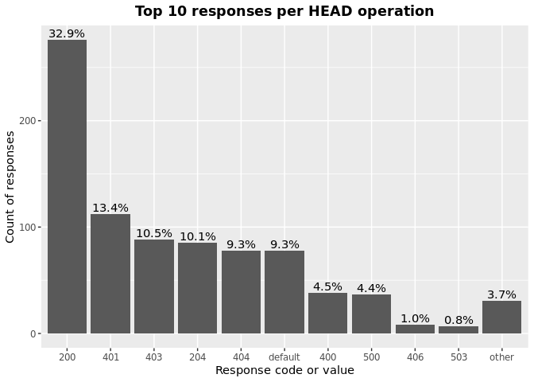

OAS Paths Operations & Responses
================
Last updated: 2023-02-05

- <a href="#findings" id="toc-findings">Findings</a>
  - <a href="#operations" id="toc-operations">Operations</a>
  - <a href="#responses" id="toc-responses">Responses</a>
  - <a href="#operations-responses" id="toc-operations-responses">Operations
    Responses</a>
    - <a href="#get" id="toc-get">GET</a>
    - <a href="#put" id="toc-put">PUT</a>
    - <a href="#post" id="toc-post">POST</a>
    - <a href="#delete" id="toc-delete">DELETE</a>
    - <a href="#options" id="toc-options">OPTIONS</a>
    - <a href="#head" id="toc-head">HEAD</a>
    - <a href="#patch" id="toc-patch">PATCH</a>
    - <a href="#trace" id="toc-trace">TRACE</a>
- <a href="#methodology" id="toc-methodology">Methodology</a>

*DISCLAIMER: the results and findings below are preliminary and
have not been fully validated or peer reviewed. Use with care. Do not
quote or disseminate.*

[Back to summary](oas_summary.md) \| [View related
issues](https://github.com/postman-open-technologies/knowledge-base/labels/oas%3Aoperations)

This document explores questions around OpenAPI paths operations
(‘get’,‘put’, ‘post’, ‘delete’, ‘options’, ‘head’, ‘patch’, ’ trace’)
and responses. Note that trace was added in OpenAPI3. See our related
[paths analysis](oas_paths.md) report for higher level findings and
other properties under `paths`.

# Findings

## Operations

Operations under paths are distributed as follows:

Table: Counts and percentages of operations under paths

| operation |      n |       pct |
|:----------|-------:|----------:|
| get       | 167140 | 0.5084277 |
| post      |  92206 | 0.2804839 |
| put       |  31129 | 0.0946921 |
| delete    |  29052 | 0.0883741 |
| patch     |   8124 | 0.0247126 |
| options   |    746 | 0.0022693 |
| head      |    342 | 0.0010403 |

## Responses

- Across all 854,944 responses, the most common codes or values are
  `200` 279,647 (32.7%), `400` 95,199 (11.1%), `404` 86,550 (10.1%),
  `401` 77,596 (9.1%), and `403` 62,919 (7.4%)
- A number of unassigned, / invalid codes and extensions were found. See
  table below for details.
- No significant variations were observed across specification versions
  (2.x vs 3.x) or collections

Table: Counts and percentages of responses under paths (across all
operations)

| response                             |      n |       pct |
|:-------------------------------------|-------:|----------:|
| 200                                  | 279647 | 0.3270939 |
| 400                                  |  95199 | 0.1113512 |
| 404                                  |  86550 | 0.1012347 |
| 401                                  |  77596 | 0.0907615 |
| 403                                  |  62919 | 0.0735943 |
| 500                                  |  62901 | 0.0735732 |
| default                              |  50931 | 0.0595723 |
| 201                                  |  22077 | 0.0258227 |
| 204                                  |  20835 | 0.0243700 |
| 429                                  |  15546 | 0.0181836 |
| 405                                  |  11362 | 0.0132898 |
| 409                                  |   9161 | 0.0107153 |
| 422                                  |   7696 | 0.0090018 |
| 202                                  |   7185 | 0.0084041 |
| 503                                  |   6391 | 0.0074753 |
| 415                                  |   6347 | 0.0074239 |
| 406                                  |   5552 | 0.0064940 |
| 502                                  |   3259 | 0.0038119 |
| 501                                  |   3156 | 0.0036915 |
| 304                                  |   2237 | 0.0026165 |
| 410                                  |   1744 | 0.0020399 |
| 504                                  |   1675 | 0.0019592 |
| 408                                  |   1429 | 0.0016715 |
| 412                                  |   1183 | 0.0013837 |
| 5XX                                  |   1014 | 0.0011860 |
| 480                                  |    984 | 0.0011510 |
| 481                                  |    892 | 0.0010433 |
| 4XX                                  |    874 | 0.0010223 |
| 482                                  |    750 | 0.0008773 |
| 302                                  |    593 | 0.0006936 |
| 483                                  |    556 | 0.0006503 |
| 402                                  |    525 | 0.0006141 |
| 413                                  |    485 | 0.0005673 |
| 484                                  |    425 | 0.0004971 |
| 300                                  |    414 | 0.0004842 |
| 420                                  |    386 | 0.0004515 |
| 207                                  |    358 | 0.0004187 |
| 485                                  |    304 | 0.0003556 |
| 301                                  |    269 | 0.0003146 |
| 307                                  |    210 | 0.0002456 |
| 505                                  |    202 | 0.0002363 |
| 486                                  |    194 | 0.0002269 |
| 203                                  |    193 | 0.0002257 |
| 414                                  |    178 | 0.0002082 |
| 303                                  |    147 | 0.0001719 |
| 206                                  |    140 | 0.0001638 |
| 487                                  |    131 | 0.0001532 |
| 418                                  |    122 | 0.0001427 |
| 205                                  |    101 | 0.0001181 |
| 416                                  |     94 | 0.0001099 |
| 417                                  |     91 | 0.0001064 |
| 419                                  |     85 | 0.0000994 |
| 426                                  |     69 | 0.0000807 |
| 424                                  |     68 | 0.0000795 |
| 488                                  |     65 | 0.0000760 |
| 555                                  |     62 | 0.0000725 |
| 456                                  |     61 | 0.0000713 |
| 449                                  |     56 | 0.0000655 |
| 489                                  |     46 | 0.0000538 |
| 308                                  |     44 | 0.0000515 |
| 423                                  |     43 | 0.0000503 |
| 529                                  |     43 | 0.0000503 |
| 490                                  |     39 | 0.0000456 |
| 510                                  |     39 | 0.0000456 |
| 411                                  |     37 | 0.0000433 |
| 210                                  |     36 | 0.0000421 |
| 491                                  |     34 | 0.0000398 |
| 596                                  |     34 | 0.0000398 |
| 599                                  |     30 | 0.0000351 |
| 999                                  |     30 | 0.0000351 |
| 492                                  |     29 | 0.0000339 |
| 299                                  |     26 | 0.0000304 |
| 461                                  |     26 | 0.0000304 |
| 512                                  |     26 | 0.0000304 |
| 520                                  |     26 | 0.0000304 |
| 507                                  |     25 | 0.0000292 |
| 909                                  |     25 | 0.0000292 |
| 493                                  |     24 | 0.0000281 |
| 515                                  |     23 | 0.0000269 |
| 521                                  |     23 | 0.0000269 |
| 101                                  |     22 | 0.0000257 |
| 494                                  |     22 | 0.0000257 |
| 495                                  |     22 | 0.0000257 |
| 553                                  |     22 | 0.0000257 |
| 407                                  |     21 | 0.0000246 |
| 496                                  |     20 | 0.0000234 |
| 460                                  |     19 | 0.0000222 |
| 497                                  |     19 | 0.0000222 |
| 499                                  |     19 | 0.0000222 |
| 498                                  |     18 | 0.0000211 |
| x-csm-error-codes                    |     18 | 0.0000211 |
| 421                                  |     16 | 0.0000187 |
| 100                                  |     10 | 0.0000117 |
| 2XX                                  |     10 | 0.0000117 |
| 428                                  |     10 | 0.0000117 |
| 506                                  |     10 | 0.0000117 |
| 462                                  |      9 | 0.0000105 |
| 508                                  |      9 | 0.0000105 |
| 425                                  |      8 | 0.0000094 |
| 509                                  |      8 | 0.0000094 |
| 511                                  |      8 | 0.0000094 |
| 900                                  |      8 | 0.0000094 |
| 430                                  |      7 | 0.0000082 |
| 531                                  |      7 | 0.0000082 |
| 102                                  |      6 | 0.0000070 |
| 451                                  |      6 | 0.0000070 |
| 457                                  |      6 | 0.0000070 |
| 467                                  |      6 | 0.0000070 |
| 513                                  |      6 | 0.0000070 |
| 514                                  |      6 | 0.0000070 |
| 450                                  |      5 | 0.0000058 |
| 463                                  |      5 | 0.0000058 |
| 477                                  |      5 | 0.0000058 |
| 478                                  |      5 | 0.0000058 |
| 479                                  |      5 | 0.0000058 |
| 516                                  |      5 | 0.0000058 |
| 910                                  |      5 | 0.0000058 |
| x-notification                       |      5 | 0.0000058 |
| 226                                  |      4 | 0.0000047 |
| 440                                  |      4 | 0.0000047 |
| 465                                  |      4 | 0.0000047 |
| 466                                  |      4 | 0.0000047 |
| 522                                  |      4 | 0.0000047 |
| 523                                  |      4 | 0.0000047 |
| 550                                  |      4 | 0.0000047 |
| 703                                  |      4 | 0.0000047 |
| x-32700                              |      4 | 0.0000047 |
| x-std-errors                         |      4 | 0.0000047 |
| 208                                  |      3 | 0.0000035 |
| 222                                  |      3 | 0.0000035 |
| 438                                  |      3 | 0.0000035 |
| 455                                  |      3 | 0.0000035 |
| 458                                  |      3 | 0.0000035 |
| 464                                  |      3 | 0.0000035 |
| 468                                  |      3 | 0.0000035 |
| 475                                  |      3 | 0.0000035 |
| 517                                  |      3 | 0.0000035 |
| 524                                  |      3 | 0.0000035 |
| 525                                  |      3 | 0.0000035 |
| 526                                  |      3 | 0.0000035 |
| 527                                  |      3 | 0.0000035 |
| 540                                  |      3 | 0.0000035 |
| 552                                  |      3 | 0.0000035 |
| x-3                                  |      3 | 0.0000035 |
| x-32602                              |      3 | 0.0000035 |
| x-vendor-operation-response-property |      3 | 0.0000035 |
| 236                                  |      2 | 0.0000023 |
| 444                                  |      2 | 0.0000023 |
| 448                                  |      2 | 0.0000023 |
| 454                                  |      2 | 0.0000023 |
| 473                                  |      2 | 0.0000023 |
| 518                                  |      2 | 0.0000023 |
| 528                                  |      2 | 0.0000023 |
| 530                                  |      2 | 0.0000023 |
| 551                                  |      2 | 0.0000023 |
| 103                                  |      1 | 0.0000012 |
| 209                                  |      1 | 0.0000012 |
| 215                                  |      1 | 0.0000012 |
| 218                                  |      1 | 0.0000012 |
| 220                                  |      1 | 0.0000012 |
| 250                                  |      1 | 0.0000012 |
| 255                                  |      1 | 0.0000012 |
| 305                                  |      1 | 0.0000012 |
| 306                                  |      1 | 0.0000012 |
| 333                                  |      1 | 0.0000012 |
| 431                                  |      1 | 0.0000012 |
| 469                                  |      1 | 0.0000012 |
| 472                                  |      1 | 0.0000012 |
| 474                                  |      1 | 0.0000012 |
| 476                                  |      1 | 0.0000012 |
| 532                                  |      1 | 0.0000012 |
| 533                                  |      1 | 0.0000012 |
| 534                                  |      1 | 0.0000012 |
| 535                                  |      1 | 0.0000012 |
| 536                                  |      1 | 0.0000012 |
| 544                                  |      1 | 0.0000012 |
| 560                                  |      1 | 0.0000012 |
| 561                                  |      1 | 0.0000012 |
| 591                                  |      1 | 0.0000012 |
| 593                                  |      1 | 0.0000012 |
| 598                                  |      1 | 0.0000012 |
| 601                                  |      1 | 0.0000012 |
| 704                                  |      1 | 0.0000012 |
| x-codegen-request-body-name          |      1 | 0.0000012 |
| x-swrclassic                         |      1 | 0.0000012 |

## Operations Responses

### GET

- GET is the \#1 ranked operation
- Across the 414,507 responses for GET, the most common values are `200`
  160,671 (38.8%), `404` 44,509 (10.7%), `400` 40,860 (9.9%), `401`
  35,942 (8.7%), and `500` 31,073 (7.5%)

Table: Counts and percentages of responses for the GET operation

| response                             |      n |       pct |
|:-------------------------------------|-------:|----------:|
| 200                                  | 160671 | 0.3876195 |
| 404                                  |  44509 | 0.1073782 |
| 400                                  |  40860 | 0.0985749 |
| 401                                  |  35942 | 0.0867102 |
| 500                                  |  31073 | 0.0749638 |
| 403                                  |  29221 | 0.0704958 |
| default                              |  26763 | 0.0645659 |
| 429                                  |   7475 | 0.0180335 |
| 405                                  |   4355 | 0.0105065 |
| 204                                  |   3796 | 0.0091579 |
| 503                                  |   3717 | 0.0089673 |
| 406                                  |   3343 | 0.0080650 |
| 415                                  |   3020 | 0.0072858 |
| 202                                  |   2460 | 0.0059348 |
| 409                                  |   2278 | 0.0054957 |
| 422                                  |   2051 | 0.0049480 |
| 502                                  |   1861 | 0.0044897 |
| 304                                  |   1664 | 0.0040144 |
| 501                                  |   1456 | 0.0035126 |
| 504                                  |   1161 | 0.0028009 |
| 410                                  |    828 | 0.0019976 |
| 408                                  |    658 | 0.0015874 |
| 5XX                                  |    505 | 0.0012183 |
| 4XX                                  |    480 | 0.0011580 |
| 302                                  |    332 | 0.0008010 |
| 201                                  |    286 | 0.0006900 |
| 412                                  |    286 | 0.0006900 |
| 420                                  |    252 | 0.0006080 |
| 300                                  |    247 | 0.0005959 |
| 301                                  |    233 | 0.0005621 |
| 402                                  |    204 | 0.0004922 |
| 413                                  |    185 | 0.0004463 |
| 480                                  |    176 | 0.0004246 |
| 481                                  |    166 | 0.0004005 |
| 203                                  |    164 | 0.0003957 |
| 307                                  |    156 | 0.0003764 |
| 505                                  |    146 | 0.0003522 |
| 207                                  |    139 | 0.0003353 |
| 482                                  |    134 | 0.0003233 |
| 414                                  |    123 | 0.0002967 |
| 206                                  |    113 | 0.0002726 |
| 418                                  |    106 | 0.0002557 |
| 416                                  |     79 | 0.0001906 |
| 303                                  |     78 | 0.0001882 |
| 483                                  |     71 | 0.0001713 |
| 484                                  |     56 | 0.0001351 |
| 426                                  |     44 | 0.0001062 |
| 485                                  |     39 | 0.0000941 |
| 417                                  |     38 | 0.0000917 |
| 419                                  |     34 | 0.0000820 |
| 456                                  |     29 | 0.0000700 |
| 555                                  |     27 | 0.0000651 |
| 423                                  |     27 | 0.0000651 |
| 299                                  |     25 | 0.0000603 |
| 529                                  |     22 | 0.0000531 |
| 553                                  |     21 | 0.0000507 |
| 510                                  |     20 | 0.0000483 |
| 205                                  |     18 | 0.0000434 |
| 424                                  |     17 | 0.0000410 |
| 101                                  |     16 | 0.0000386 |
| 999                                  |     15 | 0.0000362 |
| 308                                  |     14 | 0.0000338 |
| 461                                  |     11 | 0.0000265 |
| 512                                  |     11 | 0.0000265 |
| 407                                  |     10 | 0.0000241 |
| 909                                  |     10 | 0.0000241 |
| 596                                  |     10 | 0.0000241 |
| 520                                  |      8 | 0.0000193 |
| 460                                  |      8 | 0.0000193 |
| 462                                  |      8 | 0.0000193 |
| 421                                  |      7 | 0.0000169 |
| 100                                  |      6 | 0.0000145 |
| 910                                  |      5 | 0.0000121 |
| 900                                  |      5 | 0.0000121 |
| 521                                  |      5 | 0.0000121 |
| 411                                  |      5 | 0.0000121 |
| 515                                  |      5 | 0.0000121 |
| 428                                  |      5 | 0.0000121 |
| 467                                  |      4 | 0.0000097 |
| x-csm-error-codes                    |      4 | 0.0000097 |
| 465                                  |      4 | 0.0000097 |
| 2XX                                  |      4 | 0.0000097 |
| x-vendor-operation-response-property |      3 | 0.0000072 |
| 222                                  |      3 | 0.0000072 |
| 451                                  |      3 | 0.0000072 |
| 487                                  |      3 | 0.0000072 |
| 102                                  |      3 | 0.0000072 |
| 486                                  |      3 | 0.0000072 |
| 449                                  |      3 | 0.0000072 |
| 703                                  |      3 | 0.0000072 |
| 236                                  |      2 | 0.0000048 |
| 523                                  |      2 | 0.0000048 |
| 527                                  |      2 | 0.0000048 |
| 525                                  |      2 | 0.0000048 |
| 430                                  |      2 | 0.0000048 |
| 552                                  |      2 | 0.0000048 |
| 444                                  |      2 | 0.0000048 |
| 208                                  |      2 | 0.0000048 |
| 511                                  |      2 | 0.0000048 |
| 526                                  |      2 | 0.0000048 |
| 522                                  |      2 | 0.0000048 |
| 440                                  |      2 | 0.0000048 |
| 550                                  |      2 | 0.0000048 |
| 489                                  |      1 | 0.0000024 |
| 509                                  |      1 | 0.0000024 |
| 450                                  |      1 | 0.0000024 |
| 496                                  |      1 | 0.0000024 |
| x-codegen-request-body-name          |      1 | 0.0000024 |
| 425                                  |      1 | 0.0000024 |
| 431                                  |      1 | 0.0000024 |
| 598                                  |      1 | 0.0000024 |
| 218                                  |      1 | 0.0000024 |
| 472                                  |      1 | 0.0000024 |
| 220                                  |      1 | 0.0000024 |
| 226                                  |      1 | 0.0000024 |
| 210                                  |      1 | 0.0000024 |
| 494                                  |      1 | 0.0000024 |
| 495                                  |      1 | 0.0000024 |
| 524                                  |      1 | 0.0000024 |
| 497                                  |      1 | 0.0000024 |
| 561                                  |      1 | 0.0000024 |
| 507                                  |      1 | 0.0000024 |
| 490                                  |      1 | 0.0000024 |
| 528                                  |      1 | 0.0000024 |
| 333                                  |      1 | 0.0000024 |
| 103                                  |      1 | 0.0000024 |
| 530                                  |      1 | 0.0000024 |
| 601                                  |      1 | 0.0000024 |
| 551                                  |      1 | 0.0000024 |
| 506                                  |      1 | 0.0000024 |
| 508                                  |      1 | 0.0000024 |
| 499                                  |      1 | 0.0000024 |
| x-swrclassic                         |      1 | 0.0000024 |
| 560                                  |      1 | 0.0000024 |
| 306                                  |      1 | 0.0000024 |
| 544                                  |      1 | 0.0000024 |
| 305                                  |      1 | 0.0000024 |
| 488                                  |      1 | 0.0000024 |
| 498                                  |      1 | 0.0000024 |
| 491                                  |      1 | 0.0000024 |

### PUT

- PUT is the \#3 ranked operation
- Across the 97,715 responses for PUT, the most common values are `200`
  25,904 (26.5%), `400` 13,494 (13.8%), `404` 11,866 (12.1%), `401`
  9,888 (10.1%), and `403` 8,322 (8.5%)

Table: Counts and percentages of responses for the PUT operation

| response |     n |       pct |
|:---------|------:|----------:|
| 200      | 25904 | 0.2650975 |
| 400      | 13494 | 0.1380955 |
| 404      | 11866 | 0.1214348 |
| 401      |  9888 | 0.1011922 |
| 403      |  8322 | 0.0851660 |
| 500      |  7381 | 0.0755360 |
| default  |  4179 | 0.0427672 |
| 429      |  3742 | 0.0382950 |
| 201      |  2810 | 0.0287571 |
| 204      |  2486 | 0.0254413 |
| 405      |  1353 | 0.0138464 |
| 422      |  1118 | 0.0114414 |
| 409      |   953 | 0.0097529 |
| 202      |   790 | 0.0080847 |
| 415      |   524 | 0.0053625 |
| 406      |   370 | 0.0037865 |
| 503      |   363 | 0.0037149 |
| 412      |   326 | 0.0033362 |
| 501      |   307 | 0.0031418 |
| 502      |   225 | 0.0023026 |
| 410      |   214 | 0.0021900 |
| 408      |   161 | 0.0016476 |
| 304      |   114 | 0.0011667 |
| 5XX      |    59 | 0.0006038 |
| 504      |    51 | 0.0005219 |
| 207      |    46 | 0.0004708 |
| 482      |    41 | 0.0004196 |
| 480      |    41 | 0.0004196 |
| 481      |    41 | 0.0004196 |
| 505      |    41 | 0.0004196 |
| 205      |    39 | 0.0003991 |
| 483      |    37 | 0.0003787 |
| 485      |    37 | 0.0003787 |
| 484      |    37 | 0.0003787 |
| 486      |    34 | 0.0003480 |
| 487      |    30 | 0.0003070 |
| 307      |    25 | 0.0002558 |
| 301      |    24 | 0.0002456 |
| 413      |    24 | 0.0002456 |
| 210      |    22 | 0.0002251 |
| 521      |    18 | 0.0001842 |
| 402      |    17 | 0.0001740 |
| 302      |    15 | 0.0001535 |
| 300      |    14 | 0.0001433 |
| 4XX      |    12 | 0.0001228 |
| 555      |    12 | 0.0001228 |
| 420      |    10 | 0.0001023 |
| 414      |    10 | 0.0001023 |
| 417      |     9 | 0.0000921 |
| 416      |     7 | 0.0000716 |
| 456      |     6 | 0.0000614 |
| 424      |     6 | 0.0000614 |
| 423      |     6 | 0.0000614 |
| 203      |     6 | 0.0000614 |
| 510      |     5 | 0.0000512 |
| 460      |     4 | 0.0000409 |
| 407      |     4 | 0.0000409 |
| 428      |     4 | 0.0000409 |
| 449      |     4 | 0.0000409 |
| 461      |     4 | 0.0000409 |
| 2XX      |     3 | 0.0000307 |
| 303      |     3 | 0.0000307 |
| 308      |     3 | 0.0000307 |
| 515      |     2 | 0.0000205 |
| 550      |     2 | 0.0000205 |
| 507      |     1 | 0.0000102 |
| 411      |     1 | 0.0000102 |
| 703      |     1 | 0.0000102 |
| 540      |     1 | 0.0000102 |
| 206      |     1 | 0.0000102 |
| 524      |     1 | 0.0000102 |
| 551      |     1 | 0.0000102 |
| 552      |     1 | 0.0000102 |
| 100      |     1 | 0.0000102 |
| 512      |     1 | 0.0000102 |

### POST

- POST is the \#2 ranked operation
- Across the 239,541 responses for POST, the most common values are
  `200` 67,999 (28.4%), `400` 29,367 (12.3%), `401` 21,675 (9%), `500`
  18,377 (7.7%), and `201` 18,345 (7.7%)

Table: Counts and percentages of responses for the POST operation

| response          |     n |       pct |
|:------------------|------:|----------:|
| 200               | 67999 | 0.2838721 |
| 400               | 29367 | 0.1225970 |
| 401               | 21675 | 0.0904856 |
| 500               | 18377 | 0.0767176 |
| 201               | 18345 | 0.0765840 |
| 403               | 17359 | 0.0724678 |
| 404               | 16815 | 0.0701968 |
| default           | 14512 | 0.0605825 |
| 409               |  4363 | 0.0182140 |
| 405               |  4278 | 0.0178592 |
| 422               |  3410 | 0.0142356 |
| 429               |  3255 | 0.0135885 |
| 204               |  3124 | 0.0130416 |
| 202               |  2678 | 0.0111797 |
| 415               |  1901 | 0.0079360 |
| 503               |  1793 | 0.0074851 |
| 406               |  1068 | 0.0044585 |
| 501               |   957 | 0.0039951 |
| 480               |   731 | 0.0030517 |
| 502               |   686 | 0.0028638 |
| 481               |   649 | 0.0027093 |
| 482               |   541 | 0.0022585 |
| 408               |   440 | 0.0018368 |
| 483               |   416 | 0.0017367 |
| 504               |   410 | 0.0017116 |
| 410               |   402 | 0.0016782 |
| 412               |   322 | 0.0013442 |
| 484               |   303 | 0.0012649 |
| 5XX               |   279 | 0.0011647 |
| 413               |   250 | 0.0010437 |
| 402               |   249 | 0.0010395 |
| 302               |   236 | 0.0009852 |
| 4XX               |   207 | 0.0008642 |
| 485               |   203 | 0.0008475 |
| 304               |   185 | 0.0007723 |
| 486               |   139 | 0.0005803 |
| 207               |   136 | 0.0005678 |
| 420               |   115 | 0.0004801 |
| 487               |    96 | 0.0004008 |
| 488               |    64 | 0.0002672 |
| 303               |    58 | 0.0002421 |
| 300               |    54 | 0.0002254 |
| 489               |    45 | 0.0001879 |
| 449               |    41 | 0.0001712 |
| 419               |    41 | 0.0001712 |
| 490               |    38 | 0.0001586 |
| 414               |    38 | 0.0001586 |
| 417               |    36 | 0.0001503 |
| 491               |    33 | 0.0001378 |
| 599               |    30 | 0.0001252 |
| 492               |    29 | 0.0001211 |
| 205               |    29 | 0.0001211 |
| 411               |    26 | 0.0001085 |
| 493               |    24 | 0.0001002 |
| 596               |    24 | 0.0001002 |
| 456               |    22 | 0.0000918 |
| 494               |    21 | 0.0000877 |
| 507               |    21 | 0.0000877 |
| 495               |    21 | 0.0000877 |
| 203               |    19 | 0.0000793 |
| 496               |    19 | 0.0000793 |
| 206               |    19 | 0.0000793 |
| 424               |    19 | 0.0000793 |
| 497               |    18 | 0.0000751 |
| 520               |    18 | 0.0000751 |
| 499               |    18 | 0.0000751 |
| 529               |    18 | 0.0000751 |
| 498               |    17 | 0.0000710 |
| 307               |    16 | 0.0000668 |
| 308               |    16 | 0.0000668 |
| 426               |    15 | 0.0000626 |
| 909               |    15 | 0.0000626 |
| 999               |    15 | 0.0000626 |
| 418               |    14 | 0.0000584 |
| 515               |    14 | 0.0000584 |
| 512               |    14 | 0.0000584 |
| 510               |    13 | 0.0000543 |
| 210               |    13 | 0.0000543 |
| 505               |    12 | 0.0000501 |
| x-csm-error-codes |    10 | 0.0000417 |
| 506               |     9 | 0.0000376 |
| 421               |     9 | 0.0000376 |
| 508               |     8 | 0.0000334 |
| 423               |     7 | 0.0000292 |
| 460               |     7 | 0.0000292 |
| 509               |     7 | 0.0000292 |
| 425               |     7 | 0.0000292 |
| 407               |     7 | 0.0000292 |
| 531               |     7 | 0.0000292 |
| 514               |     6 | 0.0000250 |
| 101               |     6 | 0.0000250 |
| 513               |     6 | 0.0000250 |
| 457               |     6 | 0.0000250 |
| 511               |     6 | 0.0000250 |
| 463               |     5 | 0.0000209 |
| 479               |     5 | 0.0000209 |
| x-notification    |     5 | 0.0000209 |
| 516               |     5 | 0.0000209 |
| 477               |     5 | 0.0000209 |
| 478               |     5 | 0.0000209 |
| 416               |     5 | 0.0000209 |
| 430               |     5 | 0.0000209 |
| 461               |     4 | 0.0000167 |
| 466               |     4 | 0.0000167 |
| x-32700           |     4 | 0.0000167 |
| 450               |     4 | 0.0000167 |
| 900               |     3 | 0.0000125 |
| 475               |     3 | 0.0000125 |
| 102               |     3 | 0.0000125 |
| x-32602           |     3 | 0.0000125 |
| x-3               |     3 | 0.0000125 |
| 555               |     3 | 0.0000125 |
| 464               |     3 | 0.0000125 |
| 438               |     3 | 0.0000125 |
| 517               |     3 | 0.0000125 |
| 455               |     3 | 0.0000125 |
| 468               |     3 | 0.0000125 |
| 451               |     3 | 0.0000125 |
| 458               |     3 | 0.0000125 |
| 226               |     2 | 0.0000083 |
| 2XX               |     2 | 0.0000083 |
| 440               |     2 | 0.0000083 |
| 473               |     2 | 0.0000083 |
| 448               |     2 | 0.0000083 |
| 301               |     2 | 0.0000083 |
| 467               |     2 | 0.0000083 |
| 523               |     2 | 0.0000083 |
| 518               |     2 | 0.0000083 |
| 454               |     2 | 0.0000083 |
| 522               |     2 | 0.0000083 |
| x-std-errors      |     2 | 0.0000083 |
| 540               |     2 | 0.0000083 |
| 704               |     1 | 0.0000042 |
| 476               |     1 | 0.0000042 |
| 250               |     1 | 0.0000042 |
| 462               |     1 | 0.0000042 |
| 536               |     1 | 0.0000042 |
| 100               |     1 | 0.0000042 |
| 474               |     1 | 0.0000042 |
| 530               |     1 | 0.0000042 |
| 524               |     1 | 0.0000042 |
| 553               |     1 | 0.0000042 |
| 526               |     1 | 0.0000042 |
| 255               |     1 | 0.0000042 |
| 527               |     1 | 0.0000042 |
| 593               |     1 | 0.0000042 |
| 591               |     1 | 0.0000042 |
| 532               |     1 | 0.0000042 |
| 528               |     1 | 0.0000042 |
| 535               |     1 | 0.0000042 |
| 208               |     1 | 0.0000042 |
| 533               |     1 | 0.0000042 |
| 534               |     1 | 0.0000042 |
| 525               |     1 | 0.0000042 |
| 469               |     1 | 0.0000042 |
| 215               |     1 | 0.0000042 |

### DELETE

- DELETE is the \#4 ranked operation
- Across the 75,490 responses for DELETE, the most common values are
  `200` 17,174 (22.8%), `404` 10,264 (13.6%), `204` 10,220 (13.5%),
  `400` 8,837 (11.7%), and `401` 7,067 (9.4%)

Table: Counts and percentages of responses for the DELETE operation

| response          |     n |       pct |
|:------------------|------:|----------:|
| 200               | 17174 | 0.2275003 |
| 404               | 10264 | 0.1359650 |
| 204               | 10220 | 0.1353822 |
| 400               |  8837 | 0.1170619 |
| 401               |  7067 | 0.0936150 |
| 403               |  5548 | 0.0734932 |
| 500               |  4480 | 0.0593456 |
| default           |  4321 | 0.0572394 |
| 202               |  1022 | 0.0135382 |
| 405               |   937 | 0.0124122 |
| 409               |   844 | 0.0111803 |
| 429               |   796 | 0.0105444 |
| 422               |   539 | 0.0071400 |
| 415               |   492 | 0.0065174 |
| 406               |   400 | 0.0052987 |
| 503               |   306 | 0.0040535 |
| 501               |   286 | 0.0037886 |
| 502               |   273 | 0.0036164 |
| 410               |   223 | 0.0029540 |
| 412               |   220 | 0.0029143 |
| 201               |   208 | 0.0027553 |
| 304               |   189 | 0.0025036 |
| 408               |   158 | 0.0020930 |
| 5XX               |   102 | 0.0013512 |
| 4XX               |    78 | 0.0010332 |
| 300               |    44 | 0.0005829 |
| 480               |    36 | 0.0004769 |
| 481               |    36 | 0.0004769 |
| 504               |    34 | 0.0004504 |
| 482               |    34 | 0.0004504 |
| 483               |    32 | 0.0004239 |
| 207               |    31 | 0.0004107 |
| 484               |    29 | 0.0003842 |
| 485               |    25 | 0.0003312 |
| 402               |    24 | 0.0003179 |
| 424               |    21 | 0.0002782 |
| 486               |    18 | 0.0002384 |
| 413               |    17 | 0.0002252 |
| 555               |    10 | 0.0001325 |
| 420               |     9 | 0.0001192 |
| 419               |     8 | 0.0001060 |
| 303               |     8 | 0.0001060 |
| 308               |     7 | 0.0000927 |
| 302               |     7 | 0.0000927 |
| 307               |     7 | 0.0000927 |
| 414               |     7 | 0.0000927 |
| 417               |     6 | 0.0000795 |
| 449               |     6 | 0.0000795 |
| 205               |     5 | 0.0000662 |
| 426               |     5 | 0.0000662 |
| 206               |     4 | 0.0000530 |
| 461               |     4 | 0.0000530 |
| 456               |     4 | 0.0000530 |
| 203               |     4 | 0.0000530 |
| 529               |     3 | 0.0000397 |
| 505               |     3 | 0.0000397 |
| x-std-errors      |     2 | 0.0000265 |
| 487               |     2 | 0.0000265 |
| 515               |     2 | 0.0000265 |
| x-csm-error-codes |     2 | 0.0000265 |
| 226               |     1 | 0.0000132 |
| 2XX               |     1 | 0.0000132 |
| 507               |     1 | 0.0000132 |
| 416               |     1 | 0.0000132 |
| 299               |     1 | 0.0000132 |
| 423               |     1 | 0.0000132 |
| 301               |     1 | 0.0000132 |
| 510               |     1 | 0.0000132 |
| 418               |     1 | 0.0000132 |
| 100               |     1 | 0.0000132 |

### OPTIONS

- OPTIONS is the \#6 ranked operation
- Across the 1,128 responses for OPTIONS, the most common values are
  `200` 697 (61.8%), `204` 106 (9.4%), `401` 100 (8.9%), `403` 96
  (8.5%), and `500` 33 (2.9%)

Table: Counts and percentages of responses for the OPTIONS operation

| response |   n |       pct |
|:---------|----:|----------:|
| 200      | 697 | 0.6179078 |
| 204      | 106 | 0.0939716 |
| 401      | 100 | 0.0886525 |
| 403      |  96 | 0.0851064 |
| 500      |  33 | 0.0292553 |
| 400      |  27 | 0.0239362 |
| default  |  26 | 0.0230496 |
| 404      |  19 | 0.0168440 |
| 5XX      |  16 | 0.0141844 |
| 502      |   3 | 0.0026596 |
| 504      |   3 | 0.0026596 |
| 409      |   2 | 0.0017730 |

### HEAD

- HEAD is the \#7 ranked operation
- Across the 805 responses for HEAD, the most common values are `200`
  268 (33.3%), `401` 106 (13.2%), `403` 82 (10.2%), `204` 81 (10.1%),
  and `default` 76 (9.4%)

Table: Counts and percentages of responses for the HEAD operation

| response |   n |       pct |
|:---------|----:|----------:|
| 200      | 268 | 0.3329193 |
| 401      | 106 | 0.1316770 |
| 403      |  82 | 0.1018634 |
| 204      |  81 | 0.1006211 |
| default  |  76 | 0.0944099 |
| 404      |  75 | 0.0931677 |
| 500      |  36 | 0.0447205 |
| 400      |  36 | 0.0447205 |
| 406      |   8 | 0.0099379 |
| 503      |   7 | 0.0086957 |
| 429      |   6 | 0.0074534 |
| 501      |   3 | 0.0037267 |
| 409      |   3 | 0.0037267 |
| 419      |   2 | 0.0024845 |
| 412      |   2 | 0.0024845 |
| 5XX      |   2 | 0.0024845 |
| 304      |   2 | 0.0024845 |
| 422      |   2 | 0.0024845 |
| 410      |   2 | 0.0024845 |
| 408      |   2 | 0.0024845 |
| 416      |   1 | 0.0012422 |
| 415      |   1 | 0.0012422 |
| 206      |   1 | 0.0012422 |
| 307      |   1 | 0.0012422 |

### PATCH

- PATCH is the \#5 ranked operation
- Across the 25,758 responses for PATCH, the most common values are
  `200` 6,934 (26.9%), `404` 3,002 (11.7%), `401` 2,818 (10.9%), `400`
  2,578 (10%), and `403` 2,291 (8.9%)

Table: Counts and percentages of responses for the PATCH operation

| response          |    n |       pct |
|:------------------|-----:|----------:|
| 200               | 6934 | 0.2691979 |
| 404               | 3002 | 0.1165463 |
| 401               | 2818 | 0.1094029 |
| 400               | 2578 | 0.1000854 |
| 403               | 2291 | 0.0889432 |
| 500               | 1521 | 0.0590496 |
| default           | 1054 | 0.0409193 |
| 204               | 1022 | 0.0396770 |
| 409               |  718 | 0.0278748 |
| 422               |  576 | 0.0223620 |
| 405               |  439 | 0.0170432 |
| 201               |  428 | 0.0166162 |
| 415               |  409 | 0.0158786 |
| 406               |  363 | 0.0140927 |
| 429               |  272 | 0.0105598 |
| 202               |  235 | 0.0091234 |
| 502               |  211 | 0.0081916 |
| 503               |  205 | 0.0079587 |
| 501               |  147 | 0.0057070 |
| 4XX               |   97 | 0.0037658 |
| 304               |   83 | 0.0032223 |
| 410               |   75 | 0.0029117 |
| 300               |   55 | 0.0021353 |
| 5XX               |   51 | 0.0019800 |
| 402               |   31 | 0.0012035 |
| 412               |   27 | 0.0010482 |
| 504               |   16 | 0.0006212 |
| 555               |   10 | 0.0003882 |
| 408               |   10 | 0.0003882 |
| 205               |   10 | 0.0003882 |
| 301               |    9 | 0.0003494 |
| 413               |    9 | 0.0003494 |
| 207               |    6 | 0.0002329 |
| 426               |    5 | 0.0001941 |
| 424               |    5 | 0.0001941 |
| 307               |    5 | 0.0001941 |
| 411               |    5 | 0.0001941 |
| 308               |    4 | 0.0001553 |
| 461               |    3 | 0.0001165 |
| 302               |    3 | 0.0001165 |
| 449               |    2 | 0.0000776 |
| 423               |    2 | 0.0000776 |
| x-csm-error-codes |    2 | 0.0000776 |
| 206               |    2 | 0.0000776 |
| 417               |    2 | 0.0000776 |
| 507               |    1 | 0.0000388 |
| 209               |    1 | 0.0000388 |
| 428               |    1 | 0.0000388 |
| 418               |    1 | 0.0000388 |
| 416               |    1 | 0.0000388 |
| 100               |    1 | 0.0000388 |

### TRACE

*This operation is excluded from the analysis as it has, sadly, not been
found so far in any API.*

# Methodology

The above statistics are derived from multiple database views querying
the OpenAPI JSON under the `/paths/<path>/<operation>/<responses>`.
