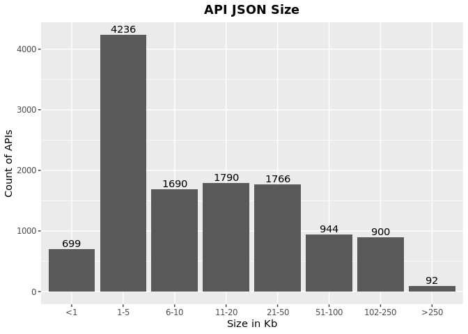

OAS JSON Size
================
Last updated: 2023-02-17

- <a href="#findings" id="toc-findings">Findings</a>
  - <a href="#what-is-the-typical-size-of-an-api"
    id="toc-what-is-the-typical-size-of-an-api">What is the typical size of
    an API?</a>
- <a href="#methodology" id="toc-methodology">Methodology</a>

*DISCLAIMER: the results and findings below are preliminary and
have not been fully validated or peer reviewed. Use with care. Do not
quote or disseminate.*

[Back to summary](oas_summary.md) \| [View related
issues](https://github.com/postman-open-technologies/knowledge-base/labels/oas%3Asize)

# Findings

## What is the typical size of an API?

- Based on 22,751 valid API specifications, the average JSON size is
  34Kb, ranging from \< 1Kb to 7,575Kb.
- No significant difference is observed between version 2 (33.4Kb) and 3
  (34.2Kb)

# Methodology

Results are based on the `json_data_size` field in the OAS resource
view. This value is computed by the Python ingestion script using size
optimized files (no indentation or cr/lf end of line characters).
