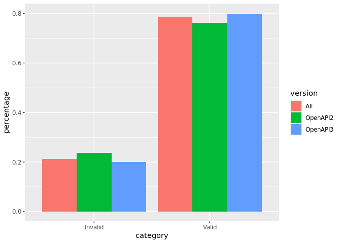

OAS Validity
================
Last updated: 2022-12-26

- <a href="#findings" id="toc-findings">Findings</a>
  - <a href="#how-many-valid-openapis-do-we-have"
    id="toc-how-many-valid-openapis-do-we-have"><em>How many valid OpenAPIs
    do we have?</em></a>
- <a href="#recommendations" id="toc-recommendations">Recommendations</a>
- <a href="#methodology" id="toc-methodology">Methodology</a>
- <a href="#api" id="toc-api">API</a>

*DISCLAIMER: the results and findings below are preliminary and
have not been fully validated or peer reviewed. Use with care. Do not
quote or disseminate.* [Back to summary](oas_summary.md) \|
[View related
issues](https://github.com/postman-open-technologies/knowledge-base/labels/oas%3Avalidity)

# Findings

## *How many valid OpenAPIs do we have?*

- Out of 15,644 entries, 12,085 (77.3%) are valid and 3,559 (22.7%) are
  invalid
- 4,627 out of the 5,928 Swagger (v2.x) entries are valid (78.1%)
- 7,458 out of the 9,716 OpenAPI (v3.x) entries are valid (76.8%)

*Further analysis is in progress to understand what are the common
causes of errors.*

<!-- -->

# Recommendations

- Further investigate and analyze common source of errors

# Methodology

Results are based on the count of the `isValid` boolean property in the
resource metadata. This flag is set by the `kb_oas_validation.py`
script, which uses the JSON schemas published under the [OAI GitHub
project](https://github.com/OAI/OpenAPI-Specification/tree/main/schemas).
Validation is performed by the Python
[jsonschema](https://github.com/python-jsonschema/jsonschema) package.
Validation errors are saved in a local file for further analysis.

# API

Data for this topic can be found under the /oas/statistics/validity
endpoint.
