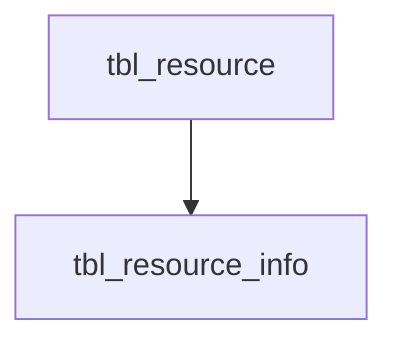

# Knowledge Base: Postgres

## Physical Model

The following tables are defined for the primary storage of all the knowledge based resources. Note that these tables are *never* programatically accessed directly, all interactions being made through views. This enables us to reorganized the physical model as needed down the road (e.g. for performance).



### tbl\_resource
This is the primary storage for the resources and holds the identifiers, the data and metadata JSON, and few extra helper fields.

<details>
<summary>View definition</summary>

```
create table if not exists tbl_resource(
id varchar, -- the resource identifier
uri  varchar primary_key, -- the resource URI
class varchar, -- the resources class 
kb_id varchar, -- the knowlegde base identifier
collection_id varchar, -- the collection identifier
repo_path varchar, -- the resource directory path in the knowledge base repository
json_data jsonb,  -- the resource JSON data
json_data_size bigint, -- the size of the data in bytes
json_meta jsonb, -- the resource metadata
updated timestamp -- the date/time the resource was updated 
)
```
</details>

### tbl\_resource\_attachment
This table is used add *attachments* to a resource, typically JSON files holding resource specific information such as extended metadata or analytical reports. The nature of the content is informed by the attachment_type, which currently can be:

- oas.validation: Output from the OAS schema validation (only when errors are reported)
- ingest.meta: extra metadata captured by the resource harvesting agent (can vary depending on the collection or harvester)


## OAS Views

### vw\_oas\_resource

All OpenAPI resources are exposed through this base view, which simply filter the core resource table by the knowledge base identifier (`oas`).

<details>
<summary>View definition</summary>

```
create or replace view vw_oas_resource as 
select *, from tbl_resource where kb_id = 'oas'
```
</details>

### vw\_oas\_resource\_attachment

Presents a logical view or the attachments for the OpenAPI resources.

<details>
<summary>View definition</summary>

```
select resource.repo_path, attachment.* from tbl_resource_attachment as attachment
join vw_oas_resource as resource on attachment.uri = resource.uri
```
</details>


### vw\_oas\_resource_host

This view joins valid *OpenAPI2* resources their ```host``` property, presenting one record per host. It includes the ```host```, ```basePath```, and ```scheme``` properties, as well as flags indicating if the entry is a localhost, dnshost, or relative path, and if the protocol is http or https. 

<details>
<summary>View definition</summary>

```
create or replace view vw_oas_resource_host as
select uri, json_meta, 
	(json_data->>'host') as host, (json_data->>'basePath') as basepath, (json_data->>'schemes') as schemes,
	case when (json_data->>'host') ilike 'localhost' or (json_data->>'host') ilike '127.0.0.1' then 1 else 0 end as is_localhost,
	case when (json_data->>'host') not ilike '%localhost%' and  (json_data->>'host') not ilike '%127.0.0.1%' then 1 else 0 end as is_dnshost,
	case when (json_data->>'host') is null and (json_data->>'basePath') is not null then 1 else 0 end as is_relative,
	case when (json_data->'schemes') ? 'http'then 1 else 0 end as is_http,
	case when (json_data->'schemes') ? 'https'then 1 else 0 end as is_https
from vw_oas_resource
where json_meta->'isValid' = 'true' and (json_data->'host' is not null or json_data->'basePath' is not null)
```
</details>

### vw\_oas\_resource_servers

This view joins valid *OpenAPI3* resource their ```servers``` property array, presenting one record per server. It includes the ```url```, ```protocol```, and ```host``` properties, as well as flags indicating if the entry is a localhost, dnshost, template host, or relative path, and if the protocol is http or https. 

<details>
<summary>View definition</summary>

```
create or replace view vw_oas_resource_servers as
select uri, json_meta,
	url, protocol, host,
	case when host ilike 'localhost' or host ilike '127.0.0.1' then 1 else 0 end as is_localhost,
	case when host !~ '{' and host not ilike '%localhost%' and  host not ilike '%127.0.0.1%' then 1 else 0 end as is_dnshost,
	case when host ~ '{' then 1 else 0 end as is_templatehost,
	case when url ilike '/%' then 1 else 0 end as is_relative,
	case when protocol ilike 'http' then 1 else 0 end as is_http,
	case when protocol ilike 'https' then 1 else 0 end as is_https,
	server
from (
select 
	uri, json_meta,
	server->>'url' as url,
	(regexp_match(server->>'url','^(.*):\/\/'))[1] as protocol,
	(regexp_match(server->>'url','^(?:https?:\/\/)?(?:[^@\/\n]+@)?(?:www\.)?([^:\/?\n]+)'))[1] as host,
	server
from (
	select uri, json_meta, jsonb_array_elements(json_data->'servers') as server
	from vw_oas_resource
	where json_meta->'isValid' = 'true' and json_data->'servers' is not null
) as t1
) as t2
```
</details>

### vw\_oas\_resource\_tld

This view stacks the vw\_oas\_resource_host and vw\_oas\_resource_servers to produces a distinct list of OpenAPI and their top level domain names. This only includes DNS based hosts (excludes localhost, relative paths, template based hosts, and IP addresses).

<details>
<summary>View definition</summary>

```

create or replace view vw_oas_resource_tld as
select * from 
(
select distinct uri, (regexp_match(host,'(?:.*\.)?(\w+\.\w+)$'))[1] as tld from vw_oas_resource_host where is_dnshost = 1
union
select distinct uri, (regexp_match(host,'(?:.*\.)?(\w+\.\w+)$'))[1] as tld from vw_oas_resource_servers where is_dnshost = 1
) as t1
where tld ~ '[a-zA-Z]'
;
```
</details>

### vw\_oas\_resource\_security

This view joins all valid OpenAPI resources with their ```security``` property array, presenting one record per entry. 

<details>
<summary>View definition</summary>

```
create or replace view vw_oas_resource_security as 
select uri, json_meta, position, security
from vw_oas_resource as resource, jsonb_array_elements(resource.json_data->'security') with ordinality security(security, position)
where json_meta->'isValid' = 'true'

```
</details>

### vw\_oas\_resource\_securitydefinitions

This view joins all valid *OpenAPI2* resources with their ```securitydefinitions``` property array, presenting one record per entry. It is designed to be stackable with the vw\_oas\_resource\_components_securityschemes view.

<details>
<summary>View definition</summary>

```
create or replace view vw_oas_resource_securitydefinitions as
select uri, class, json_meta, schemes.key, schemes.value
from vw_oas_resource as resource, jsonb_each(resource.json_data->'securityDefinitions') schemes
where json_meta->'isValid' = 'true'
order by uri

```
</details>


### vw\_oas\_resource\_components_securityschemes

This view joins all valid *OpenAPI3* resources with their ```components/securityschemes``` property array, presenting one record per entry. It is designed to be stackable with the vw\_oas\_resource\_securitydefinitions view.

<details>
<summary>View definition</summary>

```
create or replace view vw_oas_resource_components_securityscheme as
select uri, class, json_meta, schemes.key, schemes.value
from vw_oas_resource as resource, jsonb_each(resource.json_data->'components'->'securitySchemes') schemes
where json_meta->'isValid' = 'true'
order by uri
```
</details>


### vw\_oas\_resource\_validation\_errors

A helper view that provides one record for every validation error found in the invalid OpenAPI resources. 

<details>
<summary>View definition</summary>

```
select repo_path, uri, 
(jsonb_array_elements(json_data)->'path')[0] as section,
jsonb_array_elements(json_data)->'path' as path, 
jsonb_array_elements(json_data)->>'message' as message, 
jsonb_array_elements(json_data) as error 
from vw_oas_resource_attachment
where attachment_type = 'oas.validation'

```
</details>

